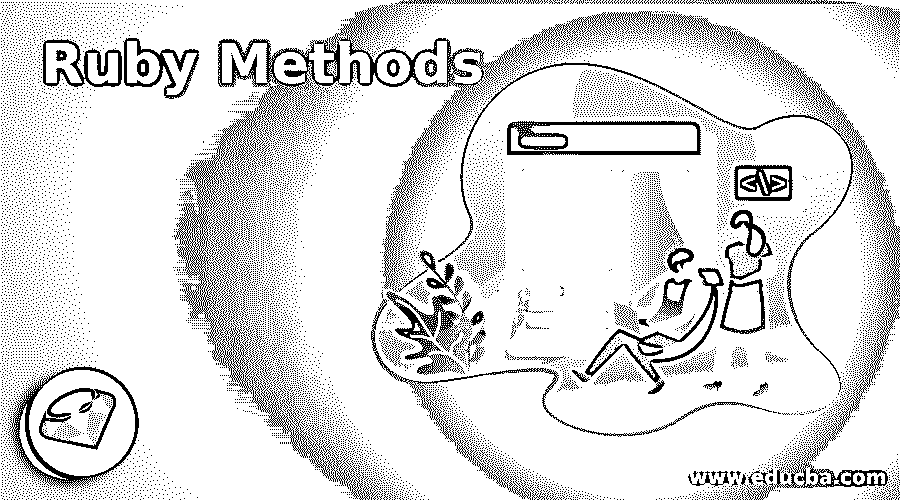

# Ruby 方法

> 原文：<https://www.educba.com/ruby-methods/>

## Ruby 方法简介

在 Ruby 中，为了完成任何一组任务或者编写某一组表达式(可能是为了计算数字的百分比或者是为了寻找两个数字的加法)，我们使用方法，方法在执行它的特定任务后返回一个值，这个值是我们以表达式的形式写在它里面的。 要在 Ruby 中创建任何方法，我们使用 def 命令(def add 或 def percentage)，我们可以在方法名(def add (a，b))后向这些方法传递参数，在编写完所有需要的表达式后，我们通过在方法底部编写 end 来结束方法。

### Ruby 中的方法是如何工作的

下面是方法的语法，从下面的语法开始，我们将一步一步地讨论 Ruby 中方法的工作原理:

<small>网页开发、编程语言、软件测试&其他</small>

*   当我们写代码定义和方法名时，意味着我们在向系统指示方法，系统把它当作定义方法的指令。
*   在方法名之后我们传递参数，这里参数可以是一个或多个，就像 def 方法的例子(a，b，c)。因此，我们向系统发出关于参数数量的指令。
*   接下来，我们要在函数内部执行一些活动，这些活动可以是加法、乘法或任何其他数学或逻辑计算。
*   无论我们在方法表达式的末尾写什么，它都会被返回，所以不需要手动返回任何东西。
*   以及方法的结束步骤，为此我们在方法的末尾使用 end 命令。一旦 Ruby 编译器读取到结束，它就知道这是方法的结束。
*   最后，到了调用我们在这里定义的方法的时候了，要调用这个方法，我们只需使用方法的名称，通过这样做，我们就调用了这个方法可用的地址，它将执行所有相关的操作。

**代码:**

`#Start of the method with parameters
def methodExample(parameters)
#Here we perform the operation or the task which we needed   #No need to return anything as in it default return the last   line of the expression .
end
#Calling of the method methodExample
methodExample`

### 如何定义方法？

为了定义任何方法，我们将在这里使用 def 命令，有两种类型的方法，一种是普通方法，另一种是基于类的方法。

让我们在这里讨论这两种类型:

#### 1.没有基于类和参数的方法

在下面的例子中，我们正在处理不属于任何类的方法，并且在方法调用中没有得到任何参数。我们可以在下面的步骤中解释下面的例子。我们已经定义了一个没有任何参数的方法，并且在这个方法中，我们打印了一些消息。在下一步中，我们用我们已经定义的名字调用这个方法。一旦我们用它的名字调用这个方法，它将打印所有的消息，一旦它读取结束命令，它将关闭这个方法。请查看下面的示例以及输出屏幕。

**代码:**

`def greetingForAll
puts "Welcome to all of in the Ruby programing world"
puts "This example is for the method without params and class"
end
greetingForAll`

**输出:**

#### 2.带类不带参数的方法

在下面的例子中，我们正在处理属于学生类的方法，他们在方法调用中没有得到参数。我们可以用下面的步骤来解释下面的例子:

我们用学生的名字定义了一个类。在 Student 类中，我们定义了一个没有任何参数的方法，并且在这个方法中，我们为 general 打印了一些消息。在下一步中，我们将使用从 Student 类创建的对象调用此方法(问候所有人)。一旦我们用它的名字调用这个方法，它将打印所有的消息，一旦它读取结束命令，它将关闭这个方法。请查看下面的示例以及输出屏幕。

**代码:**

`class Student
def greetingForAll
puts "Welcome to all of in the Ruby programing world"
puts "This example is for the method without params and class"
end
end
studentObjec =Student.new
studentObjec.greetingForAll`

**输出:**

### 如何用参数定义方法？

以下是方法:

#### 1.没有类但有参数的方法

在下面的例子中，我们正在处理不属于任何类的方法，它在方法调用中获取参数。我们可以用下面的步骤来解释下面的例子:

我们用一些参数定义了一个方法，在这个方法中，我们为以参数形式传递的学生信息打印了一些消息。在下一步中，我们将使用我们已经定义的名称调用该方法，并向其传递所需的参数。一旦我们用它的名字调用这个方法，它将打印以参数形式传递的与特定学生相关的所有消息，一旦它读取了 end 命令，它将关闭这个方法。请查看下面的示例以及输出屏幕。

**代码:**

`def greetingForAll (name ,designation)
puts "Welcome to organisation mr #{name} you are working here as #{designation}"
end
greetingForAll("ranjan","Software Engineer")
greetingForAll("Ajat","Civil Engineer")`

**输出:**

#### 2.具有类和参数的方法

在下面的例子中，我们正在处理属于**学生**类的方法，它在方法调用中获取参数。我们可以用下面的步骤来解释下面的例子:

我们用学生的名字定义了一个类。在类 Student 中，我们定义了一个方法，用一些参数作为学生信息。在下一步中，我们将使用我们从 Student 类创建的对象调用此方法(问候所有人(传递参数))。一旦我们在我们创建的对象上调用带有其名称的方法，它将为学生打印与传递的参数相关的所有消息。请查看下面的示例以及输出屏幕。

**代码:**

`class Student
def greetingForAll (name ,designation)
puts "Welcome to organisation mr #{name} you are working here as #{designation}"
end
end
studentObject = Student.new
studentObject.greetingForAll("ranjan","Software Engineer")
studentObject.greetingForAll("Ajat","Civil Engineer")`

**输出:**

### 结论

从本教程中，我们学习了 Ruby 中方法的概念，我们学习了 Ruby 类方法中使用的各种类型的方法，有参数的有类方法和无参数的无类方法，我们也很少关注这些方法的工作和执行步骤。

### 推荐文章

这是一个 Ruby 方法指南。这里我们讨论 Ruby 方法的介绍，包括它是如何工作的，如何定义方法以及如何定义参数。您也可以浏览我们的其他相关文章，了解更多信息——

1.  [Ruby do while](https://www.educba.com/ruby-do-while/)
2.  [Ruby DateTime](https://www.educba.com/ruby-datetime/)
3.  [Ruby Case 语句](https://www.educba.com/ruby-case-statement/)
4.  [红宝石琴弦](https://www.educba.com/ruby-strings/)

