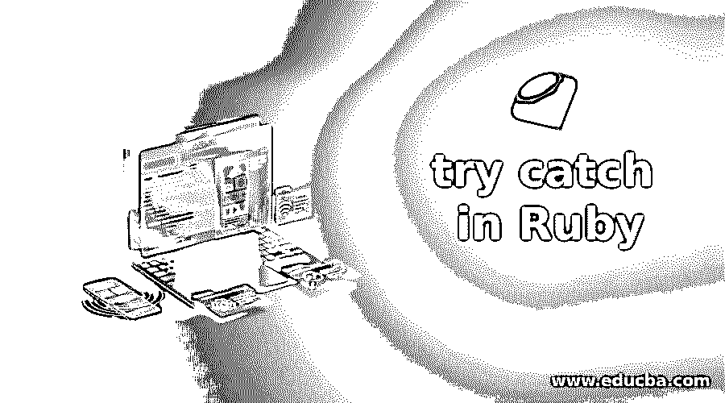
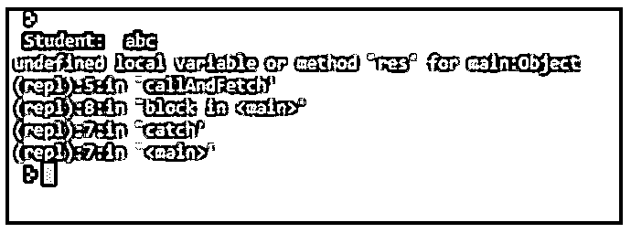
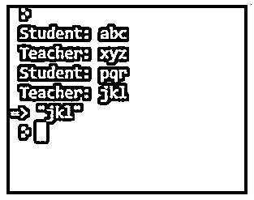
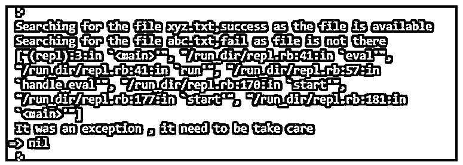

# 在 Ruby 中尝试 catch

> 原文：<https://www.educba.com/try-catch-in-ruby/>

## Ruby 中的 try catch 介绍

很多时候，当我们处理某些困难的场景时，代码很可能会执行失败，例如，如果我们要在任何文件上写一些内容，而该文件不存在，在这种情况下，代码执行将停止，这是不正确的，我们需要处理它。在 Ruby 中，我们有一种方法来处理这些情况，我们有 begin、end(默认的 try catch ),我们可以使用 try 和 catch，try catch 和 raise rescue 都用于相同的目的，一个会在另一个(catch 或 rescue)中抛出具有任何特定名称的异常(throw 或 raise)。

### Ruby 中 try catch 的语法

catch 和 throw 的语法，我们可以有三种不同类型的语法来处理异常，分别是 try catch、begin 和 rescue 以及 else。

<small>网页开发、编程语言、软件测试&其他</small>

**1。catch 和 try 的语法**

在下面的例子中，我们抛出了一个名为 nameexception 的异常，同样的异常也会在这里被捕获到。因此，如果发生任何异常，它将在 catch 块中被跟踪。

`throw :nameexception
#This is your comment and code block , it would not execute .
catch :nameexception do
#After the throw happens, a matching catch with an exception name will be handled here .
end`

**2。begin 和 rescue 的语法**

在这种情况下，在 rescue 块中会引发一个异常，而在确保块中会发送异常的详细信息。

`begin
# -  Send exception in rescue block
rescue sendAnyException
# -
rescue AnotherTypeOfException
# - Ensure block for conforming about the exception
ensure
end`

**3。与 else 的语法**

在这种情况下，我们处理或捕捉异常，并使用 else 块来显示正确的消息。

`begin
rescue
#send the name of exception here
else
# If not an exception we can do something here .
ensure
#Confirming the exception inside the esure block
end`

### try-catch 在 Ruby 中是如何工作的？

我们可以在打开任何文件和处理数据库相关查询时使用 try and catch。因为在这些情况下我们无法预测自然。文件可以在那里，也可以不在那里，同样，我们正在写入的查询表也可能不在数据库中。

#### 1.第一次尝试捕捉(纯尝试和捕捉)

*   Try 和 catch 两者一起工作，一旦 try 块中发生任何异常，它将抛出一个异常，这个异常可以是自定义的，或者我们可以为异常定义一些名称，在 catch 块中使用相同的名称，异常将被捕获。
*   我们还可以从 try 块中抛出一些豁免对象，这个特定的对象将在 catch 块中处理。

#### 2.Ruby 内部 try catch(提升和营救)

*   如果我们看到 begin 和 rescue 的 try catch，这里我们在 begin 块中编写的每个代码都受到保护，这意味着从 begin 到 rescue 的所有代码都处于安全模式(任何异常都将在那里处理)。
*   如果异常发生在 begin 块中，它将暂停，控制将在 rescue 和 end 之间进行，如果出现异常，我们可以为用户返回有效消息。
*   每次执行 rescue 语句时，Ruby 都会检查并比较每个参数引发的异常。

### Ruby 中的 try catch 示例

下面是提到的例子:

#### 示例#1

在这个例子中，我们抛出了一个名为 nameOfException 的异常，并使用相同的名称来捕获该异常。

*   首先，我们定义了一个名为 callAndFetch 的函数，这个函数将获得一个参数 student。
*   在下一个块中，我们从 begin 块发送错误或异常。
*   我们抛出的同名异常将被捕获，并打印出异常的详细信息。

**代码:**

`def callAndFetch(prompt)
print prompt
responseValue = readline.chomp
throw :nameOfException if responseValue == "!"
return res
end
catch :nameOfException do
student = callAndFetch("Student: ")
end
callAndFetch("Student:")`

**输出:**

#### 实施例 2

在这个例子中，我们抛出了一个名为 nameOfException 的异常，并使用相同的名称来捕获该异常。

*   首先，我们定义了一个名为 callAndFetch 的函数，这个函数将获得一个参数 student。
*   在下一个块中，我们从 begin 块发送错误或异常。
*   我们抛出的同名异常将被捕获，并打印出异常的详细信息。
*   这里，在使用参数 Student 调用 callAndFetch 函数之后，我们再次使用参数 Teacher 调用它。
*   但是带有参数 Teacher 的调用不会捕捉到异常，因为已经发生了异常，所以没有进一步的执行。

**代码:**

`def callAndFetch(prompt)
print prompt
responseValue = readline.chomp
throw :nameOfException if responseValue == "!"
return responseValue
end
catch :nameOfException do
student = callAndFetch("Student:")
teacher = callAndFetch("Teacher:")
end
callAndFetch("Student:")
callAndFetch("Teacher:")`

**输出:**

#### 实施例 3

在这种类型的 try catch 中，使用了 Ruby begin 和 rescue 特性来处理。它的工作方式几乎类似于简单的 try catch，唯一不同的是它比 else 多了一些特性，确保处理异常。我们看到的例子是，我们拯救了一个在 begin 块中引发的异常，我们有 rescue 语句来获取数据 exception.message，我们将在 rescue 中获得由 raise 语句引发的消息。

**代码:**

`begin
puts 'Searching for the file xyz.txt,success as the file is available'
raise 'Searching for the file abc.txt,fail as file is not there'
rescue Exception => exception
puts exception.message
puts exception.backtrace.inspect
ensure
puts "It was an exception , it need to be take care"
end`

**输出:**

### 结论

从本教程中，我们了解了 Ruby 的尝试和捕获流程，我们了解了可以使用尝试捕获的地方，我们还了解了一些在 Ruby 中间接可用的尝试捕获，如 rescue 和 raise，我们还了解了它们是如何工作的。

### 推荐文章

这是一个在 Ruby 中尝试 catch 的指南。在这里，我们讨论了 Ruby 中的 try catch 的介绍，以及它是如何工作的，并给出了相应的例子以便更好地理解。您也可以看看以下文章，了解更多信息–

1.  [Ruby 数据类型](https://www.educba.com/ruby-data-types/)
2.  [Ruby 数组方法](https://www.educba.com/ruby-array-methods/)
3.  [红宝石变量](https://www.educba.com/ruby-variables/)
4.  [While Ruby 中的循环](https://www.educba.com/while-loop-in-ruby/)

