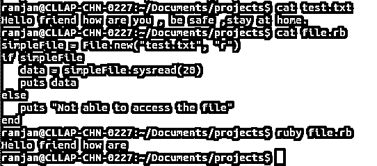
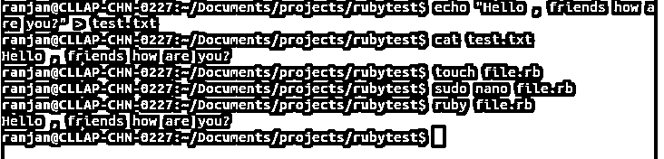
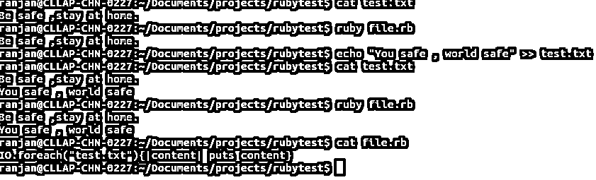

# Ruby 读取文件

> 原文：<https://www.educba.com/ruby-read-file/>

## Ruby 读取文件的定义

要在 ruby 中读取任何文件系统，我们可以在文件路径上使用关键字 new 和文件名，比如 File.new('test.txt '，" r ")，这里 test.txt 是文件名，而" r "表示我们将要打开文件的模式，这里" r "表示我们正在以读取模式打开文件，这意味着我们正在读取文件，在 Ruby 中， 有许多处理文件读取操作的重要方法，所有这些方法都是从 I/O 类派生的，有一些重要的文件读取操作，如 read(读取文件)、puts(读取变量并打印分配给该变量的值)、gets、prince、print(打印类似于 puts)所有这些方法都允许读取文件。

### 如何使用各种方法在 Ruby 中读取文件

使用 Ruby 中可用的各种方法，有很多方法可以读取 Ruby 中的任何文件系统。让我们用一些例子来讨论这些方法。

<small>网页开发、编程语言、软件测试&其他</small>

#### 1.使用新关键字

在下面的例子中，我们在关键字 call new 的帮助下打开一个文件。在 new 中，我们以类似 File.new("文件路径和文件名"，" r ")的读取模式打开文件。

*   首先，我们创建了一个名为 txt 的文件，并向该文件添加了一些内容。
*   我们使用带有两个参数的 new，在第一个参数中，我们传递将要读取的文件的名称和路径，第二个参数传递打开文件的模式(在本例中，我们以 read(r)模式打开文件)。
*   下一个代码是 if 语句，我们检查文件是否为空，以避免空内容的无用代码流。
*   最后借助以 20 为字长的方法展开。
*   在输出中，它打印文件中的 20 个字符。

**Note**: Make not that here my text file test.txt is available on the same path where Ruby code file is present, In my case both on the same directories because of that I did not require to mention the path of the file, but in case if you have your file in the other directory then the Ruby code then please mention the path instead of writing simply file name. Please follow the below code along with the out of the screen.

**代码:**

`simpleFile = File.new("test.txt", "r")
if simpleFile
data = simpleFile.sysread(20)
puts data
else
puts "Not able to access the file"
end`

**输出:**

#### 2.使用关键字打开并阅读

在下面的例子中，我们使用一个简单的 open 关键字来读取文件内容。我们可以在下面的步骤中解释下面的代码。

*   首先，我们已经写好了文件。文件是一个子类，包含所有与文件相关的活动。
*   接下来，我们编写了 open on File，这里 open 将以文件路径作为参数。记住这里我已经直接传递了文件名，因为文件 test.txt 和 file.rb 都在同一个位置。如果文件位于其他位置，那么我们可以传递文件的完整路径。
*   打开文件后，我们使用 read 方法输出打开的结果。
*   最后，我们放入来自 readData.read 的结果，这是文件的内容。

**代码:**

`readData = File.open("test.txt")
file_data = readData.read
puts file_data`

**输出:**

#### 3.使用 Read 关键字分割文件

在下面的例子中，我们使用 split 关键字来读取文件内容。我们可以在下面的步骤中解释下面的代码。

*   首先，我们编写了文件。这里的 File 是一个子类，包含所有与文件相关的活动。
*   接下来，我们在命令 File.read 的输出中编写了链形式的分割。
*   这里 File.read 将文件路径作为参数。记住这里我已经直接传递了文件名，因为文件 test.txt 和 file.rb 都在同一个位置。如果一个文件位于另一个位置，那么我们可以传递该文件的完整路径。
*   拆分法会将句子的每个单词拆分出来，逐行阅读。
*   您可以看到结果的输出，其中每个单词都显示为句子的输出。

**代码:**

`readData = File.read("test.txt").split
puts readData`

**输出:**

#### 4.使用读取行读取文件

这里我们写了一个简单的代码来打印文件的每一行，因为在下面的例子中我们只取了句子的一行，所以第一行已经被打印出来了。

**代码:**

`File.foreach("test.txt") { |each_line| puts each_line }`

**输出:**

#### 5.使用 IO 循环读取文件

在本例中，我们只是对 test.txt 内容逐行执行循环。程序的目标是打印文件内容，这里的内容是多行的。在下面的例子中，我们取了两行，我们可以在下面的步骤中解释下面的例子。

*   文件 test.txt 包含两行内容。
*   我们编写了一个块语句来逐行打印代码，每次块中的内容变量包含句子的每一行。

**代码:**

`IO.foreach("test.txt"){|content| puts content}`

**输出:**

### 推荐文章

这是一个 Ruby 读取文件的指南。在这里，我们还讨论了简介以及如何使用各种方法在 ruby 中读取文件，并给出了示例及其代码实现。您也可以看看以下文章，了解更多信息–

1.  [Ruby 数据类型](https://www.educba.com/ruby-data-types/)
2.  [Ruby 模块](https://www.educba.com/ruby-modules/)
3.  [Ruby 数组方法](https://www.educba.com/ruby-array-methods/)
4.  [安装 Ruby](https://www.educba.com/install-ruby/)

