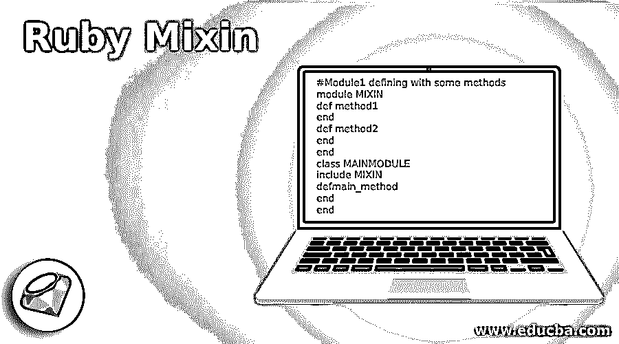
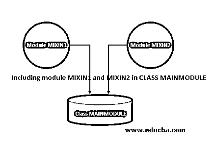
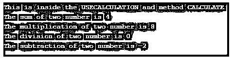
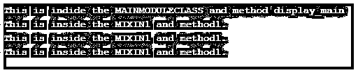

# 红宝石混合蛋白

> 原文：<https://www.educba.com/ruby-mixin/>

## Ruby Mixin 简介

如果我们想在 Ruby 中拥有多重继承，那么我们不能直接使用它们，要使用这个概念，我们需要通过 mixin 的概念，在 mixin 概念中我们使用模块的概念，在一个类中我们可以包含许多模块，每个模块包含一些类和方法，这意味着我们能够在模块的帮助下访问多重继承，这种方法在 Ruby 中被称为 mixin。我们可以使用简单的 include 关键字在一个类中包含许多模块，我们知道每个模块都可以有一些类和方法。

**语法:**

<small>网页开发、编程语言、软件测试&其他</small>

下面的简单语法显示了 Ruby 中 mixin 的流程，在下面的语法中，我们创建了一个名为 MIXIN 的模块，在这个模块中，我们将它包含在 MAINMODULE 类中。.

`#Module1 defining with some methods
module MIXIN
def method1
end
def method2
end
end
class MAINMODULE
include MIXIN
defmain_method
end
end`

### Mixin 在 Ruby 中是如何工作的？

为了了解 Ruby 中 mixin 的工作方式，我们将按照一个图表和一些步骤来展示 Ruby 中 mixin 概念的实际含义。

*   首先我们定义了一个模块 MIXIN1 和 MIXIN2。我们可以在模块中放一些类方法和常量。
*   模块 MIXIN1 和 MIXIN2 都包含一些方法，如 method1、method2、method3 和 method4。这些方法将由单个类访问，没有多重继承的概念，简单地说，这种技术被称为 mixin。
*   接下来我们定义了一个类 MAINMODULE，这个类包含了上面的两个模块。一旦我们在类中包含了模块，这个类就有资格拥有这两个模块(MIXIN1 和 MIXIN2)的所有属性。
*   接下来，我们创建 MAINMODULE 的对象，通过该对象，我们可以访问包含在 MAINMODULE 类中的两个模块的方法。
*   这种在一个类中包含和使用两个或更多模块的机制只不过是一种混合。
*   所以我们可以从语法上理解它正在取代 Ruby 中多重继承的需要。

**Note 1**: The main advantage of using the mixin in Ruby is to provide a way to use many different different methods and classes inside a single class without having the concept of the multiple inheritance. Also it gives us a powerful mechanism for managing and reusing the same piece of code for multiple locations.**Note 2:** We can use many modules inside one class and this is the main benefit of using mixin. Suppose we wanted to use some functionality, all the functionality belongs to different modules, so with the help of mixin concept we are not required to write the same code again and again.

下面给出的是图表:

### Ruby Mixin 的例子

下面是提到的例子:

#### 示例#1

在下面的例子中，我们在名为 CALCULATE 的模块中执行算术运算，这个模块将包含在 USECALCULATION 类中。

**代码:**

`# Defining CALCULATE modules which consists of some methods for arithmetic operations.
module CALCULATE
def add(a,b)
puts "The sum of two number is #{a+b}"
end
def multi(a,b)
puts "The multiplication of two number is #{a*b}"
end
def div(a,b)
puts "The division of two number is #{a/b}"
end
defsubstract(a,b)
puts "The subtraction of two number is #{a-b}"
end
end
# Defining a main class method and inside the method we are simply including all the three modules which we have defined above.
class USECALCULATION
include CALCULATE
defdisplay_output
puts 'This is inside the USECALCULATION and method CALCULATE'
end
end
# Creating object
mainObject = USECALCULATION.new
# Calling methods
mainObject.display_output
mainObject.add(1,3)
mainObject.multi(2,4)
mainObject.div(2,4)
mainObject.substract(2,4)`

**输出:**

#### 实施例 2

**代码:**

`# Defining three modules which consists of some methods .
module MIXIN1
def method1
puts 'This is inside the MIXIN1 and method1.'
end
end
module MIXIN2
def method2
puts 'This is inside the MIXIN1 and method1.'
end
end
module MIXIN3
def method3
puts 'This is inside the MIXIN1 and method1.'
end
end
# Defining a main class method and inside the method we are simply including all the three modules which we have defined abbove.
class MAINMODULECLASS
include MIXIN1
include MIXIN2
include MIXIN3
defdisplay_main
puts 'This is indide the MAINMODULECLASS and method display_main'
end
end
# Creating object
mainObject = MAINMODULECLASS.new
# Calling methods
mainObject.display_main
mainObject.method1
mainObject.method2
mainObject.method3`

**输出:**

### 结论

从这些教程中，我们看到了 Ruby 中 mixin 的基础知识，我们也看到了 mixin 在 diagram 的帮助下的工作方式，我们知道我们可以使用 mixin，我们需要将一个或多个模块包含到另一个类中，我们可以从那个类对象中访问模块的属性，比如它的方法。

### 推荐文章

这是一个 Ruby Mixin 的指南。这里我们讨论 Ruby Mixin 的介绍，以及工作和例子。您也可以看看以下文章，了解更多信息–

1.  [Ruby 数组方法](https://www.educba.com/ruby-array-methods/)
2.  [Ruby 中的循环](https://www.educba.com/loops-in-ruby/)
3.  [红宝石运算符](https://www.educba.com/ruby-operators/)
4.  [红宝石变量](https://www.educba.com/ruby-variables/)

