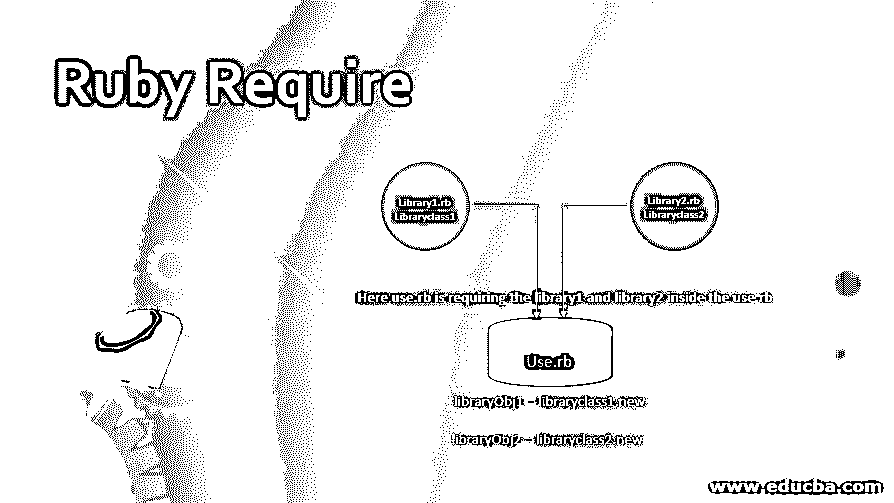
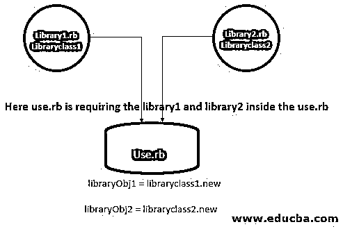

# Ruby 要求

> 原文：<https://www.educba.com/ruby-require/>

## Ruby 要求的定义

在 Ruby 中，要重用任何现有的文件和模块，我们可以使用 require 语句，require 语句允许我们在代码中使用子模块，有两种方法可以调用任何文件，第一种方法是像 require 一样给出文件的完整路径。/dire/lib/xyz.rb '在这种方法中，我们给出了库的完整路径，另一种方法是直接给出文件名，如 require 'xyz.rb '而不是提及完整路径，这也称为缩短路径，在这种方法中，应用程序将在所有预定义的目录中搜索名称，直接写入文件名对于 require 语句来说更常见。

### Ruby 的语法要求

下面是 Ruby 中 require 的语法，为了解释语法，我们取两个文件，一个文件将扮演库的角色，另一个文件通过 require 语句使用库文件。

<small>网页开发、编程语言、软件测试&其他</small>

我们可以先通过下面的步骤来解释库文件的语法。

*   在库语法中，我们可以看到我们已经创建了两个名为 library1.rb 和 library2.rb 的文件。
*   接下来，在库文件中，我们初始化并创建了类和类中的方法。
*   在 initialize 内部，我们将完成类的初始化部分，方法将执行我们需要的活动。我们可以在方法中编写一些代码，并根据我们的要求进行初始化。
*   接下来是我们的文件，它将使用 rb 和 library1.rb 文件，即 use.rb。这些库文件将允许 use.rb 文件使用 library1.rb 和 library2.rb 文件的所有方法和类。
*   最后，我们将创建一个类 LibraryClass1 和 LibraryClass2 的对象，它们分别位于 library1.rb 和 library2.rb 文件中，这是 rb 文件中所需要的。

**Note**: We need to remember one very important point which is namespace pollution, in many cases if we will define too many global variables inside the library file. Because suppose you have defined many global variables inside the library file then there is a very high chance of a conflict of the variables from library file to the file inside which we are requiring the library file.

查看文件和文件上写的语法。

#### 1.库文件(library1.rb)

`class LibraryClass1
def initialize
#Do some initialisation for the class before calling any function of the class
end
def library_method1
#Here write some code for the method
end
End`

#### 2.库文件(library2.rb)

`class LibraryClass2
def initialize
#Do some initialisation for the class before calling any function of the class
end
def library_method2
#Here write some code for the method
end
end`

#### 3.将使用库文件的文件(use.rb)

`require 'library1.rb'
require 'library2.rb'
libraryObj1 = LibraryClass1.new
libraryObj2 = LibraryClass2.new`

### 在 Ruby 中，一个必需的语句是如何工作的？

为了解释所需语句的工作流程，我们将借助下图。我们可以从以下步骤解释下图的流程。

*   在下图中，我们可以看到我们已经创建了两个名为 library1.rb 和 library2.rb 的文件。这些文件将扮演库的角色
*   接下来，在库文件中，我们创建了一个类，并在类中初始化了方法。在方法里面，我们可以放一些逻辑，在初始化里面，我们可以放初始化工作。
*   在 initialize 内部，我们将完成类的初始化部分，方法将执行我们需要的活动。我们可以在方法中编写一些代码，并根据我们的要求进行初始化。
*   接下来是我们的文件，它将使用 rb 和 library1.rb 文件，即 use.rb。这些库文件将允许 use.rb 文件使用 library1.rb 和 library2.rb 文件的所有方法和类。
*   最后，我们将创建一个类 LibraryClass1 和 LibraryClass2 的对象，它们分别位于 rb 和 library2.rb 文件中，我们在 use.rb 文件中需要它们。

**Note**: It is more advisable to create a directory inside the application with the name library and inside the library put all the library files. With the help of this type of structure, other developers will be able to understand the flow of the applications easily. And whenever anyone want to use these libraries they can directly access the library with the name of the library. In Ruby ./lib will be moved inside the $LOAD_PATH variable, which means the $LOAD_PATH variable will hold the files.

### 在 Ruby 中实现 Require 的示例

为了解释下面的例子，我们可以按照以下步骤。

*   在下面的例子中，我们可以看到我们已经创建了两个名为 rb 和 library2.rb 的文件
*   接下来，在库文件中，我们创建了一个类，并在类中初始化了方法。在方法内部，我们编写了输出消息的 put。
*   接下来是我们的文件，它将使用 rb 和 library1.rb 文件，即 use.rb，这些库文件将允许 use.rb 文件使用 library1.rb 和 library2.rb 文件的所有方法和类。
*   最后，我们将创建一个类 LibraryClass1 和 LibraryClass2 的对象，它们分别位于 rb 和 library2.rb 文件中，我们在 use.rb 文件中需要它们。

请查看下面的示例以及输出屏幕。

#### 文件库 1.rb

`puts "Library1"
class LibraryClass1
def initialize
#Do some initialisation for the class before calling any function of the class
end
def library_method1
puts "Welcome the library1 file , I am available for use.rb"
end
end`

#### 文件库 2.rb

`puts "Library2"
class LibraryClass2
def initialize
#Do some initialisation for the class before calling any function of the class
end
def library_method2
puts "Welcome the library2 file , I am available for use.rb"
end
end`

#### 文件 use.rb

`require './library1.rb'
require './library2.rb'
libraryObj1 = LibraryClass1.new
libraryObj2 = LibraryClass2.new
libraryObj1.library_method1
libraryObj2.library_method2`

**输出:**

### 结论

从这些教程中，我们了解了 Ruby 中 requires 的基础知识，我们还借助一个图表了解了 requires 的工作原理，我们知道我们可以在需要使用其他文件特性的地方使用 requires，这些特性可能是我们需要这些库文件的文件中的任何库文件的类和方法。

### 推荐文章

这是 Ruby Require 的指南。在这里，我们还讨论了定义以及在 ruby 中一个必需的语句是如何工作的，以及不同的例子和代码实现。您也可以阅读以下文章来了解更多信息—

1.  [Ruby 模块](https://www.educba.com/ruby-modules/)
2.  [红宝石评论](https://www.educba.com/ruby-comments/)
3.  [Ruby 重试](https://www.educba.com/ruby-retry/)
4.  [Ruby Math](https://www.educba.com/ruby-math/)

