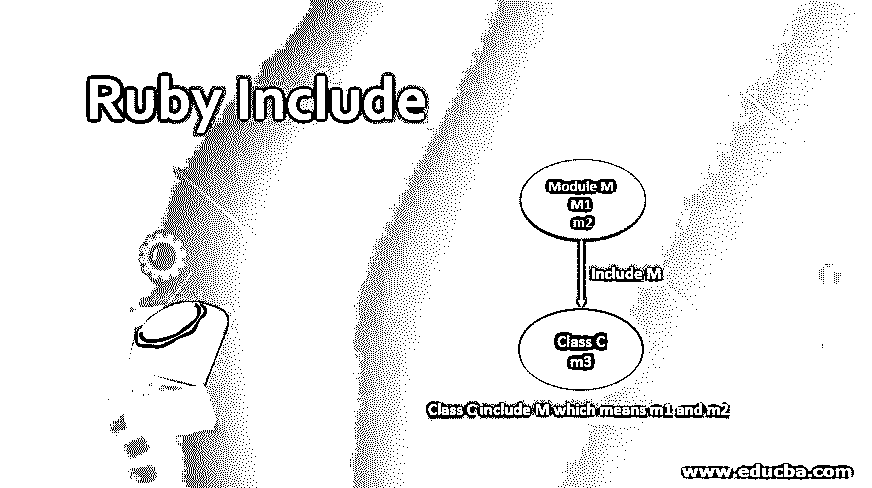
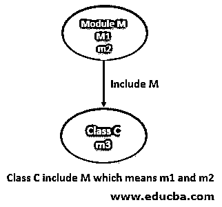
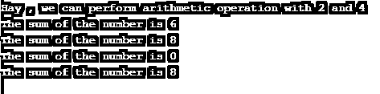
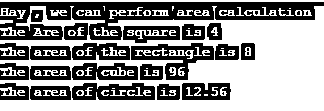

# 拼音包含

> 原文：<https://www.educba.com/ruby-include/>

## Ruby 的定义包括

在 Ruby 中，要重用任何现有模块的方法，我们可以使用 include 语句，允许我们在包含该模块的类中使用该模块的所有方法，假设我们有一个包含方法 m1 和 m2 的模块，我们有另一个包含方法 m3 的类， 现在，如果我们需要类中的一些功能，而这些功能在模块的方法 m1 和 m2 中是可用的，在这种情况下，我们不需要在类中再次编写相同的功能，我们可以简单地在类中使用 include 和模块名称，模块的所有方法都将可用。

**语法:**

<small>网页开发、编程语言、软件测试&其他</small>

下面是 Ruby 中 include 语句的语法，我们已经创建了一个模块，并将该模块包含在类的类名中。一旦我们将模块包含在类名中，该模块的所有方法都将包含在该类中。

查看文件和文件上写的语法。

`module ModuleName
class LibraryClass
def library_method
#Here write some code for the method
end
end
end
class  ClassName
include ModuleName
end`

### Ruby 中的 Include 语句是如何工作的？

我们可以借助下图来解释 include 概念的功能，让我一步一步来解释。

*   当我们用 Ruby 编写时，编译器会寻找我们包含在类中的模块名，并在类中包含该模块的所有方法。
*   一旦我们包含了模块，所有的方法都可以用类名直接访问。这里的类名是我们包含模块的类。
*   在下图中，我们可以看到我们在 C 类中使用了 include，模块 M 的所有方法都适用于 C 类

请参见下图，以便更好地理解。

### Ruby 中要实现的示例包括

下面是一些例子:

#### 示例#1

下面是一个简单的例子，我们使用了一个名为 Human 的模块和一个类 HumanType。我们可以用下面的步骤来解释下面的例子。

*   首先，我们创建了一个 Human 模块，它包含一个 display_method 方法。这里 display_method 打印一条消息。
*   接下来，我们创建了一个名为 HumanType 的类，它包含两个方法:boy 和 girl。这里男孩和女孩都在打印一些信息。
*   最后，在 HumanType 类中，我们包含了模块 Human。
*   通过使用 new 运算符，我们可以用类名直接访问模块 Human 的方法。

请遵循下面的输出示例。

**代码:**

`#Defining module which contains methods.
module Human
def display_method
puts "Hi, I am First a human"
end
end
#This class is including the module inside it ,which means it will have all the methods of the module.
class HumanType
include Human
def boy
puts "Hey, I am boy"
end
def girl
puts "Hay, I am girl"
end
end
#Accessing the methods of the module with the name of the class using a new operator.
HumanType.new.display_method
HumanType.new.girl
HumanType.new.boy`

**输出:**

#### 实施例 2

在下面的例子中，我们正在做一个算术运算，算术运算的所有方法都写在模块中，一个名为 GeneralWork 的类包含了一个名为 Calculation 的模块。我们可以用小步骤来解释这个例子。

*   模块计算包含算术运算的方法。
*   类 GeneralWork 只包含一个显示简单消息的方法。
*   一旦我们在类 GeneralWork 中包含了计算模块，这个类将拥有该模块的所有方法。
*   您可以在示例中看到，我们通过使用一个新的关键字来访问所有名为 class 的算术运算。

请遵循下面的输出示例。

**代码:**

`#Defining module which contains methods.
module Calculation
def add(a,b)
puts "The sum of the number is #{a+b}"
end
def substract(a,b)
puts "The sum of the number is #{a*b}"
end
def divide(a,b)
puts "The sum of the number is #{a/b}"
end
def multiply(a,b)
puts "The sum of the number is #{a*b}"
end
end
#This class is including the module inside it ,which means it will have all the methods of the module.
class GeneralWork
include Calculation
def general_work(a,b)
puts "Hay , we can perform arithmetic operation with #{a} and #{b}"
end
end
#Accessing the methods of the module with the name of the class using a new operator.
GeneralWork.new.general_work(2,4)
GeneralWork.new.add(2,4)
GeneralWork.new.substract(2,4)
GeneralWork.new.divide(2,4)
GeneralWork.new.multiply(2,4)`

**输出:**

#### 实施例 3

在下面的示例中，我们正在计算各种结构的面积，我们在模块和类中编写的所有方法都将包含类中的模块，并且所有用于算术计算的方法都将被捕获到类中。

请遵循下面的输出示例。

**代码:**

`#Defining module which contains methods.
module Area
def square(a)
puts "The Are of the square is #{a*a}"
end
def rectangle(a,b)
puts "The area of the rectangle is #{a*b}"
end
def cube(a)
puts "The area of cube is #{6*a*a}"
end
def circle(a)
puts "The area of circle is #{3.14*a*a}"
end
end
#This class is including the module inside it ,which means it will have all the methods of the module.
class AreaCalculation
include Area
def area
puts "Hay , we can perform area calculation"
end
end
#Accessing the methods of the module with the name of the class using a new operator.
AreaCalculation.new.area()
AreaCalculation.new.square(2)
AreaCalculation.new.rectangle(2,4)
AreaCalculation.new.cube(4)
AreaCalculation.new.circle(2)`

**输出:**

### 结论

从这些教程中，我们学习了 Ruby 中 include 的基础知识，我们还学习了 include 的工作原理，借助于一个图表，我们知道我们可以在任何类中使用 include 来使用其他模块的方法，它将包含这些模块的所有方法。

### 推荐文章

这是一个 Ruby Include 的指南。这里我们还讨论了定义以及在 ruby 中 include 语句是如何工作的？以及不同的示例和代码实现。您也可以看看以下文章，了解更多信息–

1.  [Ruby 模块](https://www.educba.com/ruby-modules/)
2.  [Ruby 数组方法](https://www.educba.com/ruby-array-methods/)
3.  [Ruby 中的循环](https://www.educba.com/loops-in-ruby/)
4.  [红宝石评论](https://www.educba.com/ruby-comments/)

