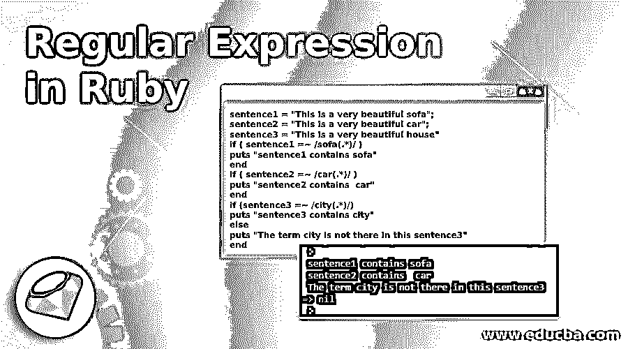
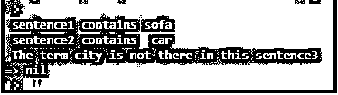
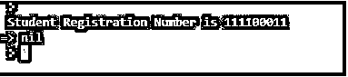
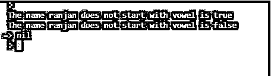

# Ruby 中的正则表达式

> 原文：<https://www.educba.com/regular-expression-in-ruby/>

## Ruby 正则表达式简介

Ruby 中的正则表达式是一些用于搜索其他匹配字符串的字符序列，例如，如果您在句子“sofa is beautiful”中搜索“sofa”，那么我们可以使用“sofa is beautiful”= ~/sofa(。*)/，这里我们只是简单地检查 sofa 在句子“sofa is beautiful”中是否可用，因此我们可以理解正则表达式在 Ruby 中的重要性，在正则表达式的帮助下，我们可以搜索非常复杂的字符串或字符串集，我们还可以使用它们来验证任何请求，例如检查请求字符串是否包含给定的字符串模式，然后才有效。

### 句法

下面是 Ruby 中正则表达式的语法。在给定的代码行中，我们编写了/pattern/，所以这里我们只是检查模式，在同一个块中，我们可以为它指定范围。例如/\D/这里 D 仅表示数值。我们也可以用类似/[a-z]/的方式来写，这意味着从 a 到 z 的所有小写字母，我们将在示例部分更多地关注语法。可选检查可用于检查所有内部模式完成后，这里它可以像\D 检查已知数字。

<small>网页开发、编程语言、软件测试&其他</small>

`/search string or pattern/optional check.`

### 用 Ruby 实现正则表达式的例子

我们可以在许多实时情况下使用正则表达式，比如当我们必须从给定的句子中找到一些特定的模式时，我们可以用它来替换匹配模式，甚至我们可以用它来测试给定的字符串或字符串集是否符合给定的格式。让我们用一个例子来讨论所有这些情况。

#### 示例#1

给定示例中使用的运算符及其含义。

*   **=∽ :** 这里我们用的是操作符=∽，这个操作符包含两件事一个是正则表达式，另一个是匹配字符串。
*   .*:我们使用的操作符是检查一个完整单词的匹配情况，*表示匹配完整单词，如“sofa ”,因此它应该匹配完整单词“sofa”。

这是 Ruby 中正则表达式的第一个例子，下面是对代码的解释。这个例子是为了检查句子中的搜索字符串是否可用。

我们有它们的变量句子 1，句子 2 和句子 3，所有这些变量都包含句子。我们的目标是检查包含一个句子的变量是否包含一个特定的单词或模式。沙发、汽车和城市的例子。首先，两个包含沙发和汽车，但句子 3 不包含城市。在下面的代码中，前两种情况打印成功，第二种情况打印失败。

**代码:**

`sentence1 = "This is a very beautiful sofa";
sentence2 = "This is a very beautiful car";
sentence3 = "This is a very beautiful house"
if ( sentence1 =~ /sofa(.*)/ )
puts "sentence1 contains sofa"
end
if ( sentence2 =~ /car(.*)/ )
puts "sentence2 contains  car"
end
if (sentence3 =~ /city(.*)/)
puts "sentence3 contains city"
else
puts "The term city is not there in this sentence3"
end`

**输出:**

#### 实施例 2

这些示例中使用的运算符有:

*   **\D(表达式)**:该运算符用于任何非数字，我们还有很多其他运算符，如 **\d** (用于任何数字)、 **\s** (用于空白字符)、 **\S** (用于任何非空白字符)
*   **sub！**:这个方法用于 Ruby 中的字符串，它为传递给它的第二个参数复制 pattern 的所有字符串。

我们可以在下面的步骤中解释下面的代码，

我们定义了一个变量 student，它包含带有注册号的句子和一些更多的细节。注册号是给定句子中唯一的数值。这里，我们在子方法的帮助下获取注册号，该子方法从我们传递给它的所需格式的句子中找到数据。

**代码:**

`#The student variable contains the student details along with the registration number in the same sentence .
student = "My name is Ranjan Kumar and my registration number is 111100011"
student = student.gsub!(/\D/, "")
puts "Student Registration Number is #{student}"`

**输出:**

#### 实施例 3

用于这些示例的运算符，

*   **Sub！(method)** :返回一个新的字符串，根据以正则表达式格式传递给它的参数删除所有其他的字符串。
*   **/#。*$/(expression)** :在这个表达式中我们选择了 Ruby 的注释之后的所有属性，并删除了注释之后的所有内容。.*用于选择所有特定符号#后的符号。

这个例子是获取字符串和数字，除了以#开头的句子。我们可以在下面的步骤中解释下面的例子。我们有一个名为 card 的变量，它保存了包含卡的详细信息和一些其他内容的句子。这里我们使用 Ruby 的函数 sub，我们在这里传递 pattern。*/，这意味着我们告诉函数考虑句子的内容，并丢弃以#开头的句子。

**代码:**

`card = "The debit card number is 2222-8880-8989-6789 #valid for 3 days only"
# Delete Ruby-style comments
card = card.sub!(/#.*$/, "")
puts "#{card}"`

**输出:**

#### 实施例 4

本例中使用的运算符是:

*   **match(方法):**该方法用于匹配字符串。
*   **【^aeiou\w](expression】**:在这个表达式中，我们使用了运算符^，它指定了字母应该从给定的字母开始。这用于检查字符串是否以任何数值开头。

在下面的例子中，我们试图找出给定的名字是否以元音字母开头。如果不是以元音开头，我们返回 true，如果是以元音开头，我们返回 false。我们可以在下面的步骤中解释下面的代码，

首先，我们定义了一个名为 not _ start _ with _ 元音的函数，这个函数将一个字符串作为参数。该字符串是来自调用的名称，用于检查它们是否以元音开头。这里我们使用 Ruby 的 match 方法来检查给定的字符串是否以元音字母开头。我们使用了/^aeiou/W 模式，这里^表示第一个字母，\W 我们用来检查给定的字符串是否以任何数字字符开头。最后，我们有 if 和 else 块，所以如果第一个字母是元音字母，它将返回 false，因为它将与 nil 匹配。在 else 块中，如果它不为 nil(这意味着 start 不以元音开头),它将返回 true。

**代码:**

`def not_start_with_vowel(string)
if /^[^aeiou\W]/i.match(string) == nil
return false
else
return true
end
end
puts "The name ranjan does not start with vowel is #{not_start_with_vowel("ranjan")}"
puts "The name ranjan does not start with vowel is #{not_start_with_vowel("ajay")}"`

**输出:**

### 结论

从本教程中，我们学习了 Ruby 的正则表达式，并了解了它在现实世界中的用途，我们在这些教程中看到了许多例子，这些例子在任何情况下都有助于过滤或验证任何给定的字符串或字符串集。

### 推荐文章

这是一个 Ruby 正则表达式的指南。这里我们讨论 Ruby 中正则表达式的介绍，语法，代码和输出的例子。您也可以浏览我们的其他相关文章，了解更多信息——

1.  [红宝石常数](https://www.educba.com/ruby-constants/)
2.  [Ruby Profiler](https://www.educba.com/ruby-profiler/)
3.  [红宝石物件](https://www.educba.com/ruby-objects/)
4.  [Ruby 模块](https://www.educba.com/ruby-modules/)

