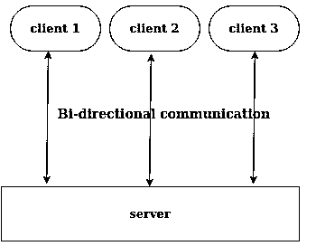

# 红宝石插座

> 原文：<https://www.educba.com/socket-in-ruby/>

## Ruby 中的套接字介绍

Ruby 中的 Socket 是一种将一个网络服务发送或通信到另一个网络服务的方式。我们使用 api 进行通信，但在套接字的情况下，它允许我们双向通信。这里，双向通信意味着网络可以在同一连接上发送和接收，因为通信后反映的变化不需要另一个调用或刷新(在更技术的方式中，它允许我们开发实时应用)。为了实现套接字，我们有许多不同的渠道，如 unix 域套接字、UDP、TCP 等，例如，您已经看到了股票交易网站，其中的更改会自动发生，而无需刷新页面，这意味着通信正在发生，任何更改都会在那里反映出来。

### Ruby 中的套接字类型

正如我们已经讨论过的，我们有各种类型的方法来使用套接字，在此基础上，我们可以在 Ruby 中有三种类型的套接字，如下所示。

<small>网页开发、编程语言、软件测试&其他</small>

#### 1.TCP 套接字

TCP socket 是 Ruby 的 socket 模块的一部分。如果我们想使用 TCP 创建套接字，那么我们可以使用 TCPSocket 类。对于这些类，我们需要提供目的地 IP 地址和目的地套接字的端口号。在这个的帮助下，我们将得到连接。如果连接失败或连接时出现错误，它将显示 Errno::econrefused。

`require “socket”
TCPSocket.new hostname port`

#### 2.Unix 套接字

UNIX bases sockets 是为在同一个系统上使用而设计的，在这里你可以把同一个系统指给你自己的计算机系统，它允许我们与同一个系统上的各种进程进行通信。基于 UNIX 的套接字速度更快，因为它们在同一个系统上，所以不需要检查路由。Unix socket 是 Ruby 的 socket 模块的一部分。如果我们想使用 UNIX 域流客户端创建套接字，那么我们可以使用 Ruby socket 模块的 UNIXSocket 类。这里我们需要将同一主机上的进程路径传递给 UNIXSocket 进行通信。

`require “socket”
UNIXSocket.new path`

#### 3.UDP 套接字

这里要注意的第一点是 UDP 是无连接的。UDP socket 是 Ruby 的 UDP socket 模块的一部分。如果我们想使用 UDP 创建套接字，那么我们可以使用套接字模块的 UDPSocket 类。这里我们需要将地址族传递给 UDPSocket 进行通信。要了解更多细节，我们可以阅读 UNIX 套接字可用的各种地址族。地址系列应该是整数值。

`require “socket”
UDPSocket.new [address_family]`

### Ruby 中 Socket 是如何工作的？

为了解释 Ruby 中 socket 的工作原理，我们将参考下面的图表和步骤。

*   在下图中，我们可以看到许多客户端连接到服务器，并在同一个连接上发送和接收响应。因此，我们将这种连接称为双向连接，因为双方都可以发送和接收数据。
*   每个客户端都将创建一个服务器实例，如 server instance = TCP socket . open(host，port-number ),并且可以读取服务器发送的任何数据。
*   其次，在服务器端，它将在特定端口 server = TCPServer.open(端口号)上打开应用程序。这里的端口号可以是任何整数值，如 3000、3002 等。客户端将使用相同的端口号进行通信。
*   一个 socket 的实时例子，如果你正在使用 facebook，那么你一定已经注意到，如果 facebook 上有任何通知，你不需要刷新页面来反映通知。因此，他们有自己的套接字系统，如果客户端有任何变化，该系统会自动将数据从服务器推送到所有连接的客户端。
*   服务器可以向所有连接的客户端发送数据，也可以从连接的客户端接收数据。

为了更好地理解，请遵循下图:

### 用 Ruby 实现 Socket 的例子

为了解释 Ruby 中套接字的一个例子，我们将创建两个文件，一个用于服务器端，另一个用于客户端。

让我首先借助以下步骤来解释服务器端代码:

*   我们已经包括了插座模块。
*   接下来我们在端口 2000 上创建或打开了一个服务器，我们可以使用任何其他端口来操作该服务器。
*   在已创建的连接实例上，我们正在等待任何客户端进行连接。
*   一旦有任何客户端使用我们定义的相同端口与此服务器连接，服务器就会发送一些数据。
*   这里我们发送日期，在发送日期之后，我们通知客户端关于套接字的关闭。

请参见下面的 socketServer.rb 文件示例和我们执行该文件的屏幕。

**文件 socketServer.rb，**

`require 'socket" # Including the socket module
serverSocket = TCPServer.open(2000) #Here we are opening socket on the port 2000
loop {
clientSocket = serverSocket.accept # Connect to the client
clientSocket.puts(Time.now.ctime) # Sending some data to the client
clientSocket.puts "We have done with the sending data to the client, now closing socket"
clientSocket.close # Close the socket
}`

**输出:**

一旦服务器启动，我们需要一些客户端与服务器连接，以获取服务器发送的数据。在下面的示例中，我们创建了一个服务器实例，其端口 2000 与服务器打开时的端口相同。一旦我们执行下面的文件，我们将得到服务器发送的输出。

请查看下面的代码示例以及输出屏幕。

**文件 clientSocket.rb**

`require 'socket' # Including the socket standard library of Ruby
hostName = 'localhost'
portNumber = 2000
socketServer = TCPSocket.open(hostName, portNumber)
while line = socketServer.gets # Here we are reading line coming from the socket
puts line.chop # Printing data
end
socketServer.close # We need to close the socket which we have open`

**输出:**

### 结论

从这些教程中，我们借助一个有用的真实例子学习了 Ruby 中 socket 的一些重要用途和基本概念，我们还借助图表和少量语法学习了 socket 的工作原理，这里我们也很少关注 socket 在真实世界用例中的使用。

### 推荐文章

这是一个关于 Ruby 中套接字的指南。这里我们讨论套接字的类型，它是如何工作的，以及用正确的代码和输出来实现的例子。您也可以浏览我们的其他相关文章，了解更多信息——

1.  [红宝石变量](https://www.educba.com/ruby-variables/)
2.  [Ruby 命令](https://www.educba.com/ruby-commands/)
3.  [Ruby 方法](https://www.educba.com/ruby-methods/)
4.  [Ruby do while](https://www.educba.com/ruby-do-while/)

