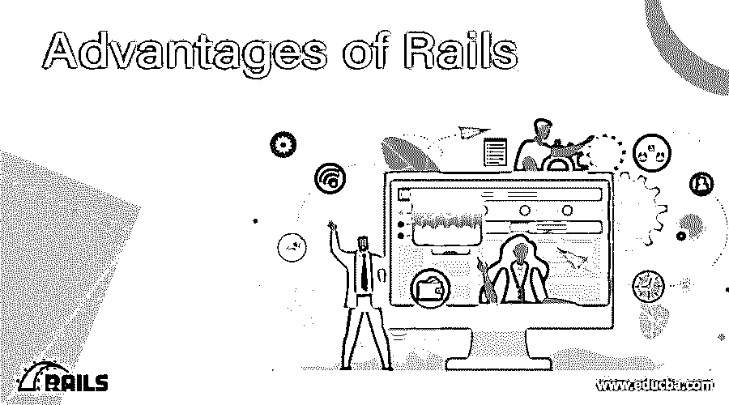
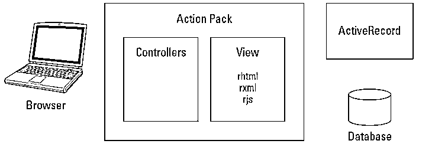
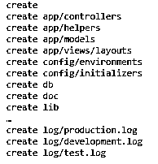

# 轨道的优势

> 原文：<https://www.educba.com/advantages-of-rails/>

## 导轨优势介绍

Rails 是将 Ruby 带到 Web 上的工具。以下是 rails 的一些优势:

*   Rails 用于创建应用程序框架。
*   Rails 生成控制器。
*   通过 Rails，我们可以通过向控制器添加方法来创建动作。
*   Rails 提供了一种创建视图模板的方法。
*   向 web 应用程序添加第二个操作。
*   渲染任何模板。
*   从视图链接到操作。

### Rails 优势

导轨具有以下优点:

<small>网页开发、编程语言、软件测试&其他</small>

#### 1.共同优势

*   Rails 是一个使用 Ruby 作为编程语言的 web 应用程序框架
*   Rails 提供了应用程序框架并添加了某些配置，因此不需要从头开始配置。
*   它使得基本的 CRUD 操作变得简单，就像我们过去在 servlets 和 [struts](https://www.educba.com/what-is-struts/) 等框架中所做的大量代码一样。在使用 Ruby 和 rails 时不会那么混乱，Rails 还消除了 XML 文件配置的[需求](https://www.educba.com/xml-commands/)

#### 2.Rails 独特且有优势的 MVC 设计模式

*   Rails 框架的核心是 MVC 设计模式。
*   ActiveRecord 和在 ActiveRecord 上构建的模型类提供了应用程序的模型层，该层提供了 rails 类和所用数据库之间的对象关系映射(ORM)。
*   Rails 应用程序的视图层是在 ERB 模板文件中实现的，ERB 文件是 HTML 和嵌入式 ruby 代码的混合，就像 JSP 文件一样。
*   Rails 支持两个内置文件:

1.  **RXML 文件**–使用 ruby 代码创建 XML 文件的方法
2.  **RJS 文件**——代表 Ruby Javascript，Action Pack 是 rails 实现这个特性的库。

*   rails 控制器实现也是 Action Pack 库的一部分，rails 保持了与客户端和服务器端交互的简单方法。

##### a) Rails 目录和内容

Rails 应用程序在目录结构和文件位置方面有一种通用的方式。这些目录及其各自的内容如下:

*   **app:** 所有应用程序的 MVC 代码放在哪里
*   **配置:**应用程序配置文件
*   **DB:** 数据库模式和迁移文件
*   **doc** :申请文件
*   **lib** :不属于 MVC 代码的特定于应用程序的定制代码
*   **log:**Rails 自动创建的应用程序日志文件
*   **public** : JavaScript、CSS、图片等静态文件
*   **脚本:**用于代码生成、调试和性能实用程序的 Rails 脚本
*   **测试:**单元测试相关代码和相关文件
*   **tmp**:Web 服务器使用的缓存、会话信息和套接字文件
*   **供应商:**安装 Rails 插件的位置

##### b) Rails 脚本

*   **Rails 控制台:**Rails 控制台是一个命令行实用程序，允许您在完整的 Rails 环境中直接从命令行运行 Rails 应用程序。在调试开发的代码时，这个工具很方便
*   WEBrick: WEBRick 是包含在 rails 框架中的 web 服务器，有助于在本地主机级别进行测试。
*   **生成器:** Rails 整合了生成脚本，用于为应用程序自动生成模型类和控制器。
*   **迁移:**用于定义数据库的结构，防止编写 [SQL](https://www.educba.com/what-is-sql/) 来创建一个数据库，数据库模式的每次改变都会产生单独的迁移文件。

#### 3.用 Rails 创建应用程序的优势

如下所述，需要遵循某些步骤

1.  使用 [rails 命令](https://www.educba.com/rails-commands/)创建项目
2.  数据库配置
3.  模型、服务和控制器创建
4.  应用程序样式

**步骤 1:** 项目创建

假设您正在创建一个名为“Phonebook”的项目，您可以创建一个目录来管理 rails 上的所有代码，然后键入给定的项目创建脚本“rails phone book*”*

一旦你这样做了，你会发现 rails 已经为你创建了结构/框架，典型的结构如下所示

您可以发现控制器、模型和视图一直在创建，将 MVC 设计模式内联，除此之外，rails 还为生产、开发和测试领域创建了日志。

*   **WEBrick 服务器创建**

键入命令“ruby script/server Webrick*”*，这使得 rails 启动服务器，服务器的名称作为参数传递，最后告诉 ruby 必须在可用选项中创建该服务器。

绑定到 WEBrick 的默认端口是 3000，如果需要，可以在环境变量中进行任何更改。

**步骤 2:** 数据库设置

让我们以 sqLite3 为例，告诉它为我们创建一个表

`sqlite> CREATE TABLE COMPANY(
ID INT PRIMARY KEY     NOT NULL,
NAME           TEXT    NOT NULL,
PhoneNumber     TEXT NOT NULL,
ADDRESS        CHAR(50),
);`

**第三步:** MVC 创建

首先使用给定的脚本生成模型“ruby script/generate model phone book”。这将在给定的目录中为您创建文件-

app/models/phonebook.rb //这代表你的模型对象
test/unit/phone book _ test . Rb
text/fixtures/phone book . yml
db/migrate
db/migrate/001 _ create _ phone book . Rb

*   **控制器和视图创建**

键入给定的命令来创建控制器和视图“ruby script/generate controller phone book ”,它会创建以下文件:

应用/视图/电话簿
应用/控制器/电话簿 _ 控制器. rb
测试/功能/电话簿 _ 控制器 _ 测试. rb
应用/助手/电话簿 _ 助手. rb

**步骤 4:** 执行应用程序并检查是否工作

首先在 app/views/phonebook 目录中创建一个模板，我们将该文件命名为“index.html.erb ”,在该文件中键入一些文本，如“嘿！它起作用”然后保存它。

通过给定的脚本“ruby 脚本/服务器”启动服务器

控制台将讲述这个故事，当应用程序运行时，转到 URL http://localhost:3000/contact/index 这里的 index 指的是您将创建的操作，从数据库中获取的结果将被传递，从而由视图呈现。

这是关于 rails 框架优点的基本介绍，您可以深入探究每个部分，还有一些可探究的高级特性，如下所述:

1.  使用 rails 进行 RESTful 开发
2.  使用带有 rails 的 ActionMailer 向订阅者发送电子邮件。
3.  active resource(REST 的客户端补充)和 XML(用于数据转换)
4.  使用 Capistrano 简化部署
5.  添加插件。
6.  使用原型和 rails

### 推荐文章

这是一本关于 Rails 优势的指南。在这里，我们讨论了在现实世界中使用 Rails 的一些优点的基本含义。您还可以查看下面的文章以了解更多信息–

1.  [阵列的优势](https://www.educba.com/advantages-of-array/)
2.  [区块链的优势](https://www.educba.com/advantages-of-blockchain/)
3.  [OOP 的优势](https://www.educba.com/advantages-of-oop/)
4.  [云计算的优势](https://www.educba.com/advantages-of-cloud-computing/)

