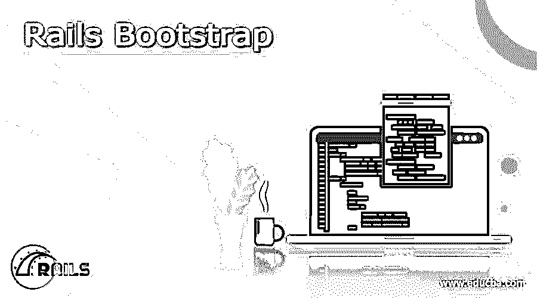
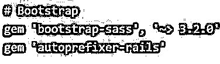
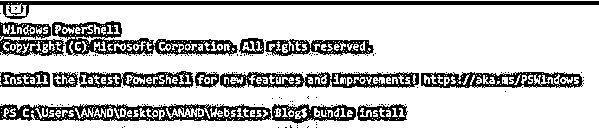
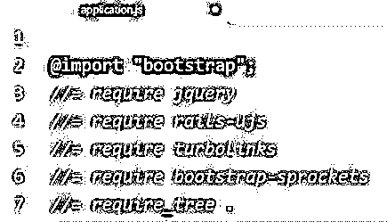
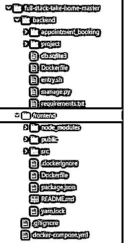

# Rails 自举

> 原文：<https://www.educba.com/rails-bootstrap/>

## Rails 引导程序简介

以下文章提供了 Rails 引导的概要。当需要开发响应性网站时，Bootstrap 开始发挥作用。Bootstrap 是一个开源框架，主要用途是在 web 应用程序世界中应用或设计响应性应用程序。bootstrap 的最新版本是 bootstrap 5。首先，我们需要理解 bootstrap 是一个基于 CSS 的框架。所以所有嵌入在基于引导程序的应用程序中的代码都将围绕 CSS 的概念被使用。bootstrap 的特性有助于开发高信息量的网页。bootstrap 的布局是 bootstrap 中最重要的元素，因为它们会影响整个页面。bootstrap 组件结合了三个主要项目，如 CSS 声明和 HTML 结构，这也将涉及 javascript 代码。

### 如何添加 Rails 自举？

用 bootstrap 添加 rails 是一个三步的过程；单独考虑引导程序的功能，引导程序可以分三步执行此操作；该过程涉及如何将软件包与已添加的引导相对应。接下来，该过程可能涉及如何通过包进一步添加引导。Post 包已经添加完毕，接下来的过程就是 bootstrap gem 添加的过程。这是一个非常关键的过程。该过程将负责打开与引导相关的各种项目。bootstrap-sass 和 autoprefixer rails 是必须添加到 bootstrap 应用程序中的两大亮点。这一过程将在下一节中解释。为了应用所有打开的宝石，捆绑器必须在后台执行。bundler 进程将负责应用 gem 文件中提到的所有 gem。这背后的过程解释如下，

<small>网页开发、编程语言、软件测试&其他</small>

下面是自举颜色比较模式及其十六进制值，供参考；在 bootstrap 中构建的所有 CSS 代码都将按照下面的列表考虑来执行，

| **名称** | 十六进制 | 红色 | 绿色的 | 蓝色 | 光 | 萨图尔。 | 价值 |
| **(RGB)** | **(RGB)** | **(RGB)** | **(RGB)** | **(HSL)** | **(单纯疱疹病毒)** | **(单纯疱疹病毒)** |
| 自举蓝 | #0D6EFD | 5% | 43% | 99% | 52% | 95% | 99% |
| 蓝色 | #0000FF | 0% | 0% | 100% | 50% | 100% | 100% |
| 自举靛蓝 | #6610F2 | 40% | 6% | 95% | 51% | 93% | 95% |
| 靛蓝 | #4B0082 | 29% | 0% | 51% | 26% | 100% | 51% |

### 如何创建 Rails 引导程序？

当必须将引导程序添加到应用程序时，要执行的第一个过程是使用包管理器服务(如 yarn、npm 和 pip)来确保安装引导程序包。在我们的例子中，我们使用 yarn package manager 服务安装了，这个过程的命令如下所示:

**命令:**

`yarn add bootstrap jquery @popperjs/core`

下一个过程涉及导航到 environment.js 文件。在 environment.js 文件中，我们可能需要将上面创建或生成的 bootstrap 包添加到系统的 jquery 执行路径中。为了执行这个操作，必须添加下面给出的代码，

**Environment.js 代码添加:**

`const { environment } = require('@rails/webpacker')
// These lines have to be added newly
const webpack = require("webpack")
environment.plugins.append("Provide", new webpack.ProvidePlugin({
$: 'jquery',
jQuery: 'jquery',
Popper: ['popper.js', 'default'] }))
// The newly added file ends here
module.exports = environment`

接下来的过程就是自举宝石添加的过程。这是一个非常关键的过程。该过程将负责打开与引导相关的各种项目。bootstrap-sass 和 autoprefixer rails 是必须添加到 bootstrap 应用程序中的两大亮点。这一过程将在下一节中解释。为了应用所有打开的宝石，捆绑器必须在后台执行。bundler 进程将负责应用 gem 文件中提到的所有 gem。这背后的过程解释如下，

**宝石文件中增加宝石:**

运行捆绑器的过程如下所述，在命令提示符下捆绑器已被执行。bundler 命令“Blog$ bundle install”用于解包和执行 bundler。这背后的过程显示在下面给出的截图。bootstrap-sass 和 autoprefixer rails 是必须添加到 bootstrap 应用程序中的两大亮点。这一过程将在下一节中解释。为了应用所有打开的宝石，捆绑器必须在后台执行。bundler 进程将负责应用 gem 文件中提到的所有 gem。

下一步是导入引导库，使用@import 命令导入引导库。非常重要的是，这个导入必须放在 application.js 文件中。application.js 文件，像 rails 应用程序的索引文件一样，必须包含第一次导入引导库的代码，只有当导入在这里很合适时，才可以发现所需的子包。从公开的应用程序包中，可以在应用程序中进一步使用相应的包，如 jquery、rails-ujs、turbolinks 和 bootstrap-链轮。在 application.js 文件中进行导入和揭示子包的代码在下面给出的快照中表示。

**Application.js 代码添加:**

现在张贴上面提到的项目的创建；引导必须准备好连接到相应的系统

### Rails 引导目录

rails 引导目录结构已经在下面给出的快照中提供；快照描述了添加引导数据库的过程，与引导数据库目录结构相关的各种文件夹可以从下面的部分获得。

### 结论

上述文章给出了关于如何使用引导程序、引导程序中的不同项目、如何将引导程序添加到 rails 结构以及添加过程中涉及的各个步骤的必要细节。此外，我们还将讨论控制台中 rails bootstrap 项目的目录结构。

### 推荐文章

这是一个关于 Rails 引导的指南。在这里，我们还将讨论定义以及如何添加和创建 Rails Bootstrap 及其目录。您也可以看看以下文章，了解更多信息–

1.  [铁轨的优点](https://www.educba.com/advantages-of-rails/)
2.  [轨道命令](https://www.educba.com/rails-commands/)
3.  [Ruby on Rails 的职业生涯](https://www.educba.com/career-in-ruby-on-rails/)
4.  [Ruby 哈希](https://www.educba.com/ruby-hashes/)

