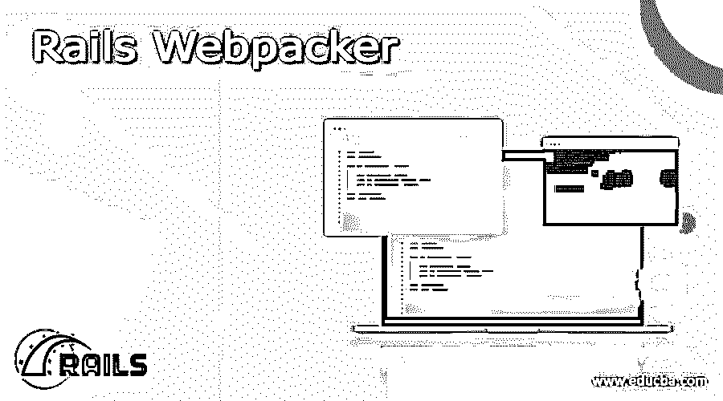
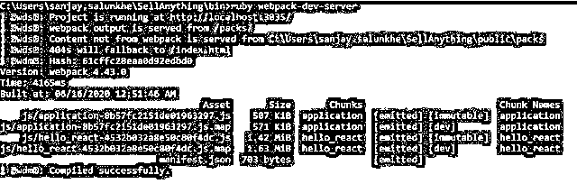

# Rails Webpacker

> 原文：<https://www.educba.com/rails-webpacker/>

## Rails Webpacker 简介

以下文章提供了 Rails Webpacker 的概要。Webpacker 是一个用来精细维护前端代码的实用程序或工具。这意味着当一个网站已经建好的时候，可能会涉及到大量的 HTML 文件。如果希望网站具有更好的前端功能和更多的交互性，那么就有必要使用大量的 javascript 和 CSS 文件。当交互性和前端功能越来越强时，可能需要的文件数量就越大。为了克服这种复杂性，webpacker 开始发挥作用。webpackers 帮助维护和轻松跟踪与网站或 web 应用程序相关的所有 javascript 和 CSS 代码。

### Rails Webpacker 的使用

webpacker 实用程序证明的一些主要使用需求如下:

<small>网页开发、编程语言、软件测试&其他</small>

*   帮助开发和部署服务器更快地重启。
*   允许反映 javascript 更改，而无需在每个实例上重新启动所使用的 web 服务器。
*   引入了大量的代码排列，这将有助于精心组织整个代码维护过程。重要的是，这里提到的代码代表 javascript 前端文件。
*   允许你的网站保持很大的互动性。
*   它允许灵活地管理和捆绑独立的文件，如。html，。javascript 和。css 打包成一个包，然后轻松地执行它们。

### 如何安装 Rails Webpacker？

让我们进一步讨论如何安装 webpacker 的过程。Webpacker 是一个连接 rails 应用程序和所有 HTML 代码到 webpack 的工具。这种连接简化了 javascript 应用程序的配置和开发，并使它们适用于生产环境。webpacker 的源代码将关联为一个 gem 文件；此外，开发服务器与服务器相关联。这是一个开发服务器，有助于保持开发过程非常快；之所以能够实现这一功能，是因为不需要在 javascript 文件中发生变化时启动和停止服务器。

下面我们来看看 webpacker 是如何设置的。Webpacker 可以安装在最新的 rails 版本中。安装 webpacker 的命令将是

命令:webpacker:install

### 如何创建 Rails Webpacker？

在创建 webpacker 的过程中，它将包含下面给出的要在后台生成的一组文件。webpacker 安装将以下列方式组织文件，

#### config/webpacker.yml

所有与环境相关的配置细节都在 webpacker.yml 文件中给出。该文件将保存有关所涉及的配置的详细信息。这将是主要配置文件。这些配置分别存储在每个环境的 config/webpack 目录下。下面讨论了一些重要的配置文件条目，

| 源路径 | 这里提到了所有 javascript 文件的位置。默认值是 app/javascript，可能没有必要故意更改该值。 |
| 源条目路径 | 所有包文件和条目文件都将在源条目路径中列出。 |
| 公共根路径 | 此处给出了可从浏览器访问的路径。 |
| 公共输出路径 | 编译 webpacker 文件时，所有编译好的文件都会被推送到 public_output_path 中。 |
| webpack _ 编译 _ 输出 | 当标志为真时，将编译所有的输出文件。 |

#### config/webpacker/

所有基于 javascript 的配置都在这个文件夹位置创建。关联的包将位于位置 app/javascript/packs 下。当编译过程启动时，每个包文件都将是一个 webpacker。我们可以从下面给出的文件中注意到，第一行用于导入给定的库；将在后台启动搜索，这是必需的。对于通常的方法，可能不需要初始化，因为初始化过程将在包含带有脚本标记的页面源代码时发生。

**示例 webpackerfile 文件:**

#### bin/webpack

webpack 位置用于保存所有生成的包。下面是 rails 应用程序创建过程中使用的各种选项或标志。每个标志将在应用程序创建过程中执行一些特定的相关操作。借助下面给出的标志，可以完成预配置数据库、跳过 javascript 文件等特定文件、捆绑包执行过程以及为应用程序选择模板等操作。“new–help”命令可用于列出与流程相关的所有标志。下面给出了命令的执行和输出。

#### bin/web pack-开发-服务器

这也是一个用于启动服务器的可执行文件，服务器将负责加载 javascript 包中的 webpacks。运行服务器的过程包括以下五个主要步骤，

| 设置环境 | 环境和 rails 的名称已经设置好了。如果没有指定环境，那么将采用开发环境作为假设。 |
| 装载配置 | 允许在下一步加载 webpacker.yml |
| 验证命令选项 | 这将检查是否已将正确的选项作为服务器命令传递。如果传递了不正确的选项，将会引发错误。 |
| 验证端口可用性 | 确定端口是否可用。这用于帮助端口的同步可用性检查。例如，当一个不同的程序使用了一个特定的端口时，该进程将出现端口不可用的错误。这种不可用性将被捕获。 |
| web pack 命令服务 | 当目录模块存在时，程序将执行目录中的命令，否则命令将在 yarn 中执行。 |

**Webpack 服务器执行示例屏幕截图:**

### 结论

上面给出的文章清楚地解释了如何在 rails 中使用 web maker。它还解释了如何使用 webpacker 来执行 rails。它的关键应用是什么？此外，还解释了安装中涉及的不同过程以及安装后用于代码维护的目录结构。

### 推荐文章

这是一个 Rails Webpacker 的指南。在这里，我们还将讨论 Rails Webpacker 的定义、用法以及如何安装和创建它。您也可以看看以下文章，了解更多信息–

1.  [铁轨的优点](https://www.educba.com/advantages-of-rails/)
2.  [轨道命令](https://www.educba.com/rails-commands/)
3.  [Ruby on Rails 的职业生涯](https://www.educba.com/career-in-ruby-on-rails/)
4.  [Ruby 哈希](https://www.educba.com/ruby-hashes/)

