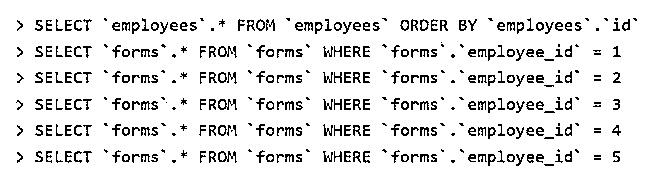

# Rails 包括

> 原文：<https://www.educba.com/rails-includes/>

## Rails 简介包括

以下文章提供了 Rails includes 的概要。Ruby rails 是一个应用程序窗口，有几个选项使程序对用户友好。Ruby rails 包括一个助手工具，用于集成命令。包括，根据用途，使用两种方法，它们是预加载和快速加载。Includes 不会为每个数据库生成 N 个 SQL 相反，它将汇总所有查询并减少后端数据生成的负载。它以集成的方式处理数据。它在使用 Ruby rails 生成应用程序时非常有用，在那里可以轻松处理大量数据。

### Rails 包括什么？

在讨论中，最典型的问题之一是活动记录中的 includes 函数是如何工作的，然而许多开发人员并不清楚它是如何工作的。因此，值得一提的是，该方法的行为非常有趣，因为它会根据场景而变化。使用 includes，Active: Record 保证所有给定的关联都用最少数量的可行查询加载。因此，当用一个表查询另一个表的数据时，两个表都被加载到内存中。

<small>网页开发、编程语言、软件测试&其他</small>

### 如何使用 Rails 包括？

Rails 将确保以最少的输入或查询输入所有数据。当从用户那里收集查询时，表格格式的输入数据将被存储在存储器中。在一个典型的场景中，如果我们有 N 个查询，系统将在后端生成 N+1 个 SQL 数据，并存储在内存中。但是不会生成那么多 SQL 数据。它会将所有查询组合成一个单亲内存。此外，includes 不会生成单独的查询来从内存中提取数据。即使嵌套查询也不会生成 N+1 个查询。其思想是，只有当编码效率低时，才生成 N+1 个查询。

让我们以 5 名雇员为例；因此，将生成 6 个 SQL 查询。

我们进行了六次数据库访问，因为我们在第一次查询中加载了雇员，然后进行了五次进一步的查询来获取每个雇员的表单。换句话说，在 N = 5 的情况下，会发生 N + 1 次 SQL 选择。

要在 rails 中生成 include 命令，请打开 Ruby rails 应用程序，并按以下格式键入命令。

下一步将使用适当的命令来获取记录。在示例中，该命令将从用户那里获取注释。user_id 为零，如图所示。

### Rails 包含问题

Rails 的主要问题或限制是所使用的数据量，我们需要大量的 SQL 查询。此外，加载数据以建立关系需要更多时间。

让我们看一个博客创建应用程序的场景。

如果我们希望在故事列表中的每一项都包含几个注释，那么代码如下:

在上面的代码中，我们可以看到我们正在创建一个博客，在那里我们将得到一个故事列表，这些故事得到了许多评论作为输入。因此，如果我们使用一个简单的数据库调用，将会为每个输入创建多个 SQL 查询。

在这种情况下，我们需要使用包含的注释来提高性能。

因此，这里我们包括两个注释来执行函数。

在这个博客部分，你知道了什么问题可以使用 includes 函数。但这是表面水平。但是，有时，我们可能会有这样的经历，包括在某些情况下表现不同。

### Rails 中使用的两种方法包括

下面给出了使用的两种方法:

*   事先装好
*   急切装载

#### 何时使用预载？

如果我们想要访问相关的记录，我们使用 preload 一次。但是，如果我们想要通过关联的记录来过滤记录，我们想要选择 eager-load；例如，需要通过访问故事和评论中的相关信息来收集每篇文章的评论数。因此，使用的预载被包括在内。

如果我们将查询从:

到

将会生成一个新的查询，因为将使用急切加载而不是预加载。

#### 预载与急载

当我们希望访问相关记录时，使用 Preload，它运行两个查询:一个加载主记录，另一个加载相关记录。

使用关联记录(注释)过滤记录并不容易，因为要运行两个不同的查询:

我们需要通知 ActiveRecord 我们希望引用另一个表，在本例中是 comments 因此，引用(:注释)组件。我们刚刚通知 ActiveRecord，我们希望访问相关记录并使用它们来过滤查询，这样它就不必进行两次查询。

当 preload 不是一个选项时，就使用 eager load，它生成一个带有左外连接的查询来获取符合条件但包含评论的文章。

### 结论

因此，在这篇博客中，我们了解了 Ruby rails 中的 includes。根据需要，有两种方法可以使用 includes。此外，我们开始知道在 ruby rails 中使用 includes 函数的必要性。在最好的情况下，如果我们需要测量应用程序中查询的性能，您需要使用最有效的方法。一般来说，使用 includes 会产生高性能的代码，为代码库中的其他开发人员提供最好的体验——当然，还有使用你的应用的消费者。了解更多关于 Ruby rails 的知识，这有助于使用 Ruby rails 处理 N 个数据，而不会获得 N+1 个 SQL 查询。

### 推荐文章

这是一个导轨指南，包括。在这里我们讨论的介绍和如何使用 Rails 包括？问题和两种方法，分别。您也可以看看以下文章，了解更多信息–

1.  [Ruby on Rails 职业生涯](https://www.educba.com/career-in-ruby-on-rails/)
2.  [Ruby On Rails 语言](https://www.educba.com/ruby-on-rails-language/)
3.  [Ruby 哈希](https://www.educba.com/ruby-hashes/)
4.  [轨道命令](https://www.educba.com/rails-commands/)

