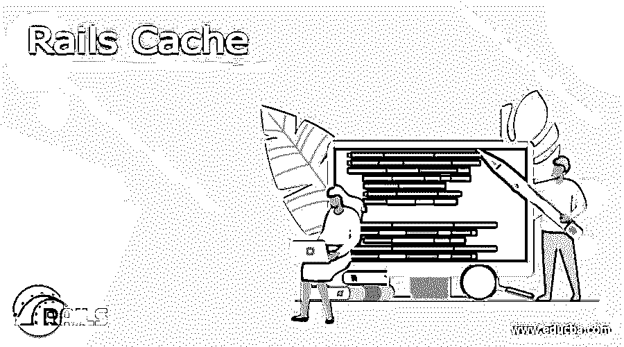

# Rails 缓存

> 原文：<https://www.educba.com/rails-cache/>

## Rails 缓存简介

缓存是一个临时存储生成的内容的过程。这些内容主要是在请求-响应场景中创建的。因此，当一个 HTTP 请求被提出并生成相应的响应时，这就是 Rails 缓存进程发挥作用的时候。缓存的目的是缓存的信息将响应类似的请求。缓存服务的一个重要方面是这些缓存服务将提高应用程序的性能。因此，缓存服务的主要用途是，它可以捕捉和维持大量并发用户的负载，而不管系统是安装在单个服务器上的单个系统上。

### 为什么要使用 Rails 缓存？

缓存是几乎所有 web 技术的一部分。当术语 web 技术开始起作用时，将考虑缓存过程。如前所述，应用程序中必须使用的高速缓存的主要优势是它能够提高或增强系统的整体性能。这是缓存系统的主要优势。在所有方面，高速缓存系统将增加应用系统的能力。通过该技术提高性能的主要方面是，高速缓存系统将有助于保存先前请求的良好存储，这些请求将在发出后续请求时被接收回来。这是这些缓存系统的最大优势。从 rails 的角度来看，有几种方法可以让缓存系统发挥作用。我们将在文章的下一节讨论使用缓存系统的方法。

<small>网页开发、编程语言、软件测试&其他</small>

### Rails 缓存的类型

rails 缓存有几种划分方式；不同类型的 rails 高速缓存如下，

#### 1.页面缓存

这里，缓存过程将在页面级别执行。因此，在这种缓存过程中将考虑整个页面。因此，页面级缓存是一个过程，在这个过程中，在特定页面上执行的操作将完全存储为 HTML 文件。因此，当进一步引发类似的操作时，可以检索和处理整个存储的页面。因此，这个过程将涉及动态内容生成。分页级缓存过程是一种粒度级别，更适合应用程序用户之间差别不大的页面。

#### 2.动作缓存

动作缓存是一个在动作级别执行缓存的过程。它们非常类似于页面级缓存过程。页面级缓存和动作级缓存的主要区别在于，缓存调用将被路由到控制器，控制器将决定可以应用什么过滤器。可以对控制器级类中的任何方法执行动作链过程。只需在代码中使用一行语法就可以实现动作缓存，

**语法:**

`caches_action :<action_name>`

**举例:**

`class ElementsController < ActionController
before_filter :authenticate
caches_action :page_index`

#### 3.片段缓存

片段级缓存是 rails 提供的缓存服务的下一部分。这是一种被认为是最细粒度的缓存技术。片段缓存是一种相当细粒度的缓存服务。当只有几个动作部分需要大范围更改时，片段级缓存过程非常有用。因此，每当某些东西需要频繁更改时，片段级缓存就会发挥作用。片段缓存的主要区别在于它只能在模板级完成，而不能在控制器级执行。这是片段级缓存服务的首要优势。片段缓存对于缓存应用程序中的小部件来说是非常重要的。下面是如何在片段级别执行缓存的示例。在下面的例子中，产品在部门级别列出，将产品封装在缓存标签中将允许 rails 处理片段缓存过程。

**举例:**

`# _elements.html.erb
<% cache(element) do %>

<%= link_to element, element.name %>: <%= element.price%>

<%= perform the intended operation%>

<% end %>`

### Rails 中的其他缓存技术

除了上面讨论的类型，在 rails 中还可以通过其他几种方式执行缓存；下面已经讨论了它们，

可以执行 HTTP 缓存，这涉及到对应用程序的最少更改，并在 HTTP 级别缓存缓存数据。

低级缓存是缓存过程直接遍历 rails 对象的地方。它可以用来存储任何检索成本非常高的数据。这些数据可以认为有些过时了。这种缓存技术广泛用于涉及数据库级调用和 API 级调用的项目。性能提高的主要方面或技术是缓存系统将帮助保存以前请求的良好存储，这些请求将在发出后续请求时被接收回来。

### Rails 缓存清除

清除与 rails 缓存服务相关的缓存可以在命令级别执行。为了执行这个操作，使用了 rails cache clear 命令。

**命令:**

`Rails.cache.clear`

该命令非常有用，可以清除缓存存储中的所有内容，不管它们是什么系统。更具体地说，为了表示存储在文件存储中的高速缓存和存储在 mem_cache_store 中的高速缓存，当在控制台中使用清除高速缓存命令时，这两个高速缓存都将被清除。

### 结论

本文非常简要地讨论了缓存的各种技术和必要性。本文指出了为什么在基于 web 的技术中使用缓存服务，以及如何借助 rails 缓存服务提升应用程序的性能。

### 推荐文章

这是一个关于 Rails 缓存的指南。在这里，我们还将讨论定义、使用原因、类型以及 rails 中的其他缓存技术。您也可以看看以下文章，了解更多信息–

1.  [铁轨的优点](https://www.educba.com/advantages-of-rails/)
2.  [轨道命令](https://www.educba.com/rails-commands/)
3.  [Ruby on Rails 的职业生涯](https://www.educba.com/career-in-ruby-on-rails/)
4.  [Ruby 哈希](https://www.educba.com/ruby-hashes/)

