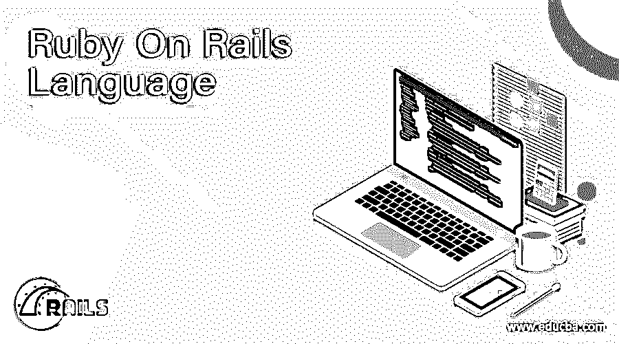
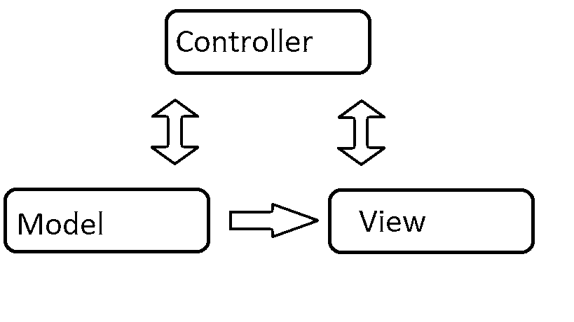

# Ruby On Rails 语言

> 原文：<https://www.educba.com/ruby-on-rails-language/>




## Ruby On Rails 语言简介

听说过 Ruby on Rails 语言吗？如果您对 web 开发感兴趣或者已经研究了一段时间，那么您可能已经听说过它。简单地说，它是一种用于 web 开发的流行语言。如果您是一名经验丰富或对 Ruby on Rails 语言感兴趣的 web 开发人员，那么这可能是您进入这种奇妙语言之旅的良好起点。你可能也熟悉其他的 web 开发形式，如 [PHP](https://www.educba.com/rails-vs-php/) ，Perl， [Java](https://www.educba.com/bundle/pwyw-javascript-2016-bundle/) ，Python。

### Ruby on Rails 语言的历史

Ruby on Rails 语言的开发可以追溯到 2004 年，David Heinemeier Hansson 选择了当时相对不太出名的编程语言 Ruby，因为他认为 Java 和 PHP 不够灵活或强大。他使用 Ruby 开发了 Rails，这是他自己的 web 开发框架——基于简单的、现有的和经过验证的想法，而不是使用全新的、实验性的想法。Ruby on Rails 语言的成功在很大程度上是因为它基于这些成熟的范例。

<small>网页开发、编程语言、软件测试&其他</small>

### 什么是 Ruby on Rails 语言？

它是一个基于模型-视图-控制器模式的框架，将应用程序分成三个部分:


#### 1.模型

模型是描述您的应用程序正在解决的问题的行为或结构的业务对象。它们通常由对象关系映射框架支持，将您的对象持久化到后台的数据库中。

#### 2.视角

视图本质上是向用户呈现数据的模板，也是应用程序呈现部分的逻辑。

#### 3.控制器

它的核心是控制器，它处理客户机请求，启动模型中的更改，并触发模板的呈现。

因此，简单地说，模型是你的后端应用程序功能，视图是用户看到的模板和表示方面，控制器决定什么在什么时候做什么。Rails 专注于以某种方式做事，并围绕这种方式简化它们的元素。因此，如果您选择在 Rails 上构建，就必须按照 Rails 的方式来做。你可以用不同的方式做事，但可能会有点麻烦。所有这些使它看起来在方法上相当有限，但事实是这种方法实际上类似于大多数程序员所做的。事实上，开发 Rails 首先是为了程序员的生产力，而不是纯粹的性能。

当然，这也意味着它可能比 Python 或 PHP 上的类似堆栈要慢一些。现在，要使用它，你需要已经安装了一些东西。

*   Ruby 的最新版本。
*   RubyGems 打包系统，Ruby 自带的。
*   正在运行的 SQLite3 数据库安装。

**推荐课程**

*   [在线免费 Python 培训](https://www.educba.com/software-development/courses/python-certification-course/)
*   [完成免费软件测试课程](https://www.educba.com/software-development/courses/selenium-training-certification/)
*   [免费 Java 编程培训](https://www.educba.com/software-development/courses/java-course/)

### 创建新 Rails 项目的分步指南

按照下面给出的步骤，一个接一个地用 Ruby on Rails 语言创建一个示例应用程序。

这里的示例应用程序是一个简单的 weblog(博客)。在开始之前，您需要在系统上安装 Rails。说到您的系统，下面给出的例子使用$来表示终端提示符。您的系统可能会有不同的显示。Ruby on rails for Windows，提示符应该是 C:\source_code >。

#### 步骤 1:安装 Ruby on Rails 语言

有很多工具可以用来在你的系统上快速安装 Ruby on Rails 或者 Ruby。如果你用麦克 OS X，你可以用东海道。对于 Windows 用户来说，Rails Installer 是一个不错的选择。

首先打开命令行提示符。从“开始”菜单中选择“运行”,如果您使用的是 Windows，请键入 cmd.exe；如果您使用的是 Mac OS X，请打开 Terminal.app。没有 SQLite3 的 Windows 用户和其他人可以从 SQLite3 网站安装它。现在，验证您已经安装了:

```
$ ruby –v
```

这应该会返回您安装的 Ruby 版本。

```
$ sqlite3 –version
```

这应该会返回您安装的 SQLite3 版本。

现在，是时候使用 RubyGems 的 gem install 命令安装 Rails 了。

```
$ gem install rails
```

现在，键入以下命令来验证安装:

```
$ rails --version
```

这应该会返回已安装的 Rails 版本，您可以继续了。

#### 步骤 2:创建应用程序

既然您已经掌握了 Ruby on Rails 编程语言和 SQLite3，那么是时候开始制作应用程序了。Rails 有很多名为“生成器”的脚本，旨在使开发变得更加容易。这些生成器创建开始工作任务所需的一切。一个这样的生成器是“新应用生成器”。这为创建一个全新的 Rails 应用程序提供了必要的基础，这样您就不必自己编写一个了。

要使用这个生成器，您需要打开一个终端并导航到您可以创建文件的目录。在那里，您需要键入以下内容:

```
$ rails new blog
```

这将在博客目录中创建一个名为‘Blog’的 Rail 应用程序。gem 文件中提到的所有 gem 依赖项都已经安装在使用预打包包的目录中。您可以通过运行 rails new–h 命令来查看这些命令行选项。

创建博客应用程序后，切换到其文件夹:

```
$ cd blog
```

博客目录有几个自动生成的文件夹和文件，这构成了 Rails 应用程序的结构。本 ruby on rails 编程语言教程的大部分内容都在 app 文件夹中，但下面快速浏览一下每个文件夹的功能:

*   **App:** 它包含应用程序的控制器、视图、模型、助手、资产和邮件程序。
*   **Bin:** 该文件夹包含启动应用程序的 rails 脚本和用于设置、部署或运行应用程序的其他脚本
*   **Config:** 这个文件夹有应用程序数据库、路由等等。
*   **ru:** 这是用于启动应用程序的机架式服务器的机架配置。
*   **Db:** 这个包含您的数据库模式和数据库迁移。
*   **lock:** 这些文件使您能够为 Rails 应用程序指定必要的 gem 依赖项。它们被 Bundler gem 使用。
*   **Lib:** 这些是扩展应用模块。
*   **日志:**这些是应用程序日志文件。
*   **Public:** 唯一会被外界看到的文件夹，包含编译后的资产和静态文件。
*   **Rakefile:** 该文件加载并定位可从命令行运行的任务，任务通过 Rails 组件定义。您可以通过将文件添加到 lib/tasks 目录来添加自己的任务，而不是编辑现有的 Rakefiles。
*   **doc:** 这是一份指导手册，您可以根据自己的应用进行编辑。
*   测试:拥有单元测试、夹具等测试设备。
*   **Tmp:** 他们有付费，缓存，会话文件。
*   供应商:这是第三方代码进入的地方。

#### 第三步:开始

让我们从快速张贴一些文字开始。您需要首先启动并运行您的 [Rails 应用服务器](https://www.educba.com/advantages-of-rails/)。

以下是您的操作方法:

**启动网络服务器:**

您实际上已经设置了一个功能应用程序，但是您需要在开发机器上启动 webserver 来启动它。

为此，您需要在博客目录中运行以下命令:

```
$ bin/rails server
```

如果运行 ruby on rails for Windows，需要直接将 bin 文件夹中的脚本传递给 Ruby bin/rails 服务器。要编译 JavaScript 或 CoffeeScript 资产压缩，首先需要在您的系统上有一个 JavaScript 运行时。如果没有运行时，在编译资源时会看到 ExtJS 错误。不过，Windows 和 Mac OS X 机器通常都会安装运行时。

运行 ExeJS 将启动 web 服务器 WEBrick，这是 Ruby 的默认分布式服务器。通过打开浏览器并导航到[http://localhost:3000 . org](https://www.localhost3000.org/)，您可以看到您的应用程序正在运行。您将在这里看到 Rails 默认信息页面。

在终端窗口中使用 Ctrl+C 来停止 web 服务器。如果服务器已经停止，您应该能够看到命令提示符光标。开发模式下的 Rail 通常不需要重启服务器。服务器通常会自动获取文件中的所有更改。

您看到的信息页面是您的新应用程序的第一个测试。它确保正确配置所有必要的工具和软件。一切都在正确的位置。您还可以通过选择关于您的应用程序的环境链接来查找您的应用程序环境的摘要。

#### 第四步:下一步

下一步是让 Rails 说“你好”，这需要一个控制器和视图。控制器将接收应用程序的请求，并使用路由来确定获得特定请求的控制器。在许多情况下，每个控制器有不止一个路由，路由也可以服务于不同的动作来收集信息以输出视图。视图旨在以用户易于理解的格式显示信息。请记住，信息是在控制器而不是视图中收集的；视图只是显示信息。默认情况下，视图模板是用嵌入式 Ruby 或 eRuby 编写的。这种语言在发送给查看器之前，由请求周期在 Rails 中进行处理。

要创建一个新的控制器，您需要运行控制器生成器，将其命名为“welcome”，并使用一个名为“index”的操作。

下面是设置它的代码:

```
$ bin/rails generate controller welcome index
create  app/controllers/welcome_controller.rb
route  get 'welcome/index'
invoke  erb
create    app/views/welcome
create    app/views/welcome/index.html.erb
invoke  test_unit
create    test/controllers/welcome_controller_test.rb
invoke  helper
create    app/helpers/welcome_helper.rb
invoke  assets
invoke    coffee
create      app/assets/javascript/welcome.js.coffee
invoke    scss
create      app/assets/stylesheets/welcome.css.scss
```

记下控制器和视图的位置，因为这是重要的信息。现在，在文本编辑器中打开 app/views/welcome/index . html . erb 文件，并删除所有现有代码。

用这个替换它:

```
<h1>Hello, Rails!</h1>
```

在这个阶段，您现在必须设置 Rails，以便在需要时显示 Hello 消息。在这个例子中，它需要在您访问[http://localhost:3000 . org](http://localhost:3000.org)时出现。接下来，您必须告诉 Rails 您的实际主页的位置。为此，请在文本编辑器中打开 config/routes.rb 文件，并键入以下内容:

rails . application . routes . draw do

```
get 'welcome/index.'
```

我们刚才打开的文件是您的应用程序的路由文件，它以特定于领域的语言保存条目，告诉 Rails 如何将请求连接到动作和控制器。该文件在注释行上有几个示例路线。找到以词根开头的行并删除注释。它应该类似于以下内容:

```
root 'welcome#index'
```

现在，如果您停止了 web 服务器，请重新启动它，并导航到 localhost URL。您应该会看到您刚才写的问候信息。

#### 第五步:向前迈进

现在是时候让事情变得复杂一点了。现在，您将在博客应用程序中创建一个新资源。该资源是相似文章或对象的集合。创建、读取、更新和销毁资源项被称为 CRUD 操作。Rails 有一个资源方法来声明一个标准的 REST 资源。

以下是您的操作方法:

```
Rails.application.routes.draw do
resources :articles
root 'welcome#index.'
end
```

如果您正在运行 bin/rake 路线，您将会看到它已经有标准 REST 选项的路线。您还会看到 Rails 已经推断出了文章的形式，并利用了这些区别。

```
$ bin/rake routes
Prefix Verb   URI Pattern                  Controller#Action
articles GET    /articles(.:format)          articles#index
POST   /articles(.:format)          articles#create
new_article GET    /articles/new(.:format)      articles#new
edit_article GET    /articles/:id/edit(.:format) articles#edit
article GET    /articles/:id(.:format)      articles#show
PATCH  /articles/:id(.:format)      articles#update
PUT    /articles/:id(.:format)      articles#update
DELETE /articles/:id(.:format)      articles#destroy
root GET    /                            welcome#index
```

### 结论

Rails 旨在通过假设每个开发人员都需要开始做的某些事情来简化 web 应用程序编程。您可以用更少的代码在 Rails 上编写应用程序，同时实现比其他框架或语言更多的功能。

Rails 哲学有两个主要原则:

*   不要重复你自己:不要重复你自己或者 DRY 是一个软件开发原则，它规定，“每一项知识在一个系统中必须有一个单一的、明确的、权威的表示”。这意味着不要反复编写相同的代码。它使整个程序更少错误，更具可扩展性和可维护性。
*   **约定胜于配置:**还记得我们提到的 Rails 方式吗？Rails 认为它自己的一套关于 web 应用程序功能的约定是做事情的最佳方式。它默认使用这些约定，因此您不必通过配置文件指定每一项。

### 推荐文章

这是 Ruby On Rails 语言指南。在这里，我们将讨论入门、历史和 5 个步骤指南，它们对于开始使用 ruby on rails 语言非常有帮助。您也可以看看以下文章，了解更多信息–

1.  [Ruby 文件](https://www.educba.com/ruby-file/)
2.  [红宝石变量](https://www.educba.com/ruby-variables/)
3.  [红宝石中的螺纹](https://www.educba.com/thread-in-ruby/)
4.  [为 Ruby 中的循环](https://www.educba.com/for-loop-in-ruby/)


