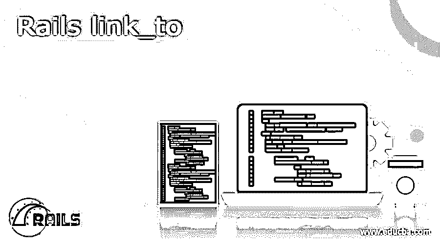

# Rails link_to

> 原文：<https://www.educba.com/rails-link_to/>

## Rails link_to 的定义

Link_to 是 Rails 支持的一个帮助器方法。Rails 能够为给定的对象创建路线或链接。它可以帮助提供到文档的特定部分或整个文档本身的超链接。此外，link_to 在我们在文档中使用的视图类型中没有重要作用。在生成 URL 时，要使给定类的任何子链接指向它们对应的路径，可以使用这个 link_to。

### 概观

基本上，整个互联网网页的工作原理是在网页之间建立链接。因此，在一个页面和另一个页面之间导航很重要。所以，我们需要一个助手来链接页面。帮助器链接页面的一个例子是 Rails link_to。rails link_to 是一个助手，它帮助我们创建一个到现有主文档的超链接。Rain link_to 将被创建为锚点标签或 h-ref 标签。锚标记是一种 HTML 代码，它创建了到另一个页面或现有文档的特定部分的另一个链接。link_to 代码创建的锚元素在一组选项的帮助下使用 URL。用于通过此链接的锚元素不仅是 hash (#)，还可以是 strings。可以使用 back 符号而不是 hash 符号来生成 referrer。如果 JavaScript 中没有使用 referer，那么将使用 back link 代替 referer。当 nil 作为链接传递时，名称本身将成为链接的值。

<small>网页开发、编程语言、软件测试&其他</small>

`link_to(name = nil, options = nil, html_options = nil, &block)`

HTML 中的 link_to 和 Rails 中的 link_to 是有区别的。在一个简单的 HTML 中，link_to 的用法如下(见下文)。

`<a href="/ruby-book">Improve Your Ruby Skills</a>`

在 Rails 中 link_to 克林会是这样的，如下所示。

`<%= link_to "Improve Your Ruby Skills", "/ruby-book" %>`

主要区别在于 Rails 中路线的使用。因为路由有使用 _path 方法的优点。此外，我们可以实现我们的链接的 href 标签(锚标签)，这是生成的。使用 Rails link_to 的另一个优点是，我们不需要插值，因此链接变得更容易。

### 如何使用 Rails link_to？

选项和参数:

1.第一个参数将是链接上的文本。

2.第二个参数是我们要链接的 URL。在这里，如果需要，我们可以使用硬核。或者我们可以使用 Rails 模型或 _path 方法。

例如:

`<%= link_to "Improve Your Ruby Skills", book_path(@book) %>`

或者

`<%= link_to "Improve Your Ruby Skills", @book %>`

使用 Rails 的另一个优点是，当使用适当的约定时，它能够识别正确的东西。它能够区分单数和复数对象。

**3。单复数形式的使用:**

当使用单数宾语时，例如，当我们只使用一首特定的歌曲时，从特定的资源使用术语歌曲。当我们提到资源的集合时，请使用正确的复数形式，例如歌曲。

`# Plural
<%= link_to "All songs", songs_path %>
# Singular
<%= link_to "Edit Song", edit_song_path(@song) %>`

上面的代码显示了使用 link_to 时单词的正确用法之间的明显区别。“耙路线”将帮助我们跟踪我们希望跟踪的路线。

### 创建 Rails link_to

使用查询参数和锚点创建链接总是很有帮助的。使用 Rails link_to，我们可以创建 URL，也可以链接图片。在这一部分中，我们将看到使用 URL 和图像创建链接的示例代码。使用 Rails link_to 的额外优势是可以从生成的 URL 访问额外的数据。

创建如下所示的 URL

`"/songs#programming"`

应该使用如下所示的代码创建链接:

`<%= link_to "Programming songs", songs_path(anchor: "programming") %>`

要获得所需的所有灵活性，请使用 URL 助手，如 _path 或 _URL 以及 link_to。

为了链接图像，下面的例子有助于理解。

许多人不知道 link_to 可选块。这也有助于我们将自己与图像联系起来。下面的代码就是一个例子。

`<%= link_to songs_path do %>
<%= image_tag "song Collection" %>
<% end %>`

上面的例子解释了现在可选块将是图像，或者在其他情况下，它将是可点击的链接文本或 HTML 元素。

### 删除铁路连接至:

要删除铁路 link_to，有两种方法可用。第一个是术语“确认”，另一个是术语“禁用 _with”。让我们看一看例子来清楚地理解这一点。

`<%= link_to "Delete Song", @book, method: "delete", { confirm: "Are you sure?", disable_with: "Processing..." } %>`

在上面的例子中，我们试图删除正在生成的歌曲链接。链接的默认动作通常是获取请求。因此，现在我们正在尝试删除正在生成的链接。显然，删除操作要更加具体。
在这种情况下，如果我们要链接到上一页，在删除现有的链接后，那么下面的例子将解释这一点。
< %= link_to【返回】，:back % >

### 结论

Rails link_to 基本上帮助我们在页面之间或者任意两个内容之间创建链接。它能够以 URL 的形式创建链接。与普通 HTML link_to 相比，使用 Rails link_to 还有一些额外的优势。这里，Rails link_to 使用路由。还有许多其他的优点，比如，我们可以创建 URL，不仅可以链接文本，还可以链接图片。我们能够创建和删除使用 link_to helper 代码创建的超链接。在这篇博客中，我们看到了选项和参数，除此之外，我们还看到了创建和删除 lins_to 选项。

### 推荐文章

这是一个 Rails link_to 的指南。这里我们讨论定义，概述，如何使用 Rails link_to？带代码实现。您也可以看看以下文章，了解更多信息–

1.  [张量流概率](https://www.educba.com/tensorflow-probability/)
2.  [张量流展平](https://www.educba.com/tensorflow-flatten/)
3.  [PyTorch Conv2d](https://www.educba.com/pytorch-conv2d/)
4.  [TensorFlow Keras Model](https://www.educba.com/tensorflow-keras-model/)

