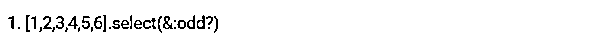
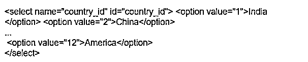
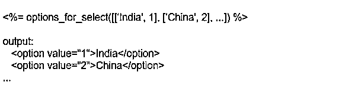
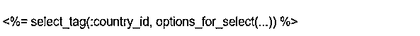
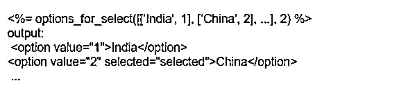

# 轨道选择

> 原文：<https://www.educba.com/rails-select/>

## 轨道选择的定义

在 Ruby rails 中，我们使用一些助手来使用户感到轻松。这是另一个助手，被称为选择。这个助手用于从整个数据集中过滤出所需的数据。或者用户可以从对象数组中过滤任何数据。要使用 select，用户应使用 block。但是我们也可以将 select 与其他帮助器结合使用，比如 enumeration 或 enum。类似于“GET”，一个帮助在 web 浏览器上搜索和获取您的需求的助手，助手“Rails select”可以在 Ruby rails 中使用。

### 什么是 Rails Select？

正如我们上面讨论的，Rails 使用一些标签或助手从任何给定的数组中过滤出所需的数据。Rails select 的工作方式与 Rails 非常相似。但是这两者之间有一个小小的区别。他们速度不同。让我简单地告诉您 Rails select 标签是如何工作的。因此，当给定辅助标记 Rails select 时，从一组对象(数组)中，将发生一些迭代来找出并选择给定的关键字。

<small>网页开发、编程语言、软件测试&其他</small>

在这里，我们将详细了解搜索标签的工作原理。最初，当我们给出输入时，ActiveRecord 将进入画面。这将把 Ruby 类型的记录转换成数据库记录。当我们给标记 Ruby-select 时，这个过程从搜索块开始，首先将数据库转换成 Ruby 对象。然后，它将进行多次迭代，从给定的对象数组中提取所有可能的相关数据。这里，时间仅用于转换过程。在 ruby rails 中使用这个 helper 标签的另一个好处是，我们可以使用用户定义的 select 关键字来监控数组块中迭代所用的时间。缺陷是，select 的内存消耗会更多。在下一节中，我们将看到如何使用这个助手标记来选择客户定义的关键字。

### 如何使用 rails select？

正如我们所知，我们使用 Ruby select 来过滤掉我们想要的对象，select 需要一个块。在块内，它试图用对象数组评估你的块，比如它是真还是假，或者它是否可以从数组中选择对象等等。让我们看一个如何使用 Ruby rails 的例子。

因此，如果我们有一个数字数组，并且只需要选择奇数，代码将如图所示。使用 select 有两种可能的方式。

以上两个代码可以在 Ruby rails 控制台中用来从给定的数组中选择奇数。后一种代码是更简化的形式。所以，当我们需要直接从数组中调用对象时，这个方法会更好。我们也可以将 select 标签和 hash 标签一起使用。

### 轨道选择方法:

在上一节中，我们看到了创建 Rails select 的基本方法。还有其他方法可以将 select 与其他辅助标记结合起来。另一种方法是结合 _index 和就地过滤数组本身。

在 with_index 辅助标记中，select 标记起作用。过滤过程借助于索引而不是对象(如字符串或数字)进行。通常我们知道，select 标签只对对象有效。在另一种方法中，就地过滤阵列的工作方式略有不同。因此，当我们在 Ruby 中使用 select 标记时，它将创建一组新的数组。如果我们想改变原始数组中的对象本身，我们可以用 select 选项来实现。这是一个额外的优势！

### Rails 选择示例:

在 HTML 中创建选择框需要大量的标记(每个选项有一个选择元素)，动态生成最有意义。

下面是一个标记示例:

用户将得到一组国家，它们的名字显示在上面的例子中。在内部，应用程序只想处理它们的 id，因此它们被用作选项的值属性。让我们探索一下 Rails 能为我们做什么。

Select 标签是最通用的助手；它只是构造了 SELECT 标记，该标记包装了一个选项字符串:

这是一个开始，但是选项标签不是动态创建的。“选择助手”的选项可用于创建选项标签:

options for select 的第一个输入是一个嵌套数组，包含两个元素:选项文本(国家名称)和选项值(选项值)(国家 id)。该选项的值就是将发送给我们的控制器的内容。这通常是相应数据库对象的 id，然而，这并不总是正确的。

有了这些知识，我们可以一起使用 select 标记和 select 选项来获得所需的完整标记:

您可以通过将选项的值提供给 options for select 来预先选择选项。

如果正在生成的选项的内部值与该值匹配，Rails 会将所选属性添加到该选项中。

### 结论

因此，在这篇博客中，我们有机会详细了解名为 rails_select 的助手标签。我们也看到了优点和缺点。我们尝试与另一个名为 where 的助手进行比较和对比。简而言之，概括一下，亮点如下:通过设置块和创建数组来选择作品。它通过重复迭代进行搜索。这通常需要很长的时间和记忆。我们可以将这种方法与其他不同的方法结合起来，如 with_index 等。，我们也通过一些例子看到了如何使用这个助手标签。此外，我们还看到了一些详细的例子来理解这个 helper 标签如何在 Ruby rails 应用程序上工作的后端。希望你理解了这个博客，祝你阅读愉快。

### 推荐文章

这是一个导轨选择指南。这里我们讨论定义，什么是 rails select，如何使用 Rails Select，方法和代码实现的例子。您也可以看看以下文章，了解更多信息–

1.  [铁轨的优点](https://www.educba.com/advantages-of-rails/)
2.  [轨道命令](https://www.educba.com/rails-commands/)
3.  [Ruby on Rails 职业生涯](https://www.educba.com/career-in-ruby-on-rails/)
4.  [Rails vs PHP](https://www.educba.com/rails-vs-php/)

