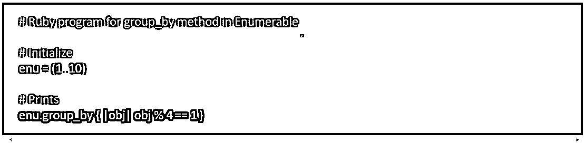
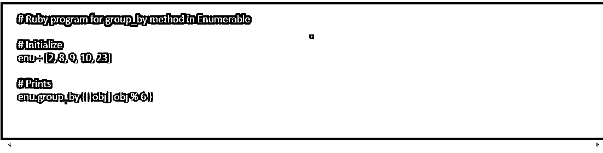
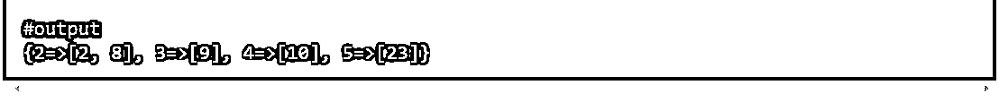
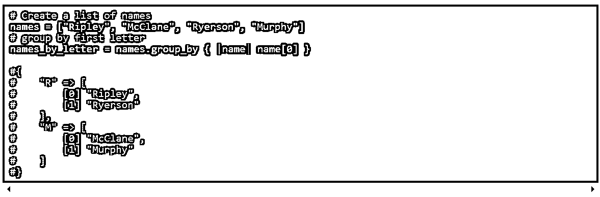
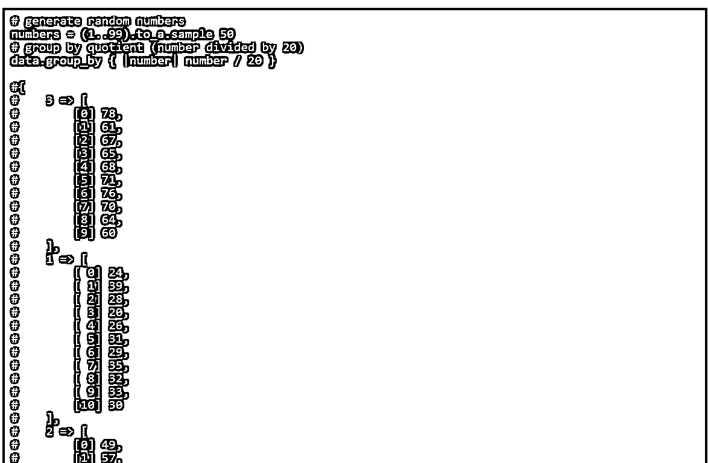
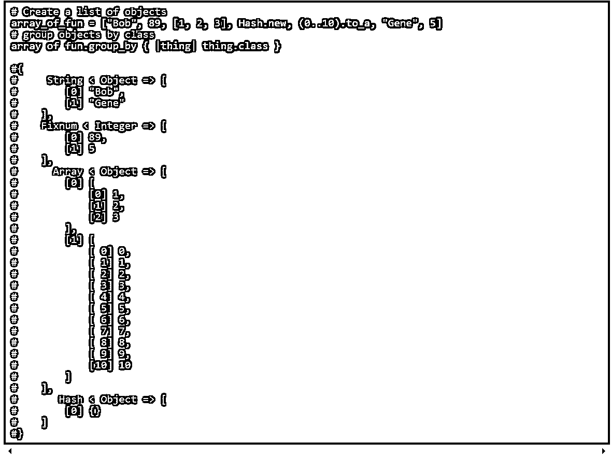

# Rails 分组依据

> 原文：<https://www.educba.com/rails-group_by/>

## Rails group_by 简介

下面的文章提供了 Rails group_by 的概要。ruby rails 编程中的 Group by 就是数据类型之一。可枚举集合的集合是将结果分组到一个块中的先决条件。例如，我们可以按日期对记录进行分组。Ruby 中的 group_by 函数允许我们根据任意属性对对象进行分组。因为它是可枚举模块的一部分，我们可以在任何需要进行多次迭代的地方使用它。要使用 group_by，需要理解两个概念。数组是用于分组的项以及与数组中的对象匹配的值的集合。

### 说明 Rails_group by

正如其中所引用的，Ruby 在 Enumerate 中包含了一个强大的库，允许我们这些程序员拥有细粒度的管理。但是，我们可以列举一组或另一组方法，累一个崇高的方法。Group_by 允许我们在精确的基础上建立项目。这种信息在 ruby rails 应用程序中特别有用。我们要识别确定的概念，把机构的信息归入某一类。首先，收集需要分组的小工具(例如，数组)。您希望应用于机构的规则，ones gadgets group_by 返回一个散列，其中包含通过我们的分组规则确定的关键字和值，这些值与我们的唯一集合中的项目相匹配。让我们来看看 group_by 的三个真实的全局时间！文档中明确指出，在调用 group_by 之后，必须使用一个代码块。该方法将利用该块作为排列项目和使用该行的标准。功能强大的 group_by 函数可以被任何可枚举的对象访问，这意味着你可以以任何有意义的方式组织条目、键或值。鲁比会帮助我们做到这一点。

<small>网页开发、编程语言、软件测试&其他</small>

首先，让我们看看如何使用字符串进行分组。然后，我们可以看到如何按整数分组，第三，让我们看看如何按各种对象分组。当基于字符串分组时，我们必须记住我们存储的姓应该是字符串，以便该数据类型可以在执行函数时比较字符串。然后根据姓名的第一个字母进行分组。第二个是基于整数的分组。分组任务将从给定的数字或整数数组中执行。请记住，仅基于输入函数，分组将会发生。所以，定义你想如何执行这个函数。对对象进行分组的第三种方法是按类进行分组。因此，如果我们有一个包含不同类型对象的数组，比如说，同时包含数字和字符串，我们可以根据它们所属的类对它们进行分组。对于每种类型，让我们在下一节中看看例子。

### 如何使用 Rails group_by？

enumerable 的 group_by 方法返回一个散列值，在这个散列值中，组被分组后，作为块的结果被维护在一起。如果没有提供块，则返回一个枚举数。

语法:

`enu.group_by { |obj| block }`

参数:该函数接受一个可选块，该块指定如何进行分组。

它返回一个散列值作为结果。

要初始化 group_by 函数，请在控制台中打开 Ruby rails 应用程序。

然后在用逗号分隔的方括号中清楚地定义你的对象射线(见例子)。然后调用函数 group_by，用花括号定义所需的确切分组类型。

执行该功能。参见所示示例；你会明白如何调用函数。上面也清楚地提到了语法。因此，很容易使用名为 group_by 的函数，这在实时中很重要。

### Rails group_by 示例

让我们看看如何根据字符串或字母对数组中的对象进行分组。因此，下面的例子是根据名称的首字母对对象进行分组。在本例中，names 数组包含四个不同的名称；调用函数根据字母对它们进行分组。在输出中，第一个字母相同的字母被分组。类似地，可以在一个数组中存储“n”个对象，并且可以调用 group_by 函数。

现在让我们看看如何根据整数对对象进行分组。在下面的例子中，数组中给出了一组从 1 到 100 的随机整数的对象。接下来，调用函数 group_by，定义当数字除以 20 时，用商对对象进行分组。

下面的示例中也显示了输出。在这里，您观察到分组是通过商度发生的。例如，如果商是 1，则这些数字被分组，如果商是 2，则它们被分组。因此，基于给定的输入，分组发生了。

在下一个例子中，我们将看到如何根据对象的类别对对象进行分组。由于数组在名称方面包含整数和字符串，因此函数定义得很清楚，分组应该基于类进行。因此，数字归入一类，名字归入另一类。因此，如果它包含不同类对象的组合或混合，group_by 将有助于根据它包含的类来分离它们。但是，请再次记住，应该清楚地定义函数。

这些都是一些人为的例子，但是当与其他方法结合使用时，group_by 对于组织你的项目可能是有用的。现在是时候开始分组了！

### 结论

Group_by 就是这样一个简单的函数，它可以实时地帮助对大量数据进行分组。上面的例子解释了如何正确地对数据进行分组。你可以试着根据用户的需求将它们分组。这是一个简单而有用的函数，我们可以在 Ruby rails 应用程序中使用。

### 推荐文章

这是一个 Rails group_by 指南。在这里，我们还将讨论指令以及如何使用 Rails group_by 以及示例和输出。您也可以阅读以下文章，了解更多信息——

1.  [Ruby on Rails 的职业生涯](https://www.educba.com/career-in-ruby-on-rails/)
2.  [轨道命令](https://www.educba.com/rails-commands/)
3.  [铁轨的优点](https://www.educba.com/advantages-of-rails/)
4.  [Ruby On Rails 语言](https://www.educba.com/ruby-on-rails-language/)

