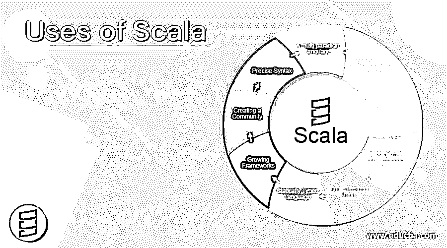

# Scala 的使用

> 原文：<https://www.educba.com/uses-of-scala/>

## Scala 使用简介

Scala 是一种用于函数式编程和强静态系统的编程语言。它是面向对象的，运行在 JVM 上。它能够与现有的 Java 代码和库进行互操作。它被认为是一种静态类型语言，没有原始数据的概念。它由马丁·奥德斯基设计，于 2004 年 6 月正式发布。作为一种提供多核架构的多范式语言，它有很多优点。下面介绍 Scala 的主要用途或应用，以及它受欢迎的原因。

### Scala 的十大用途

以下是 10 大用途列表:

<small>网页开发、编程语言、软件测试&其他</small>

**1。多范例语言**

Scala 是一种支持面向对象编程和函数式编程的语言，学习起来很有好处。学习这些可以建立必要的、逻辑的、功能的和面向对象的技能。你可以很容易地探索函数式和 OOP 的两个方面。Scala 允许你定义不同类型的数据属性和行为属性。Scala 函数被认为是第一个允许你传递值并且支持匿名函数的类。这使得它很优雅，也是 Scala 在市场上如此受欢迎的最大原因之一。

**2。它可以与 Java** 合并使用

Scala 运行在 Java 虚拟机(JVM)上。要看用 Scala 的人想不想用 Java。Java 的这种互操作性是 Scala 的最佳选择之一。这使得 Scala 开发者可以直接从 Scala 代码中使用 Java 的所有库。这对 Java 开发人员也是有益的，因为他们也可以很容易地利用他们在 Scala 中的技能。也可以从 Java 调用 Scala 代码，用户可以很容易地用 Scala 编写程序的任何部分，而用 Java 编写其余部分。因此，这一特性使用户能够用 Java 和 Scala 编写代码，并同时使用这两种语言。

**3。模式内置语言**

Scala 是在瑞士大学开发的，目的是在编程语言研究中为 Java 等主流语言创造新的创新。这种语言已经有了一些内置的最佳实践和模式。变量是不可变的，在 Java 中很容易重载。除此之外，它还提供采用新的语言，如 Python、Ruby 等。实现函数式编程。

**4。一种表达**的语言

Scala 是一种天生比 Java 更具表现力的语言。在 Java 之后学习 Scala 的开发人员会发现用 Scala 编写代码更加容易和有趣。为了了解这种语言与 Java 相比的美妙之处，让我们看一个例子。

Java 代码:

`Public class wordcount{
Public static void main(String [] args){
StringToken st= new StringToken(args[0]);
Map<String, Integer> map= new HashMap<String, Integer>();
while(st.hasMoreTokens()) {
String word= st.nextToken();
Integer count= map.get(word);
If(count == null)
map.put(word, count+1);
}
System.out.println(map);
}
}
Scala code:
Object WordCountScala extends App {
Println( args(0).split(“ ”).groupBy(x => x).map(t => t._1 -> t._2.length))
}`

Scala 中的代码更加精确和简洁。它以更好的方式解释了代码。

**5。市场需求高**

一个开发人员需要永远受欢迎。使用 Scala 的主要原因还是为了更好的成长和就业。学习 Scala 会增加你的需求，会让你更有市场。许多公司如 Twitter、LinkedIn、Foursquare 等都在使用 Scala。一旦你学会了 Scala 的用法，你就可以轻松地获得你想要的提升。在不久的将来，由于 Scala 的可伸缩性，所有的投资银行和金融机构都将使用它。有许多公司分享 Scala 的有效使用方法。它将很快成为 Java 的第一选择。

**6。静态类型语言**

静态类型语言避免了代码中的错误，并帮助程序员编写正确的代码和容易地调试代码。在动态语言中，错误只有在运行程序时才可见。Scala 的使用提供了静态和动态语言的精华。它看起来是动态的，但却是强静态类型的语言。Scala 为变量和函数提供了类型推断，比 [Java 和 C#](https://www.educba.com/java-vs-c-sharp/) 中有限的类型推断要好得多。它还提供了一个完全使用类型引用的编译器。

7 .**。成长框架**

Scala 的应用程序提供了各种库，因此它可以用来构建许多框架。许多公司都在努力让 Scala 成为主流语言。已经有很多像 Lift 和 Play 这样的框架出现了。另一个基于 Scala 的框架，Akka，它是并发的，像一个工具包和运行时一样建立，用于构建高度并发、分布式和容错的系统。它还为 JVM 上的事件驱动应用程序提供了一个更好的平台。

**8。创建社区**

Scala 可以说是一种发展迅速的语言，许多程序员将加入 Scala 的行列。甚至懂 Java 的开发人员现在也开始学习 Scala。有许多新的库和框架正在 Scala 的应用上构建。有许多正在构建的 ide 支持 Scala，并且比 Eclipse 和 IntelliJ 提供更好的支持。使用 Scala 也有原因，因为它本质上是动态的。除此之外，它是面向对象的，并提供函数式编程。

**9。精确语法**

Scala 的另一个用途是它有非常精确的语法。Java 有很长的语法。Scala 可读性更强，同时也更简洁。称为 scalac 的 Scala 编译器可以生成更好的代码，比如 to String()、equals()等。

10。相对容易学

Java 编程人员发现学习任何函数式语言都很困难。由于 Scala 面向对象的功能，它的使用非常简单。Scala 有清晰的语法、漂亮的库、优秀的在线文档，业内有很多人在使用它。

### 结论

因此，一旦你学会了 Scala，它就有很多用途。它一定会增加你作为开发商在市场上的价值。您将能够开发新的框架并使用这种语言的动态特性。Scala 在全世界范围内流行，你的职业生涯将会达到新的高度。

### 推荐文章

这是 Scala 在现实世界中的使用指南。在这里，我们讨论了 Scala 的不同用途，比如多范例语言、不断发展的框架、创建社区、精确的语法等等。您也可以阅读以下文章，了解更多信息——

1.  [Scala 面试问题](https://www.educba.com/scala-interview-questions/)
2.  [Splunk 的用途](https://www.educba.com/uses-of-splunk/)
3.  [Clojure vs Scala](https://www.educba.com/clojure-vs-scala/)
4.  [Groovy vs Scala](https://www.educba.com/groovy-vs-scala/)

