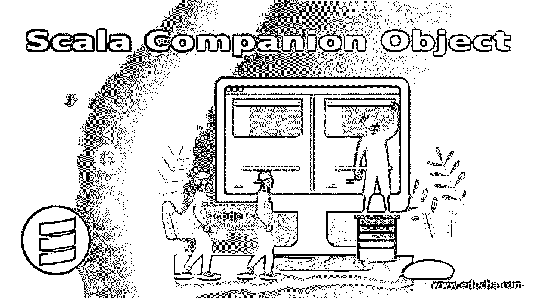
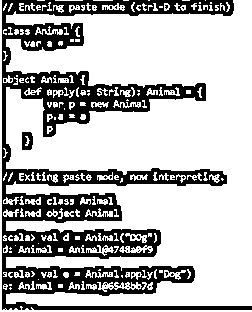
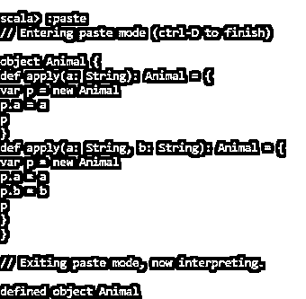
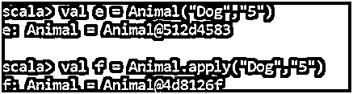
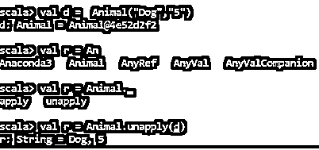
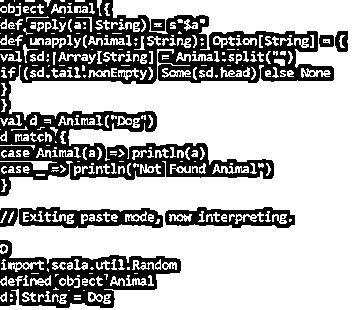

# Scala 伴随对象

> 原文：<https://www.educba.com/scala-companion-object/>




## Scala 伴随对象简介

Scala companion 是 Scala 文件中与 class 同名的对象。它可以访问私有成员。它们有编译成类的静态方法。与 Scala 中的类名同名的对象，在与类相同的文件中声明，称为 Scala Companion，类称为 Companion class。

它们是很好的代码封装器，是功能代码和面向对象代码的桥梁。伴随对象提供了代码中静态和非静态方法之间的清晰画面。

<small>网页开发、编程语言、软件测试&其他</small>

**语法:**

```
// SCALA CODE :-
Class Class_Name
{
//class methods and body
}
Object Class_Name
{
// Object Body
}
```

### 伴随对象是如何工作的？

Scala 伴随对象允许我们创建一个类的实例，而不需要使用 new 关键字。在伴随对象中有一个工厂方法 apply，它让我们可以在不使用 new 关键字的情况下调用对象。它就像 Scala 中的一个语法糖，在编译期间用 apply 方法转换代码。

拥有一个伴随对象的好处是我们可以访问它们的私有成员。

#### 示例#1

**代码:**

```
class Animal {
var a = ""
}
object Animal {
defapply(a: String): Animal = {
var p = new Animal
p.a = a
p
}
}
defined class Animal
defined object Animal
scala>val d = Animal("DOg")
d: Animal = Animal@4748a0f9
scala>val e = Animal.apply("Dog")
e: Animal = Animal@6548bb7d
```

**输出:**




这里我们看到，借助于伴随对象，我们能够直接调用该方法。

这个 apply 方法可以有多个参数，并且伴随对象可以有多个 apply 方法来提供多个构造函数。

#### 实施例 2

**代码:**

```
class Animal {
var a = ""
var b = ""
}
object Animal {
defapply(a: String): Animal = {
var p = new Animal
p.a = a
p
}
defapply(a: String, b: String): Animal = {
var p = new Animal
p.a = a
p.b = b
p
}
}
scala> val e = Animal("Dog","5")
e: Animal = Animal@512d4583
scala>val f = Animal.apply("Dog","5")
f: Animal = Animal@4d8126f
```

**输出:**







### Scala 伴随对象的方法 Unapply

这里我们看到，添加 apply 方法让我们可以创建新的对象，同样，我们可以使用 UNAPPLY 方法来解构造实例。

在伴随对象中应用 unapply 方法会创建一个提取器方法来从对象中提取字段。unapply 方法在匹配表达式中启用了一种方便的模式匹配形式。

#### 示例#1

**代码:**

```
class Animal {
var a = ""
var b = ""
}
object Animal {
defapply(a: String): Animal = {
var p = new Animal
p.a = a
p
}
defapply(a: String, b: String): Animal = {
var p = new Animal
p.a = a
p.b = b
p
}
defunapply(p: Animal): String = s"${p.a}, ${p.b}"
}
scala>val d = Animal("Dog","5")
d: Animal = Animal@4e52d2f2
scala>val r = Animal.unapply(d)
r: String = Dog, 5
```

**输出:**




在这里我们可以看到，该方法没有将对象实例分解成单独的组件。

这个伴随对象在 scala 模式匹配中有很大的作用，因为方法 unapply 接受一个对象并输出参数。

#### 实施例 2

**代码:**

```
object Animal {
defapply(a: String) = s"$a"
defunapply(Animal: String): Option[String] = {
valsd: Array[String] = Animal.split("")
if (sd.tail.nonEmpty) Some(sd.head) else None
}
}
vald = Animal("Dog")
d match {
case Animal(a) =>println(a)
case _ =>println("Not Found Animal")
}
```

**输出:**




所以在上面这段代码中，我们在 Animal 类中使用了 apply 和 unapply 方法来创建和模式匹配。

这里，对象应用方法用于根据动物的名字创建它，而取消应用方法用于反转它。因此，当在 case 类内部调用时，我们调用上面的 unapply 方法，而对象的正常调用将调用 apply 方法。

因此，在这种特殊方法的帮助下，我们能够用 scala 编写模式匹配代码。

```
vala = Animal("Dog")
```

调用 apply 方法

```
Animal.apply(“Dog”)
```

调用用于模式匹配的 unapply 方法。

```
a match {
```

```
case Animal(a) =>println(a)
Animal.unapply(“Dog”)
```

**Note:** Both the Apply and unapply methods are now available for free when we create the Class using the Case Class methodology.

这样，我们就可以在 scala 代码中使用 Scala 伴侣对象，并使对象调用部分变得更容易。

### 结论

从上面的文章中，我们对 Scala 伴侣对象有了一个更公平的想法，并且我们检查了它在 Scala 应用程序中是如何帮助的。我们检查了如何将方法应用于伴随对象和用于调用对象而不使用 new 运算符。通过这几个例子，我们看到了如何在伴随对象上应用和取消应用方法。

这是 SCALA 的一个非常有趣的概念，它让我们清楚地了解了对象的创建。

### 推荐文章

这是一个 Scala 伴侣对象的指南。在这里，我们讨论 Scala Companion Object 及其不同示例和代码实现的简要概述。您也可以浏览我们推荐的其他文章，了解更多信息——

1.  [科特林 vs Scala |十大对比](https://www.educba.com/kotlin-vs-scala/)
2.  [Scala 数据类型概述](https://www.educba.com/scala-data-types/)
3.  [Scala for 循环|前 6 个例子](https://www.educba.com/scala-for-loop/)
4.  [Scala 高阶函数](https://www.educba.com/scala-high-order-functions/)


