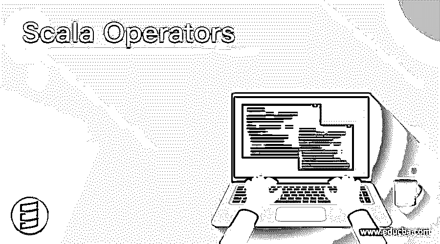

# Scala 运算符

> 原文：<https://www.educba.com/scala-operators/>

## Scala 运算符简介

运算符用于在任何编程语言中执行逻辑和数学计算。 [Scala 还有](https://www.educba.com/what-is-scala/)各种运算符来执行各种计算和任务，但它们是作为方法实现的，因为 Scala 是一种[面向对象的语言](https://www.educba.com/object-oriented-programming-in-java/)，因此它将每个符号视为对象，将操作视为方法。它们使计算变得简单和容易。

Scala 中的不同操作符有:

<small>网页开发、编程语言、软件测试&其他</small>

*   算术运算符
*   [赋值运算符](https://www.educba.com/assignment-operators-in-java/)
*   关系运算符
*   逻辑运算符
*   [按位运算符](https://www.educba.com/bitwise-operators-in-javascript/)

现在让我们详细研究一下每个运算符。

### Scala 算术运算符

这些运算符用于执行数学计算或运算。

| **操作员** | **符号** | **解释** | **格式** |
| 添加 | + | 将两个操作数相加 | x + y |
| 减法 | – | 从左操作数中减去右操作数 | x y |
| 增加 | * | 将两个操作数相乘 | x * y |
| 分开 | / | 分子除以分母 | x / y |
| 系数 | % | 返回除法运算后的余数 | x % y |

**示例:**Scala 中的算术运算符

**代码:**

`object Arith {
def main (args: Array [String]) {
var a = 10;
var b = 5;
println (a + b);
println (a – b);
println (a * b);
println (a / b);
println (a % b)
}
}`

**输出:**

scala> Arith.main(空)

Fifteen

Five

Fifty

Two

Zero

### Scala 赋值运算符

这些运算符用于为变量或对象赋值。

| **操作员** | **符号** | **解释** | **格式** |
| 分配 | = | 将右操作数的值赋给左操作数 | x = y + z |
| 添加 | += | 将两个操作数相加，最后将值赋给左边的操作数 | x += y |
| 减法 | -= | 从左操作数中减去右操作数，然后将值赋给左操作数 | x -= y |
| 增加 | *= | 将两个操作数相乘，并将值赋给左边的操作数 | x *= y |
| 分开 | /= | 将左操作数除以右操作数，并将值赋给左操作数 | x /= y |
| 系数 | %= | 计算两个操作数的模，并将值赋给左边的操作数 | x %= y |
| 按位 AND | &= | 比较两个操作数的二进制值，如果两个操作数都为 1，则返回 1，否则返回 0，并将值赋给左边的操作数 | x &= 5 |
| 按位或 | &#124;= | 比较两个操作数的二进制值，如果两个操作数都为 0，则返回 0，否则返回 1，并将值赋给左边的操作数 | x &#124;= 5 |
| 按位异或 | ^= | 比较两个操作数的二进制值，如果两个操作数相同，则返回 0，否则返回 1，并将值赋给左边的操作数 | 十. ^= 5 |
| 左移 | <<= | 将位向左移位，并将结果赋给左操作数 | x <<= 5 |
| 右移 | >>= | 将位向右移位，并将结果赋给左操作数 | x >>= 5 |

**示例:**Scala 中的赋值操作符

**代码:**

`object Assign {
def main (args: Array [String]) {
var a = 10;
var b = 5;
println (a += b);
println (a –= b);
println (a *= b);
println (a /= b);
println (a %= b);
a = 20;
b = 15;
println (a &= b);
println (a |= b);
println (a ^= b);
println (a <<= 2);
println (a >>= 2);
}
}`

**输出:**
scala > Assign.main(空)

Fifteen

Ten

Fifty

Ten

Zero

Four

Eleven

Four

Sixteen

Four

### Scala 关系运算符

这些操作符在检查上述条件后返回布尔值。

| **操作员** | **符号** | **解释** | **格式** |
| 等于 | == | 如果两个操作数相等，则返回 true，否则返回 false | x == y |
| 不等于 | != | 如果两个操作数不相等，则返回 true，否则返回 false | x！= y |
| 大于 | > | 如果左操作数大于右操作数，则返回 true，否则返回 false | x > y |
| 不到 | < | 如果左操作数小于右操作数，则返回 true，否则返回 false | x < y |
| 大于或等于 | >= | 如果左操作数大于或等于右操作数，则返回 true，否则返回 false | x >= y |
| 小于或等于 | <= | 如果左操作数小于或等于右操作数，则返回 true，否则返回 false | x <= y |

**示例:**Scala 中的关系运算符

**代码:**

`object Relation {
def main (args: Array [String]) {
var a = 10;
var b = 5;
println (a == b);
println (a != b);
println (a > b);
println (a < b);
println (a >= b);
println (a <= b);
}
}`

**输出:**

scala> Relation.main(空)

错误的

真实的

真实的

错误的

真实的

错误的

### Scala 逻辑运算符

这些运算符也根据输入或操作数返回布尔值。

| **操作员** | **符号** | **解释** | **格式** |
| 逻辑与 | && | 如果两个操作数都不为零，则返回 true，否则返回 false | x && y |
| 逻辑或 | &#124;&#124; | 如果任何操作数非零，则返回真，否则返回假 | x &#124;&#124; y |
| 逻辑非 | ! | 它反转操作数。为假返回真，反之亦然 | !英语字母表的第 24 个字母 |

**举例:**Scala 中的逻辑运算符

**代码:**

`object Logic {
def main (args: Array [String]) {
var a = true;
var b = false;
println (a && b);
println (a || b);
println !(b);
}
}`

**输出:**

scala> Logic.main(空)

错误的

真实的

真实的

### Scala 按位运算符

这些运算符对位进行运算，并返回相应的整数值作为输出。

| **操作员** | **符号** | **解释** | **格式** |
| 二进制与 | “&”号 | 按位检查操作数，如果两位都是 1，则返回 1，否则返回 0 | x & y |
| 二元或 | &#124; | 按位检查操作数，如果两位都是 0，则返回 0，否则返回 1 | x &#124; y |
| 二元异或 | ^ | 按位检查操作数，如果两位相同，则返回 0，否则返回 1 | x ^ y |
| 二进制非 | ~ | 返回 1 的补码，即从 1 变为 0，反之亦然 | ~x |
| 二进制左移 | << | 左操作数的位向左移位右操作数提到的位数 | x << 3 |
| 二进制右移 | >> | 左操作数的位向右移位右操作数提到的位数 | x >> 3 |
| 二进制右移零填充 | >>> | 左操作数的位向右移位右操作数提到的位数，移位后的值用零代替。 | x >>> 3 |

**举例:**Scala 中的按位运算符

**代码:**

`object Bit {
def main (args: Array [String]) {
var a = 10;
var b = 5;
println (a & b);
println (a | b);
println (a ^ b);
println ( ~ b);
a = 16;
b = 12;
println (a >> b);
println (a << b);
println (a >>> b);
}
}`

**输出:**

scala> Bit。主(空)

Zero

Fifteen

Fifteen

Ten

Four

Sixty-four

Four

### 推荐文章

这是 Scala 操作符的指南。这里我们讨论 Scala 运算符的基本概念和不同类型，并举例说明。您也可以阅读以下文章，了解更多信息——

1.  [Scala 的用途](https://www.educba.com/uses-of-scala/)
2.  [Scala 中断](https://www.educba.com/break-in-scala/)
3.  [Scala 版本](https://www.educba.com/scala-versions/)
4.  [Scala 数据类型](https://www.educba.com/scala-data-types/)

