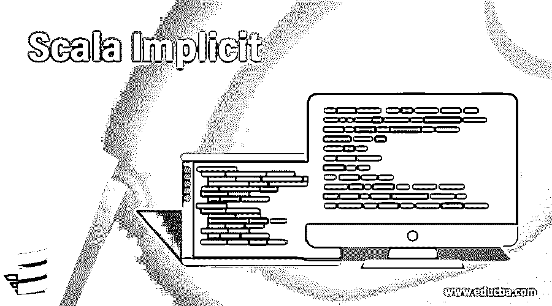
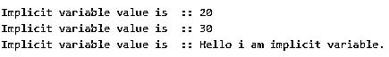
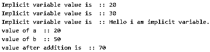

# Scala 隐式

> 原文：<https://www.educba.com/scala-implicit/>

## Scala Implicit 简介

隐式代表我们不需要在程序中创建或调用一些代码，而代码是由编译器自己管理的。我们不需要显式调用某个函数，在某些情况下它是由编译器管理的。换句话说，我们可以说这个 scala 隐式允许我们忽略变量的引用，有时也调用一个方法，我们依赖编译器为我们完成这项任务，并在需要时建立连接。编译器可以为我们做很多事情，而不需要对代码做太多的修改。

**语法**

<small>网页开发、编程语言、软件测试&其他</small>

为了使用 scala implicit，我们有一个不同的语法，可以在下面看到，但是总的来说，我们使用了一个 implicit 关键字来隐式化任何变量。

**1。定义名称(隐式 a:数据类型)**

`def demo1(implicit a: Int)`

**2。定义名称(隐式 a:数据类型，b:数据类型)**

`def demo2(implicit a : Int, b : String)`

**3。定义名称(变量名称:数据类型)(隐式变量名称:数据类型)**

`def demo3(a: String)(implicit b : Int)`

**4。定义名称(隐式变量名称:数据类型)(变量名称:数据类型)**

`def demo3( implicit a: String)( b : Int)  // but this way is not correct will generatecompile time error.`

**5。定义名称(隐式变量名称:数据类型)(隐式变量名称:数据类型)**

`def name(implicit a: Int)(implicit b : Int) //not correct just to show the different snta avilable`

### Scala 中的隐函数是如何工作的？

在 scala 中，隐式的意思和其他语言一样。我们可以避免一些代码来显式地编写它，这项工作由编译器来完成。在 Scala 中，我们有隐式类型，即隐式类。隐式参数，隐式函数。让我们逐一讨论；

#### 1.隐式参数

隐式参数只是意味着，如果我们使用 Implicit 关键字使任何参数隐式，那么它只是意味着，如果没有提供变量值给它，编译器将会查看变量值。然后编译器会为我们传递一个值给它。我们可以使用 val，def，var 和 implicit 关键字来定义变量。

**示例# 1–隐式定义变量名称:数据类型**

`>> implicit def impvar : Int`

**示例 2–隐式变量变量名称:数据类型**

`>> implicit var impvar : Stiring`

**示例# 3–隐式 val 变量名称:数据类型**

`>> implicit val impvar : Float`

使用 implicit 关键字定义变量的一些规则。

**1。定义名称(隐式 a:数据类型)**

`def demo1(implicit a: Int)`

**解释:**在上面的语法中，我们将在 def 之后提供一个名称，在这个名称中，我们可以通过使用 implicit 关键字后跟变量的数据类型来使变量隐式化。

**2。定义名称(隐式 a:数据类型，b:数据类型)**

`def demo2(implicit a : Int, b : String)`

**解释:**在上面的语法中，我们通过提及两个变量的数据类型，将它们定义为隐式变量。但是请记住，我们只是在使两个变量隐式化的开始定义了关键字。

**3。定义名称(变量名称:数据类型)(隐式变量名称:数据类型)**

`def demo3(a: String)(implicit b : Int)`

解释:在这个语法中，我们定义了两个变量，但是我们想让其中一个成为非隐式的，所以这里变量‘a’是非隐式的，我们把它定义在一个单独的括号中。对于‘b’这个我们要把它定义成一个单独的括号。

**4。定义名称(隐式变量名称:数据类型)(变量名称:数据类型)**

`def demo3( implicit a: String)( b : Int)`

**解释:**在这种情况下，它不会工作，因为这不是在 scala 中定义它的正确方式。

**5。定义名称(隐式变量名称:数据类型)(隐式变量名称:数据类型)**

`def demo4(implicit a: Int)(implicit b : Int)`

**解释:**上述声明对隐函数的定义也不正确。

**6。定义名称(隐式 a:数据类型，隐式 b:数据类型)**

`def demo5(implicit a : data_type, implicit b : data_type)`

**说明:**上面的声明是隐函数声明时常见的错误。

#### 2.隐函数

Scala 的隐函数我们可以通过使用 implicit 关键字来定义，参见下面的语法；

`implicit Z => Y`

这也可以定义为> > scala。隐含函数[Z，Y]

使用隐式函数的主要优点是它们从代码中移除了样板文件。这意味着我们可以定义隐函数的名字。则只能使用该名称，而无需声明完整类型。删除不必要的代码也是隐函数的一个优点。

#### 3.隐式类

如果你想定义一个隐式类，那么只需在 class 关键字前使用一个隐式关键字。

`implicit class class_name {
//code logic
}`

这样，我们就可以在 Scala 中定义隐式类了。

### 实现 Scala 隐式的例子

下面是提到的例子:

#### 示例#1

在本例中，我们定义并打印变量值。

**代码:**

`object Main extends App{
// Your code here!
// declaring implicit variable
implicit def impval : Int = 20
implicit var impval1 : Int = 30
implicit val impval2 : String = "Hello i am implicit variable."
// printing their values.
println("Implicit variable value is  :: " + impval)
println("Implicit variable value is  :: " + impval1)
println("Implicit variable value is  :: " + impval2)
}`

**输出:**

#### 实施例 2

调用声明了隐式参数的函数。

**代码:**

`object Main extends App{
// Your code here!
// declaring implicit variable
implicit def impval : Int = 20
implicit var impval1 : Int = 30
implicit val impval2 : String = "Hello i am implicit variable."
// printing their values.
println("Implicit variable value is  :: " + impval)
println("Implicit variable value is  :: " + impval1)
println("Implicit variable value is  :: " + impval2)
demo1(20, 50)
def demo1(implicit a: Int , b : Int){
println("value of a  :: " + a)
println("value of b  :: " + b)
var result = a + b
println("value after addition is  :: "  + result)
}
}`

**输出:**

### 结论

Scala Implicit 为我们提供了各种优势，比如去除样板文件，而且我们不需要调用方法和引用变量，这可以由编译器来管理，或者我们可以说依赖于编译器在调用它们时提供它们的值。

### 推荐文章

这是一个 Scala 隐式指南。这里我们讨论 Scala Implicit 的介绍，语法，它是如何工作的，以及更好理解的例子。您也可以浏览我们的其他相关文章，了解更多信息——

1.  [Scala 运算符](https://www.educba.com/scala-operators/)
2.  [Scala 中的构造函数](https://www.educba.com/constructors-in-scala/?source=leftnav)
3.  [Scala 集合](https://www.educba.com/scala-collections/?source=leftnav)
4.  [Scala 高阶函数](https://www.educba.com/scala-high-order-functions/?source=leftnav)

