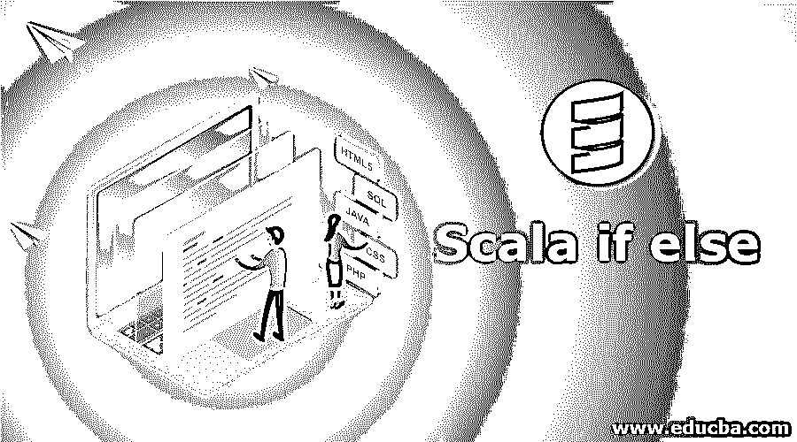
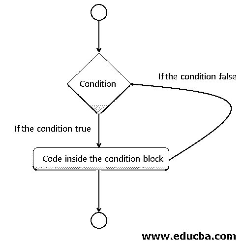
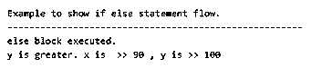
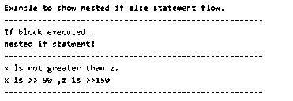
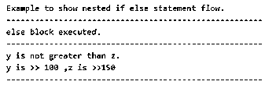
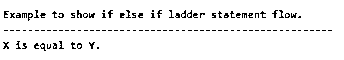

# Scala if else

> 原文：<https://www.educba.com/scala-if-else/>




## Scala 简介 if else

If else 语句是一个代码块，它根据提供的值决定是否执行特定的代码。它类似于 java 和其他可用的语言。我们可以说它是我们逻辑的决策者，只有在满足条件的情况下，部分代码才会被执行。因此，if 和 else 是面向对象编程中的决策语句，这对于在实践场景中应用我们的逻辑非常重要。

**语法:**

<small>网页开发、编程语言、软件测试&其他</small>

```
if(your condition here){
// here the piece of code you want o execute
}else{
// code to be executed.
}
```

如果您提供的条件被计算为真，则代码将执行；否则，它将不会进入该块。

在上面的例子中，if 块只有在计算结果为真时才会被执行。在编程语言中，这个 IF 语句后面还有 ELSE 语句。如果你想在结果不为真的情况下执行一些代码，那么这个 else 锁将被执行。为 else 语句提供 IF 块并不是强制性的，它是可选的，或者我们可以说是基于我们想要实现的需求或逻辑。

### Scala if else 流程图

下面你可以找到 IF 和 ELSE 语句的流程图。首先，它将进入代码并检查 IF 语句中提供的条件。在程序设计语言中，IF 和 ELSE 语句依赖于布尔值，即 TRUE 和 FALSE。

所以输入后，它将计算 if 条件的结果，如果结果为真，那么 if 块内的代码将被考虑在内。如果计算结果为假，则执行其他代码。但是如果我们提供了 else 语句，那么它里面的代码将被执行。




在 Scala 中，我们有各种各样 IF 语句；

*   IF-ELSE 语句
*   嵌套 IF-ELSE
*   如果-否则-如果-否则

但是现在，我们将更多地关注 IF ELSE 语句。为了使用 IF ELSE，我们需要先理解 IF 语句，因为 ELSE 语句必须包含 IF，但是 IF 可以独立执行。

**1。IF-ELSE 语句:**在这种情况下，我们将 IF 语句后跟 ELSE 语句。如果提供的条件为真，则执行该块，如果为假，则执行 Else 块。Else 将总是在 false 或不满足条件的情况下执行。

**语法:**

```
if(){
// if logic
}else{
// else logic
}
```

**初学者示例:**

**代码:**

```
object Main extends App{
// Your code here!
vari = 10
if(i == 10){
println("only executed when the condition is TRUE :: Equal")
}else{
println("not equal")
}
}
```

**2。嵌套的 IF-ElSE:** 在这个例子中，IF 中有 IF-ElSE 语句，或者一个 ElSE 语句取决于逻辑。我们在已经存在的语句中嵌套语句。

**语法:**

```
if(condition){
// if true (nesting)
if(){
}else{
}
}else{
// if false (nesting)
if(){
}else{
}
}
```

**3。IF-ELSE-IF-ELSE:** 在这种情况下我们提供多个 IF 条件。如果任何一个条件为真，那么其余条件将被跳过，程序将正常执行。

**语法:**

```
if(condition_1){
}else if(condition_2){
}else if(condition_3){
}else{
}
```

### Scala 中 if else 语句如何工作？

在 Scala 中，这些也是决策语句。它允许我们通过提供的条件来控制程序的流程。它们依赖布尔值来执行代码。如果为真，那么将执行特定的代码块。在这个 else 块中，并不总是强制性的，它只是取决于业务需求。请记住，为了使用 IF ELSE，我们需要实现 IF 语句。这是命令。

他们负责控制程序的流程。

### Scala if else 的实现示例

下面是 Scala if else 的例子:

#### 示例 1–IF-ELSE 语句

这是一个简单的基于 TRUE 和 FALSE 值的 IF ELSE 语句。

**代码:**

```
object Main extends App{
//your code
println("Example to show if else statement flow.")
println("------------------------------------------------------")
var x = 90
var y = 100
if(x > y){
println("If block executed.")
println("x is greater." + "x is  >> " + x + " , y is >> " + y  )
}else{
println("else block executed.")
println("y is greater. " + "x is  >> " + x + " , y is >> " + y  )
}
}
```

**输出:**




#### 示例 2–嵌套的 IF Else 语句

它包含语句的嵌套。

**代码:**

```
object Main extends App{
println("Example to show nested if else statement flow.")
println("------------------------------------------------------")
var x = 90
var y = 100
if(x > y){
println("If block executed.")
var z = 150
println("nested if statment!")
if(x > z ){
println("------------------------------------------------------")
println("x is greater than z.")
println("x is >> "+ x +" ,z is >>" +z)
println("------------------------------------------------------")
}else{
println("------------------------------------------------------")
println("x is not greater than z.")
println("x is >> "+ x +" ,z is >>" +z)
println("------------------------------------------------------")
}
}else{
println("else block executed.")
var z = 150
if(y > z ){
println("------------------------------------------------------")
println("y is greater than z.")
println("y is >> "+ y +" ,z is >>" +z)
println("------------------------------------------------------")
}else{
println("------------------------------------------------------")
println("y is not greater than z.")
println("y is >> "+ y +" ,z is >>" +z)
println("------------------------------------------------------")
}
}
}
```

**输出:**







#### 示例# 3–如果是阶梯

它多次包含 IF-ELSE 语句的阶梯。

**代码:**

```
object Main extends App{
println("Example to show if else if ladder statement flow.")
println("------------------------------------------------------")
var x = 90
var y = 90
if(x > y){
println("X is greater than Y.")
}else if(x == y ) {
println("X is equal to Y.")
}else{
println("Y is greater than X.")
}
}
```

**输出:**




### 结论

如果 ELSE 是决策控制语句，并且它们的工作方式类似于任何其他可用的语言，那么它们的语法可能会有所不同。他们的结果取决于真值和假值，以便做出决定。它们为我们提供了一种控制程序流程和帮助构建逻辑的方法。

### 推荐文章

这是一本 Scala if else 的指南。在这里，我们讨论 Scala if else 及其不同示例以及代码实现的简要概述。您也可以浏览我们推荐的其他文章，了解更多信息——

1.  [科特林 vs 斯卡拉](https://www.educba.com/kotlin-vs-scala/)
2.  [Scala 数据类型](https://www.educba.com/scala-data-types/)
3.  [Scala for 循环](https://www.educba.com/scala-for-loop/)
4.  [Scala 高阶函数](https://www.educba.com/scala-high-order-functions/)


