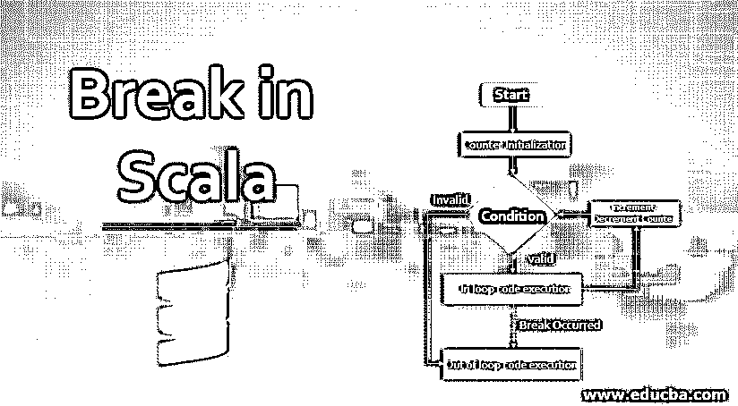
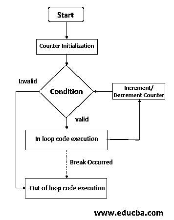
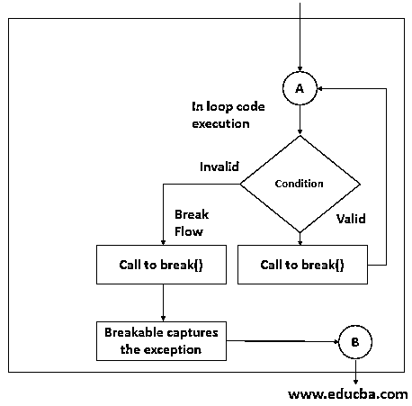
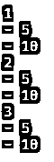
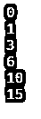

# Scala 中的断点

> 原文：<https://www.educba.com/break-in-scala/>




## Scala 中 Break 的介绍

scala 中的 Break 是一种[编程语言](https://www.educba.com/what-is-a-programming-language/)，它无缝地结合了面向对象范式和函数范式。Scala 这个名字是由 SCAlable 和 Language 这两个术语组合而成的。但是该语言需要注意的一个方面是排除了最基本的流结构，如 Break 和 Continue。你知道可伸缩语言为什么会这样吗？不，你说！好吧，不用担心，在这篇文章中，我们确实触及到了这一点。我们试着用一些例子来分析如何在程序中使用 break。稍后，我们还将触及不添加 break 作为语言中的隐式流结构背后的设计。

因此，尽管该语言不支持 Break 关键字作为语言构造，但我们可以使用 util.control.Breaks. **_** 包来实现类似的功能。

<small>网页开发、编程语言、软件测试&其他</small>

让我们看一下实现 break 的语法，

**语法:**

```
import util.control.Breaks._
breakable {
<LOOP> {
<statements>
<condition> break; //Conditionally break out of loop
}
}
```

从语法上可以看出，这里有几件重要的事情，

*   导入包，
*   将循环封闭在易碎函数中。
*   此外，显而易见的…中断声明。

顺便说一个有趣的事实，这里的 break 语句是一个函数调用。但稍后会详细介绍。

### 流程图

接下来，让我们在流程图的帮助下，通过查看执行是如何工作的来进一步理解。下图的流程图描述了普通 for 循环的工作原理。它从一个初始化块开始。该块下面是一个决策框，用于验证是否满足指定的条件。基于决策框的输出，选择两条路线中的一条。




我们对“循环代码执行”块内部发生的事情感兴趣。块中的虚线表示由于 break 语句导致的程序流的变化。

下图显示了 Scala 中“循环代码执行”的内部原理。在图 2 的流程图中，有一个对 break 函数的调用，该调用反过来会引发一个异常。这个异常由 breakable 处理，它改变了程序流。或者，在[中，Java break](https://www.educba.com/break-statement-in-java/) 是语言中预定义的结构，它不会抛出异常，而是像 goto 那样改变代码流。

如流程图所示，控制从决策框(图 1 中)到达图 2 中的 A。此外，来自 B 的控制转到上图中的“循环外代码执行”块。




### 工作

让我们通过查看函数内部来进一步了解 Scala 中的 break 是如何工作的。Breakable 是一个函数，它有一个 case 来处理 breakException。此外，break 函数抛出一个 breakException。

**代码:**

```
def breakable(op: => Unit) {
try {
op
} catch {
case ex: BreakControl =>
if (ex ne breakException) throw ex
}
}
def break(): Nothing = { throw breakException }
```

有人可能会开始怀疑为什么要这样做。几乎所有语言都有内置的 break 语句。那么为什么语言开发者决定不把 break 作为武器库的一部分呢？嗯，有几个原因，

*   其他语言结构。
*   此外，它们在与闭包交互时会产生问题。
*   它们与函数文字不太匹配。

"你可以在 Martin Odersky，Lex Spoon 和 Bill Venners 所著的《Scala 编程，第二版》中读到更多相关内容."

### Scala 中的 Break 示例

让我们看几个例子来理解这是如何做到的。

#### 示例#1

这个例子演示了如何在单个循环中使用 break。

**代码:**

```
import scala.util.control.Breaks._
object BreakExample extends App {
breakable {
for (index <- 1 to 10) {
println(index)
if (index >= 5) break
}
}
}
```

**输出:**
T3】


**解释:**如例所示，for 循环被封闭在易碎块中。对于 For 循环的每次迭代，if 循环检查索引是否小于或等于 5，如果条件有效，则调用 break，使程序退出 for 循环。输出将是从 1 到 4 的所有索引值。

#### 实施例 2

这个例子演示了插入嵌套循环的用法。

**代码:**

```
import scala.util.control.Breaks._
object BreakTests extends App
{
val listA = List(1, 2, 3);
val listB = List(5, 10, 15);
var itemA = 0;
var itemB = 0;
breakable
{
for (itemA <- listA)
{
println("" + itemA);
breakable
{
for (itemB <- listB)
{
println("- " + itemB);
if (itemB == 10) break;
}
}
}
}
}
```

**输出:**




**解释:**程序在内部 for 循环中遇到 break 语句。用法与示例 1 中的用法非常相似。在这种情况下，当遇到中断时，控件将只退出内部循环，而不退出外部循环。外部 for 循环将按预期继续运行。观察输出可以清楚地看到，每当 itemB 的值为 10 时，for 循环就会退出。外部 for 循环经历一次完整的迭代。

#### 实施例 3

break 语句如何在 while 循环中工作将在下面解释。

**代码:**

```
import scala.util.control.Breaks._
object BreakTests extends App
{
var index = 0;
var sum = 0
breakable
{
while (index < 1000) {
sum += index
index +=1
println(sum);
if (sum > 10) break;
}
}
}
```

**输出:**




**解释:**这个例子类似于例子 1，除了这里使用了 while 循环来演示 while 循环中 break 的工作方式。这里计算一个和，只要和变量值超过 10，就开始中断。

### 结论

所以，总之，Scala 不鼓励使用显式 break 语句。关于如何避免使用 break 语句，有很多不同的机制。然而，如果中断是不可避免的，你可以使用中断包来完成任务。

### 推荐文章

这是 Scala 中的 Break 指南。在这里，我们将讨论 scala 中 break 的语法、流程图和工作原理，以及示例和实现。你也可以看看下面的文章来了解更多-

1.  [Scala 版本](https://www.educba.com/scala-versions/)
2.  [Scala 数据类型](https://www.educba.com/scala-data-types/)
3.  [Scala foreach](https://www.educba.com/scala-foreach/)
4.  [Scala for 循环](https://www.educba.com/scala-for-loop/)


