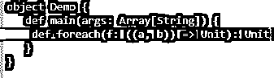
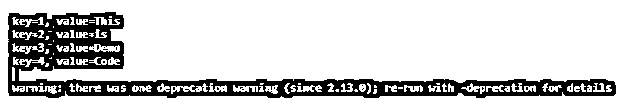
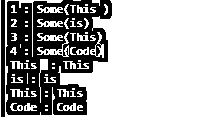

# Scala 映射 Foreach

> 原文：<https://www.educba.com/scala-map-foreach/>

## Scala Map Foreach 简介

Scala Map 也称为哈希表，是一个名为哈希表的键/值对的集合。键用于访问与其关联的值。映射中的值可以相同，但键总是唯一的。Map 是一个高阶函数，每个方法都有一个将某个函数作为参数的函数，并将该函数应用于源集合的每个元素。

Scala MAP 的每个函数都有**，用于迭代并将函数应用于 Scala Map 的所有元素。它通过迭代并对每个元素应用传递的函数来返回 MAP 中的所有元素。它也用于 Scala 中的模式匹配。在 Scala 中，一个带有 Scala For Each 的匹配表达式是一种非常方便和易读的方法。我们可以使用元组来访问 Scala 映射的键和值。For Each 方法也可用于迭代键或映射中的值。**

<small>网页开发、编程语言、软件测试&其他</small>

**语法:**

Scala Map Foreach 函数的语法是:

`def foreach(f: ((a, b)) => Unit): Unit`

它返回地图上所有应用了函数的元素。

**快照:**

### Map Foreach 功能的工作原理

让我们看看 For Each 函数在 Scala 中是如何工作的。

每个函数的 Scala 都用于遍历 Scala 映射。从 for 关键字开始，它用于 Scala Map 的迭代。for-each 循环通常没有显式计数器，也就是说，它应用于 Scala MAP 中的所有键值对。

因为每种方法都更容易编码，并且在语法上更加代码友好。

每个方法都需要一个过程，产生一个返回类型单元。该过程应用于结果为 unit 的所有元素。

这也使得的功能对于用户来说更容易编码和打印所需的输出。

### Scala 映射 Foreach 示例

Scala Map 中的每个方法都有很多用法，我们将借助例子来检查它的一些功能和优势。

#### 示例 1:创建一个 Scala 映射。

`val map1 = Map(1 -> "This ", 2 -> "is", 3 -> "Demo", 4 -> "Code")`

地图已创建。

`val r = map1.foreach(r => println("key=" + r._1 + ", value=" + r._2))`

使用 Scala 迭代地图的每个值

在这里，我们使用每种方法来迭代映射并获取键和值。

**完整代码:**

`object Demo {
def main(args: Array[String]) {
val map1 = Map(1 -> "This ", 2 -> "is", 3 -> "This", 4 -> "Code")
val r = map1.foreach(r => println("key=" + r._1 + ", value=" + r._2))
}
}`

键和值使用 Scala Map 进行迭代。

**截图:**

如果同一个值取了两次，那么相同的元素只取一次。

让我们用一个例子来验证这一点，在上面的地图中添加一个类似的键。

`val map1 = Map(1 -> "This ", 2 -> "is", 3 -> "This", 4 -> "Code" , 3 -> "This")`

用重复值创建的映射。

让我们对每个循环进行迭代。

`val r = map1.foreach(r => println("key=" + r._1 + ", value=" + r._2))`

输出不会打印相同的对象。

**完整代码:**

`object Demo {
def main(args: Array[String]) {
val map1 = Map(1 -> "This ", 2 -> "is", 3 -> "This", 4 -> "Code" , 3 -> "This")
val r = map1.foreach(r => println("key=" + r._1 + ", value=" + r._2))
}
}`

**输出:**

让我们在同一个映射上显式迭代键和值。

**代码:**

`val map1 = Map(1 -> "This ", 2 -> "is", 3 -> "This", 4 -> "Code")
val a = map1.keys.foreach( key => println(key + " : "+map1.get(key)))`

这将打印 Scala 映射中的所有键。

`val b = map1.values.foreach( value => println(value + " : "+value))`

这将打印 Scala 映射中的所有值。

**完整代码:**

`object Demo {
def main(args: Array[String]) {
val map1 = Map(1 -> "This ", 2 -> "is", 3 -> "This", 4 -> "Code")
val a = map1.keys.foreach( key => println(key + " : "+map1.get(key)))
val b = map1.values.foreach( value => println(value + " : "+value))
}
}`

**输出:**

从这些例子中，我们看到了如何在 Scala Map 中实现每个循环。

### 地图教学的规章制度

让我们看看用 Scala MAP 创建 For Each 的各种规则和规定。

*   For Each 循环用于迭代地图中的所有元素。
*   我们可以使用 Scala Map 为每个元素应用函数。
*   Scala 映射键和值对可以使用 Scala 中的 for-each 循环进行迭代。
*   我们可以对每个方法使用匹配表达式。
*   For Each 方法还用于迭代元组。
*   返回类型是单位。
*   For Each 方法可以用来直接打印 Scala 中的元素。
*   修改是不可取的。
*   For Each 循环不跟踪索引。
*   用于向前迭代对象。
*   对于每一个，在 Map 中遵循单步迭代。

### 结论

从上面的文章中，我们看到了 Scala Map 中 FOR Each 方法的使用。从各种例子和分类中，我们试图理解 **FOR EACH** 方法如何在 **Scala Map** 函数中工作，以及在编程层面使用的是什么。

我们还看到了键-值对中每个循环的内部工作和优点，我们为各种编程目的定义了键-值对。此外，语法和例子帮助我们更准确地理解函数。

### 推荐文章

这是一个 Scala Map Foreach 的指南。这里我们讨论 Map Foreach 函数的介绍、工作原理以及 Map Foreach 的规则和规定。您也可以看看以下文章，了解更多信息–

1.  [Scala 字符串](https://www.educba.com/scala-string/)
2.  [Scala 日期函数](https://www.educba.com/scala-date-function/)
3.  [Scala 正则表达式](https://www.educba.com/scala-regex/)
4.  [标量向量](https://www.educba.com/scala-vector/)

