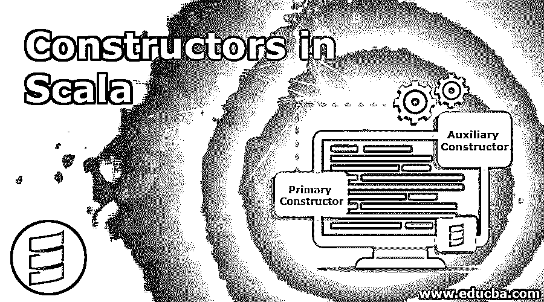
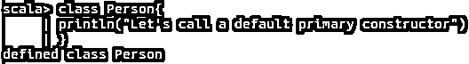
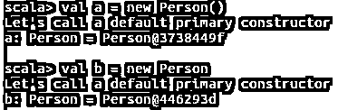
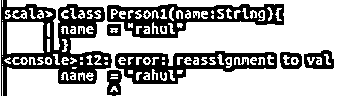
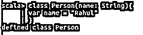
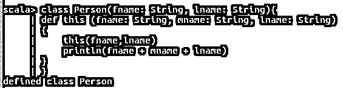

# Scala 中的构造函数

> 原文：<https://www.educba.com/constructors-in-scala/>

## Scala 中的构造函数简介

在本文中，我们将讨论 Scala 构造函数及其类型。Scala 对构造函数的支持与 Java 略有不同。因此，迁移到 Scala 的 Java 开发人员在学习或使用 Scala 构造函数时可能会感到有点不适应。但是我确信这会很有趣，因为 Scala 中的这种差异使得它的定义更加简洁和准确。Scala 支持两种类型的构造函数主构造函数和辅助构造函数。

在这篇文章中，我们将深入探讨 scala 中构造函数的用法。所以让我们开始吧。

<small>网页开发、编程语言、软件测试&其他</small>

### Scala 中构造函数的类型

Scala 中主要有两种类型的构造函数:

1.  主要构造函数
2.  辅助构造者

众所周知，Scala 中的构造函数与 Java 中的不同。一个 scala 类只能有一个主构造函数，但是可以有多个辅助构造函数。

scala 中类的示例定义:

**语法:**

`class < class-name > (params-list) // class definition
{
// Class body goes here
}`

 `#### 主要构造函数

给定上面给出的类定义，Scala 提供了一个带有类定义的默认构造函数。如果构造函数没有在类中显式定义，它将覆盖除方法之外的整个类体。主构造函数可以用零个或多个参数定义。继承另一个类的类中的。只有主构造函数有能力调用超类构造函数。

让我们来看一些使用构造函数的例子。

**代码:**

`class Person
{
println("Let's call a default primary constructor")
}`

**输出:**

在上面的例子中，我们创建了一个名为 Person 的类，它只是打印一条消息。正如我们看到的，类中没有定义构造函数。如果没有显式定义构造函数，Scala 会隐式添加一个没有参数的默认构造函数。所以在这里，不需要定义构造函数，也不需要在里面执行操作。为开发者节省了大量的时间和代码空间。

**代码:**

`val a = new Person()
val b = new Person`

**输出:**

在上面的例子中，我们试图使用隐式构造函数创建 Person 类的实例。Person 类的对象可以通过两种方式创建，带空参数或不带参数都会产生相同的结果。我们可以看到，当隐式构造函数在从类创建对象的过程中被自动调用时，消息被打印出来。

让我们看另一个例子来进一步加深我们的理解

**代码:**

`class Person(name: String)
{
println("My name is " + name + ".")
}`

**输出:**

与前面的例子相比，您注意到类定义有什么不同吗？花些时间仔细比较一下类定义。

在这个例子中，我们向类传递参数。看起来我们可以在 scala 类中传递参数，这似乎很符合逻辑。现在，我们不希望构造函数每次都打印相同的消息，而是希望为每个用户打印单独的消息。因此，我们必须在创建对象时从类的实例外部传递消息。所以我们将在 scala 中使用一个参数化的构造函数。scala 类中传递的参数最好的部分是，它被当作一个实例变量，而没有将构造函数变量映射到实际的实例变量。让我们看看，如果我们尝试给参数重新赋值，会发生什么。

**代码:**

`class Person1(name: String)
{
name = "rahul"
}`

**输出:**

如果你试图定义一个类，在这个类中你想给与自变量变量同名的变量赋值，Scala 会抛出这个错误，如上图所示。因此，它确保了参数变量被视为实例变量。

**代码:**

`class Person(name: String)
{
var name = "rahul"
}`

**输出:**

那么，如果您遇到了这样的用例，您希望将变量赋给某个值，而不希望值作为参数出现，该怎么办呢？所以如果你想给一个和参数同名的变量赋值，scala 给出了一个解决方法。我们可以用关键字 var 重新初始化 argument 变量，如上图所示。

**代码:**

`Val p = new Person(" Rahul Bose ")`

**输出:**

所以这里唯一的修改是我们传递了一个关于新对象创建的参数。它打印我们通过用户创建传递的参数。因此，您可以在不对代码进行任何重大更改的情况下，为您的类赋予独特的风格。

### 辅助构造者

虽然 Scala 为您提供了一个默认的构造函数(主构造函数),甚至不需要显式定义它，但是如果您想要使用自定义的构造函数来实现一个用例呢？scala 通过辅助构造函数满足了这个要求。这些构造函数为你提供了 Scala 中构造函数重载的功能。虽然只能有一个主构造函数，但是在一个类定义的主体中，我们可以有任意多的辅助构造函数。是不是很棒！

只有一个基本条件，即您必须在辅助构造函数的方法定义的第一行代码中调用主构造函数或任何其他先前定义的辅助构造函数。这意味着我们将直接或间接地调用类的主构造函数，而主构造函数将是实现类实例的实际构造函数。

让我们看一个例子来进一步理解这一点。这里让我们看一个用例，我们有一个主构造函数，它接受一个人的名字和姓氏。

现在我们得到了一个在打印姓名时添加用户中间名的要求。因此，这里我们可以实现辅助构造函数，它可以接受三个参数，而主构造函数只接受两个参数。让我们实现辅助构造函数

**代码:**

`class Person(fname: String, lname: String)
{
def this (fname: String, mname: String, lname: String)
{
this(fname, lname)
println(fname + mname + lname)
}
}`

**输出:**

正如我们在例子中看到的，辅助构造函数总是用关键字 this 来定义。它有我们上面讨论过的基本定义。

在第一行中，它调用主构造函数，然后打印传递了三个参数的消息。这是 Scala 中构造函数重载的一个非常基本的例子。

**代码:**

`var user = new Person(“Rahul ”, “Singh ”,”Bose ”)`

**输出:**

正如我们所看到的，我们创建了一个带有三个参数的用户实例，并打印出给定的人名。

### 推荐文章

这是 Scala 中构造函数的指南。这里我们讨论了在 Scala 中创建构造函数的方法，我们也展示了构造函数重载及其不同的类型。您也可以浏览我们推荐的其他文章，了解更多信息——

1.  [理解 Scala 的概念](https://www.educba.com/what-is-scala/)
2.  [科特林 vs Scala |十大对比](https://www.educba.com/kotlin-vs-scala/)
3.  [Scala 有哪些版本？](https://www.educba.com/scala-versions/)
4.  [Scala 数据类型概述](https://www.educba.com/scala-data-types/)
5.  [Scala for Loop 的前 6 个例子](https://www.educba.com/scala-for-loop/)

`