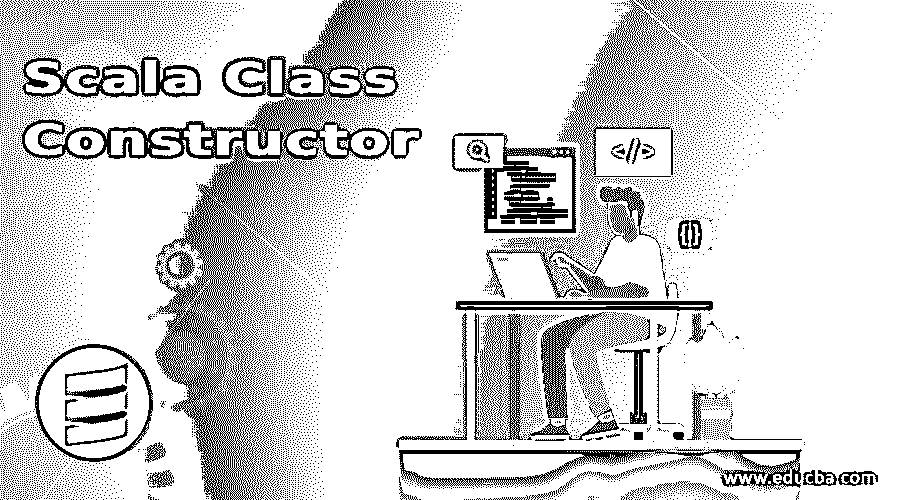
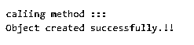
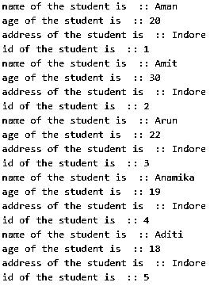
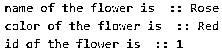

# Scala 类构造函数

> 原文：<https://www.educba.com/scala-class-constructor/>




## Scala 类构造函数介绍

在一般编程中，语言构造函数也用来初始化成员变量和对象状态。构造函数应该与类同名。最重要的是，它们用于初始化对象和执行所需的方法。Scala 主要支持两种类型的构造函数，即主构造函数和辅助构造函数。我们也可以在构造函数中传递参数，这样在创建对象的时候我们就可以初始化它们。但是记住它应该总是和类名同名。

### 构造函数的类型

以下是构造函数的类型:

<small>网页开发、编程语言、软件测试&其他</small>

#### 1.主要构造函数

**语法:**

```
class name_class(list_of_parameter){
// logic goes here.
}
```

下面是一个例子:

**代码:**

```
class Demo(name:String, age: Int){
// stat1
// stat2
// stat3
}
```

#### 2.辅助构造者

**语法:**

`def this(parameter_list)`

下面是一个例子:

```
defthis(name: String, age: Int)

```

This constructor we can define using this keyword which contains all other constructors as well. We will discuss them in detail in the next section.
如何在 Scala 中对类应用构造函数？
Scala constructors also used to initialize the object state or behavior. Scala provides us two types of constructor which are:
#1.默认主构造函数
This constructor is the part of primary constructor only but the difference is that it is introduced by the compiler itself if we do not create any constructor for a class only to support object creation for that class.

Below is the example:

Code:

```
class Student
{
defmessage()
{
println("Student object created !!");
}
}
object Main
{
defmain(args: Array[String])
{
// creating object for Student class.
var s = new Student();
s.message();
}
}
```

在这个类型中没有创建任何构造函数，但是编译器为我们介绍了。我们在对象创建后调用 message()方法。但是它不包含任何参数。
#2.主要构造函数
如果我们的 Scala 类只包含一个构造函数，并且这个构造函数叫做主构造函数或者默认构造函数。如果我们没有为类提供任何构造函数，scala 编译器会为我们插入一个默认的构造函数。这个主构造函数像它的类一样包含相同的名称和主体。因此，如果 scala 为我们插入了一个默认的构造函数，这意味着我们不需要显式地创建构造函数。
主构造函数可以是参数化或非参数化的，这取决于我们。在 scala primary constructor shares 中，类似 class the 的相同签名意味着我们定义的类中的所有东西都只属于 primary constructor，但这不包括它们的方法声明和定义。如果编译器为我们插入构造函数，那将是一个零参数的构造函数，没有参数，所以如果你想初始化成员变量，我们需要定义我们自己的构造函数，包含所需的参数。
**代码:**

```
class Student(name: String, surname: String, age: Int)
{
defgetMessage()
{
println("name of Student: " + name);
println("surname of Student : " + surname);
println("age of Student :" + age);
}
}
object Main
{
defmain(args: Array[String])
{
// creating object
var s = new Student("Demo hello", "bye", 50);
s.getMessage();
}
}
```

在上面的例子中，我们创建了一个学生类，它包含了它的名字、年龄和姓氏作为类变量，当类的对象准备好时，这些变量被赋值。所以在我们的 main 方法中，我们用值初始化对象，并调用 getMessage()方法来显示信息。
 **#3。辅助构造器**
一个 scala 类可以包含任意数量的辅助构造函数，但是参数列表应该是不同的。我们也可以从辅助构造函数中调用其他构造函数，为此我们可以使用这个关键字。像任何其他编程语言一样，我们必须在构造函数语句的开头调用另一个构造函数，换句话说，它应该是第一个语句。
该类可以包含主构造函数和辅助构造函数。
由此，我们可以说 scala 辅助构造函数是构造函数重载的另一个名称，因为它以同样的方式工作。我们可以用不同的参数列表指定任意数量的辅助构造函数，否则会导致构造函数不明确。

**代码:**

```
class Flower(color:String){
defthis(color:String, name:String)={
this(color)
println(color+" "+name)
}
}
object MainObject{
def main(args:Array[String]){
new Flower("Red")
new Flower("Red","Rose")
}
}
```

在这个例子中，我们定义了两个构造函数，一个用于初始化颜色，另一个用于颜色和名称。只打印来自构造函数的信息。

### 实现 Scala 类构造函数的例子

下面是 Scala 类构造函数的例子:

#### 示例#1

这个例子展示了默认构造函数在 scala 中是如何工作的。

**代码:**

```
object Main extends App{
// Your code here!
// initializing ibject and calling method
var student = new Student()
student.getInformation()
}
class Student{
defgetInformation(){
println("caliing method ::: ")
println("Object created successfully.!!")
}
}
```

**输出:**




#### 实施例 2

这个例子展示了主构造函数在 scala 中是如何工作的。

**代码:**

```
object Main extends App{
// Your code here!
// initializing ibject and calling method
var student1 = new Student("Aman", 20, "Indore", 001)
var student2 = new Student("Amit", 30, "Indore", 002)
var student3 = new Student("Arun", 22, "Indore", 003)
var student4 = new Student("Anamika", 19, "Indore", 004)
var student5 = new Student("Aditi", 18, "Indore", 005)
student1.getStrudentInfo()
student2.getStrudentInfo()
student3.getStrudentInfo()
student4.getStrudentInfo()
student5.getStrudentInfo()
}
class Student(name: String, age: Int, address: String, Id: Int){
defgetStrudentInfo(){
println("name of the student is :: " +name)
println("age of the student is :: " +age)
println("address of the student is :: " +address)
println("id of the student is :: " +Id)
}
}
```

**输出:**




#### 实施例 3

辅助构造函数的用法。

**代码:**

```
object Main extends App{
// Your code here!
// initializing ibject and calling method
var flower1 = new Flower("Rose", "Red", 001)
var flower2 = new Flower("flower 2","yellow", 002)
flower1.getFlowerInfo()
}
class Flower(name: String, color: String){
var Id: Int = 0;;
defthis(name: String, color: String, Id: Int){
this(name, color)
this.Id = Id
}
defgetFlowerInfo(){
println("name of the flower is :: " +name)
println("color of the flower is :: " +color)
println("id of the flower is :: " +Id)
}
}
```

**输出:**




### 结论

Scala 构造函数也用来创建一个对象。它为我们提供了两种类型的主构造函数和辅助构造函数。我们还可以通过使用第二种类型的辅助构造函数来重载构造函数。它们基本上是为了维持物体的状态，没有它我们就无法进一步前进。

### 推荐文章

这是一个 Scala 类构造函数的指南。在这里，我们讨论了 Scala 类构造函数及其不同示例和代码实现的简要概述。您也可以浏览我们推荐的其他文章，了解更多信息——

1.  [科特林 vs Scala |十大对比](https://www.educba.com/kotlin-vs-scala/)

2.  [Scala 数据类型概述](https://www.educba.com/scala-data-types/)

3.  [Scala for 循环|前 6 个例子](https://www.educba.com/scala-for-loop/)

4.  [Scala 高阶函数](https://www.educba.com/scala-high-order-functions/)


```

```