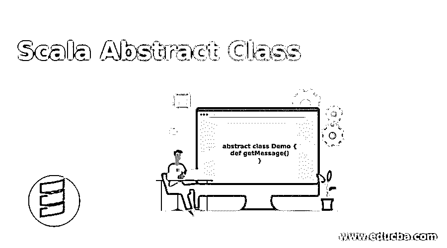
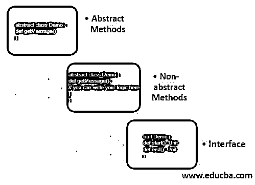
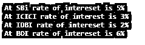

# Scala 抽象类

> 原文：<https://www.educba.com/scala-abstract-class/>

## Scala 抽象类的定义

抽象类的概念来源于抽象。在这个过程中，我们只向用户显示服务，而对用户隐藏这些服务的实现。他们只是使用这些服务并执行他们的任务，而不管后台发生了什么。Scala 抽象类的整体思想和 Java 抽象类是一样的，在 Scala 中也是用来实现抽象的。

**语法:**

<small>网页开发、编程语言、软件测试&其他</small>

`abstract class your_class_name{
// define methods
}`

上面的语法显示了我们如何在 Scala 中定义一个抽象类，这与 java 非常相似。在 Scala 中，我们使用 abstract 关键字来创建任何抽象类。在这个类中，我们可以定义自己的方法，这些方法本质上可以是抽象的，也可以是非抽象的。支持抽象和非抽象两种方法类型。

`abstract class Demo{
}`

### Scala 中抽象类是如何工作的？

抽象是向用户隐藏复杂性的过程，只向他们展示我们为他们创建的服务。复杂性包含服务的编码部分和实际实现，该服务在内部使用许多用户不知道的其他服务，用户没有义务知道内部工作。

抽象可以通过两种方式实现。

*   抽象方法
*   非抽象方法
*   连接

但是正如我们所看到的，抽象类并没有为我们提供完全的抽象，因为它包含了抽象和非抽象的方法。这里我们将详细讨论抽象和非抽象方法。

#### 1.抽象方法

那些不包含方法实现的方法被称为抽象方法。当我们在一个类中定义抽象方法时，我们不需要提供方法体。

**语法:**

`abstract class Demo {
def getMessage()
}`

在上面的例子中，我们只是在类中定义了方法签名。我们不负责提供此方法的实现。扩展这个类的类可以覆盖这个方法，并根据需要提供实现。因此，通过这种方式，我们在 Scala 中实现了抽象，有点类似于 java 中我们遵循的语法的唯一区别。

#### 2.非抽象方法

这些方法是那些在声明它们自己的时候定义它们的实现的方法。它们包含它们的主体，这意味着它们内部的实际逻辑，所以我们可以说这个逻辑没有对用户隐藏，因为我们提供了实现，所以它们不能给我们完整的抽象。

**语法:**

`abstract class Demo {
def getMessage(){
// you can write your logic here
}
}`

在上面的例子中，我们也定义了方法的主体。因此，通过这种方式，我们可以在类内部定义 Scala 中的非抽象方法。

#### 3.连接

但是通过使用接口，我们可以实现 100%的抽象。在 Scala 中，我们使用 trait 关键字来定义接口，就像 java 一样。

**语法:**

`trait Demo {
def start(): Unit
def end(): Unit
}`

所以上面的代码表明，如果任何类试图实现这个接口，那么它们也需要提供这些方法的实现。所以现在我们来看看抽象在 Scala 中的一些实际应用。假设我们有一个方法被这么多类所需要，这些类是这个父类的子类。但是这些类不想使用正在编写的逻辑，因为逻辑或实现或者我们可以说业务需求对于所有的孩子都是不同的。每个孩子都希望自己具体实现那个方法。所以现在抽象进入了画面。

在这种情况下，我们可以创建一个父类，并在其中定义一个抽象方法，然后扩展该父类的类可以通过覆盖它们来提供自己的方法实现。所以现在每个子类的实现对其他类都是隐藏的，这也有助于安全。

### Scala 抽象类的例子

我们有一家银行作为其所有子银行的母银行。但是他们提供给客户的利益各不相同，就像他们提供的利率因银行而异一样。因此，在这种情况下，我们可以将我们的 print 类作为 Bank，而所有其他子类都是 SBI、ICICI、IDBI、BOI 等等。

#### 1.方法的具体实现

**代码:**

`abstract class Bank
{
def rateofInterest()
}
class SBI extends Bank
{
def rateofInterest()
{
println("At SBi rate of intereset is 5%")
}
}
class ICICI extends Bank {
def rateofInterest(){
println("At ICICI rate of interest is 3%")
}
}
class IDBI extends Bank {
def rateofInterest(){
println("At IDBI rate of intereset is 2%")
}
}
class BOI extends Bank {
def rateofInterest(){
println("At BOI rate of intereset is 6%")
}
}
object Main
{
// This method will execute the method code by calling them form object
def main(args: Array[String])
{
// objects of All child class
var obj = new SBI()
obj.rateofInterest()
var obj1 = new ICICI()
obj1.rateofInterest()
var obj2 = new IDBI()
obj2.rateofInterest()
var obj3 = new BOI()
obj3.rateofInterest()
}
}`

**输出:**

#### 2.保持安全

`abstract class Animal
{
def differentAnimalType()
}
class Cat extends Animal
{
def differentAnimalType()
{
println("Hello i am Cat here //")
}
}
class Dog extends Animal {
def differentAnimalType(){
println("Hello i am Dog here //")
}
}
class Snack extends Animal {
def differentAnimalType(){
println("Hello i am Snack here //")
}
}
object Main
{
def main(args: Array[String])
{
// objects of GFG class
var obj = new Cat()
obj.differentAnimalType()
var obj1 = new Dog()
obj1.differentAnimalType()
var obj2 = new Snack()
obj2.differentAnimalType()
}
}`

**输出:**

### 推荐文章

这是一个 Scala 抽象类的指南。在这里，我们也讨论了 scala 中抽象类的定义和工作原理，以及不同的例子和代码实现。您也可以看看以下文章，了解更多信息–

1.  [Scala 数据类型](https://www.educba.com/scala-data-types/)
2.  [Scala 列表](https://www.educba.com/scala-list/)
3.  [Scala 伴随对象](https://www.educba.com/scala-companion-object/)
4.  [Scala 散列表](https://www.educba.com/scala-hashmap/)

