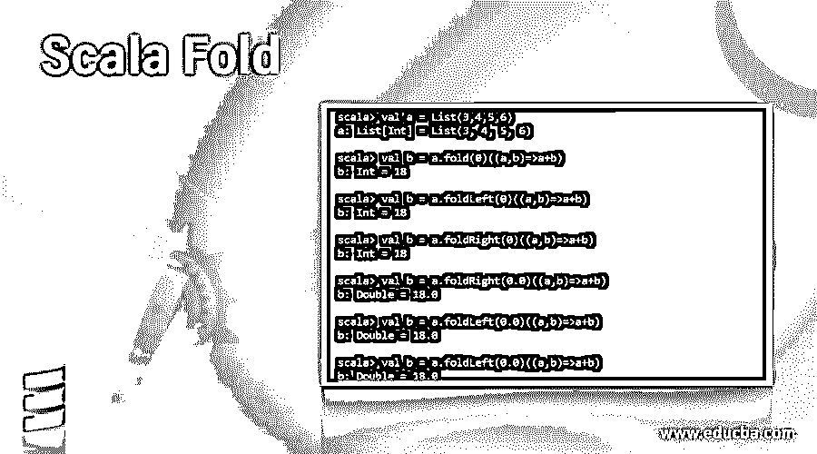
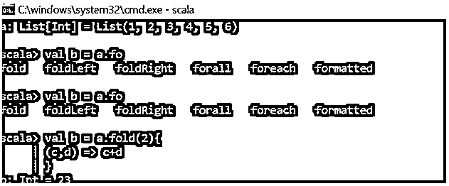
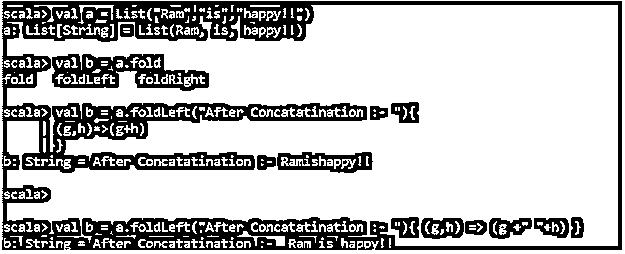
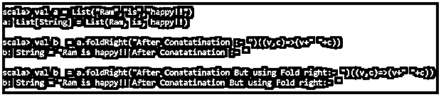
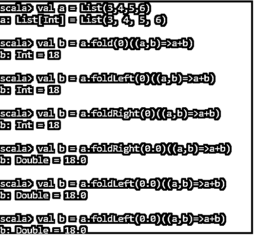

# 斯卡拉褶皱

> 原文：<https://www.educba.com/scala-fold/>




## Scala 文件夹简介

Scala Fold 是 Scala 集合上非常重要和强大的操作，它接受输入操作并从集合中返回单个值。

拥有一个初始化的初始值也可以处理一个空集合，只给出初始值作为结果。我们在集合上使用 SCALA FOLD 函数，从左右两边折叠集合。折叠操作的执行顺序是不确定的。

<small>网页开发、编程语言、软件测试&其他</small>

**语法**

```
FOLD
deffold[b >: b1](z: b)(op: (b, b) => b): b       // First   Argument as the Initial Value
FOLD LEFT
deffoldLeft[B](z: B)(op: (B, A) => B): B       // Second Argument as the Operation with return value.
FOLD RIGHT
final deffoldRight[B](z: B)(op: (A, B) => B): B
```

### Scala 褶皱功能

Fold 函数将 scala 集合提供的初始值和操作作为输入，并通过迭代集合返回结果。

它有一个初始值，可以在语句中进一步使用，否则如果给定一个空集合，它将被返回。

我们甚至可以通过改变初始值变量的数据类型来改变我们想要输出的值的数据类型。

因为 fold 方法中不保留顺序，所以它使用两个函数 FOLD LEFT 和 FOLD RIGHT 来定义操作的执行顺序。

这些操作既适用于 Scala 可变集合，也适用于非可变集合。

它接受两个参数作为输入参数。第一个参数是我们给定的初始值，第二个参数是覆盖我们操作的函数。

每当一个执行开始时，第一个参数在一个列表上继续第二个参数的第一项，并生成一个 return 语句。一旦生成了 return 语句，它就以 return 语句作为第一个输入参数，移动到下一项，并继续进一步遍历。

这样，当循环结束时，最后返回的值就是生成的输出。

为了保持顺序，我们使用向右折叠和向左折叠功能。

现在让我们用例子来验证一下:

这是一个小的 scala add 程序，借助了 Fold 函数。

```
scala> val a = List(1,2,3,4,5,6)
a: List[Int] = List(1, 2, 3, 4, 5, 6)
scala> val b = a.fold(2){
| (c,d) => c+d
| }
b: Int = 23
```

所以上面的代码采用初始值函数，并对其进行运算以产生结果。

**代码:**




SCALA FOLD LEFT 从左到右遍历集合中的元素。因此顺序将是从左到右，当从左到右遍历它时，最左边的元素将首先被考虑。

让我们用一个例子来验证一下

```
scala> val a = List("Ram","is","happy!!")
a: List[String] = List(Ram, is, happy!!)
scala> val b = a.fold
fold   foldLeft   foldRight
scala> val b = a.foldLeft("After Concatatination :- "){
| (g,h)=>(g+h)
| }
b: String = After Concatatination :- Ramishappy!!
scala>
scala> val b = a.foldLeft("After Concatatination :- "){ (g,h) => (g +" "+h) }
b: String = After Concatatination :-  Ram is happy.
```




SCALA FOLD RIGHT 从右向左遍历集合中的元素。因此顺序将是从右到左，当从右到左遍历它时，最右边的元素将首先被考虑。

让我们用一个例子来验证一下

```
scala> val a = List("Ram","is","happy!!")
a: List[String] = List(Ram, is, happy!!)
scala> val b  = a.foldRight("After Conatatination :- ")((v,c)=>(v+" "+c))
b: String = "Ram is happy!! After Conatatination :- "
scala> val b  = a.foldRight("After Conatatination But using Fold right:- ")((v,c)=>(v+" "+c))
b: String = "Ram is happy!! After Conatatination But using Fold right:- "
```




```
scala> val a = List(3,4,5,6)
a: List[Int] = List(3, 4, 5, 6)
scala> val b = a.fold(0)((a,b)=>a+b)
b: Int = 18
scala> val b = a.foldLeft(0)((a,b)=>a+b)
b: Int = 18
scala> val b = a.foldRight(0)((a,b)=>a+b)
b: Int = 18
```

这里我们看到结果是相同的，但是代码的执行顺序是不同的。

```
scala> val b = a.foldRight(0.0)((a,b)=>a+b)
b: Double = 18.0
scala> val b = a.foldLeft(0.0)((a,b)=>a+b)
b: Double = 18.0
scala> val b = a.foldLeft(0.0)((a,b)=>a+b)
b: Double = 18.0
```

即使如上所述，也只能通过改变所用初始变量的数据类型来改变数据类型。所以从上面的例子我们可以看到，对于一个整型变量，数据类型改为 Double。

**代码:**




因此，通过这篇文章，我们试图了解 scala Fold 是如何在 scala 应用程序中使用的，以及 Scala 应用程序的各种功能。

### 结论

从上面的文章中，我们看到了如何使用 scala fold 方法，以及如何将该操作用于各种 scala 功能。借助例子，我们还看到了 scala 如何获取初始值并对函数进行运算；我们还检查了如何借助 scala 集合上的 Fold Left 和 Fold Right 选项来实现顺序。

所以从上面的文章中，我们可以得出结论，Scala Fold 函数对于各种面向对象编程方法来说是一个强大的 Scala 操作。

### 推荐文章

这是一个 Scala 折叠指南。在这里，我们讨论 Scala Fold 函数，以及 Scala 如何将初始值和代码放在一起的例子。您也可以看看以下文章，了解更多信息–

1.  [Scala 集合](https://www.educba.com/scala-collections/)
2.  [Scala 数据类型](https://www.educba.com/scala-data-types/)
3.  [Scala 版本](https://www.educba.com/scala-versions/)
4.  [可扩展性测试](https://www.educba.com/scalability-testing/)


