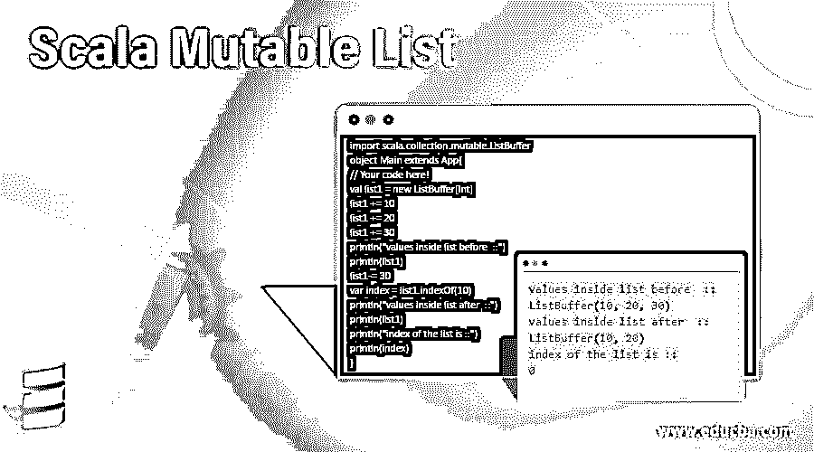
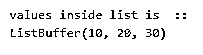
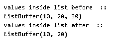
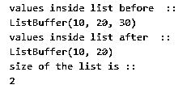
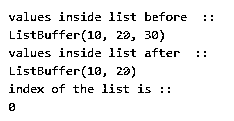
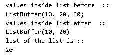

# Scala 可变列表

> 原文：<https://www.educba.com/scala-mutable-list/>




## Scala 可变列表简介

列表是集合在 scala 中的实现，它们是不可变的。列表使用链表数据结构。可变列表也是 scala 集合的一部分，用于存储和检索数据。Scala 为我们提供了许多创建可变列表的类。可变意味着列表中的对象是不断变化的。如果我们有对象列表不断变化的要求，那么我们应该选择可变列表。可变类还提供了许多在列表上执行的操作。还有一个方法可以将可变列表转换成不可变列表。

**语法**

<small>网页开发、编程语言、软件测试&其他</small>

```
var variabe_name = new Mutable_class_name[datatype]()
var variabe_name = new Mutable_class_name(val1, val2, val3, val4, val5 , val so on ...)
```

在上面的语法中，我们可以用两种方法创建一个可变列表；

1)第一种方法是创建一个空的可变列表，并提到它的数据类型。

2)第二种方法是同时创建和初始化列表。

### Scala 中的可变列表是如何工作的？

Scala 为我们提供了各种创建可变列表的类。列表中的元素是不断变化的，那么我们可以用一个可变列表，但是这个可变列表我们可以用 toList 方法再次转换成一个不可变列表。让我们逐一讨论各种可变类；

#### 1.可变列表

这个类在内部使用队列。队列遵循先进先出的方法。首先插入的元素将首先被移除。在队列中，我们总是在队列末尾添加元素，从队列顶部删除元素。

**扩展类:**

*   抽象序列
*   线性序列
*   LinearSeqOptimized[A，可变列表[A]]
*   GenericTraversableTemplate[A，MutableList]
*   生成器[A，可变列表[A]]
*   可序列化

**可变列表的超类型；**

*   (Int)一个，，集合。可重复的
*   序列[A]
*   易变的
*   可迭代的，可遍历的
*   可克隆的
*   可穿越的
*   travelable once[a]
*   SeqLike[A，Seq[A]
*   io。可序列化
*   可序列化
*   生成器[A，可变列表[A]]
*   可生长的
*   可清除的
*   可旅行的
*   可旅行的
*   可并行化[A，ParSeq[A]]
*   gentravelebleonce[a]
*   FilterMonadic[A，可变列表[A]]
*   HasNewBuilder[A，MutableList[A]]
*   LinearSeqOptimized[A，可变列表[A]]
*   线性序列
*   LinearSeqLike[A，可变列表[A]]
*   SeqLike[A，可变列表[A]]
*   可克隆的
*   郎。可克隆的
*   抽象序列
*   基因序列[A]
*   GenSeqLike[A，可变列表[A]]
*   部分函数[Int，A]
*   可抽象的
*   IterableLike[A，MutableList[A]]
*   等于
*   可遗传的
*   TraversableLike[A，可变列表[A]]
*   GenTraversableLike[A，可变列表[A]]
*   AnyRef
*   任何的
*   GenericTraversableTemplate[A，MutableList]
*   线性序列
*   抽象序列
*   序列[A]
*   genicable like[A，可变列表[A]]

**已知孙类为可变列表；**

*   长队
*   队列代理
*   同步队列

#### 2.列表缓冲区

ListBuffer 是 Scala 中另一种可变类。ListBuffer 在这个包里面是可用的> > Scala . collection . mutable . list buffer . Scala list buffer 给我们常量时间追加和前置操作。但是其他大部分操作都是线性的。ListBuffer 只是 List 的实现。

**扩展类:**

*   抽象缓冲区[A]
*   SeqOps[A，列表缓冲区，列表缓冲区[A]]
*   strict optimized dseqops[a，ListBuffer，ListBuffer[A]]
*   ReusableBuilder[A，不可变。列表[A]]
*   iteratible factoryfaults[a，列表缓冲区]
*   默认可序列化

#### 3.链接列表

这是 scala 中可变列表的另一种形式。在这里，我们创建了列表的头部，这个列表可以手动操作和创建。这可以在 Scala . collection . mutable . linked list 包中找到。

**扩展类:**

*   抽象序列
*   线性序列
*   generic warning template[a，LinkedList]
*   LinkedIn like[a，LinkedIn[a]]
*   可序列化

#### 4.双重链接列表

这个类在内部使用一个包含节点头部和尾部的链表。节点有头和尾两部分。还有下一个和上一个节点的地址。它在 Scala . collection . mutable . double linked list 类中可用。

**扩展类:**

*   抽象序列
*   线性序列
*   generic objects template[a，DoubleLinkedList]
*   可序列化
*   DoubleLinkedListLike[A，DoubleLinkedList[A]]

### Scala 可变列表的例子

下面提到了不同的例子:

#### 示例#1

在这里，我们使用一个列表缓冲区创建一个可变列表，并打印它的所有元素。

**代码:**

```
import scala.collection.mutable.ListBuffer
object Main extends App{
// Your code here!
val list1 = new ListBuffer[Int]
list1 += 10
list1 += 20
list1 += 30
println("values inside list is  ::")
println(list1)
}
```

**输出:**




#### 实施例 2

在这个例子中，我们使用 scala 中可用的-=方法从可变列表中删除元素。

**代码:**

```
import scala.collection.mutable.ListBuffer
object Main extends App{
// Your code here!
val list1 = new ListBuffer[Int]
list1 += 10
list1 += 20
list1 += 30
println("values inside list before  ::")
println(list1)
list1 -= 30
println("values inside list after  ::")
println(list1)
}
```

**输出:**




#### 实施例 3

在这个例子中，我们使用 size 方法计算列表中的元素。

**代码:**

```
import scala.collection.mutable.ListBuffer
object Main extends App{
// Your code here!
val list1 = new ListBuffer[Int]
list1 += 10
list1 += 20
list1 += 30
println("values inside list before  ::")
println(list1)
list1 -= 30
var size = list1.size
println("values inside list after  ::")
println(list1)
println("size of the list is ::")
println(size)
}
```

**输出:**




#### 实施例 4

在这个例子中，我们通过使用 scala 集合中可用的 index of 方法来获取可变列表中元素的索引。

**代码:**

```
import scala.collection.mutable.ListBuffer
object Main extends App{
// Your code here!
val list1 = new ListBuffer[Int]
list1 += 10
list1 += 20
list1 += 30
println("values inside list before  ::")
println(list1)
list1 -= 30
var index = list1.indexOf(10)
println("values inside list after  ::")
println(list1)
println("index of the list is ::")
println(index)
}
```

**输出:**




#### 实施例 5

在这个例子中，我们使用 scala 集合中的 head 方法来获取列表的头部。

**代码:**

```
import scala.collection.mutable.ListBuffer
object Main extends App{
// Your code here!
val list1 = new ListBuffer[Int]
list1 += 10
list1 += 20
list1 += 30
list1 += 50
list1 += 40
list1 += 60
println("values inside list before  ::")
println(list1)
list1 -= 30
var head = list1.head
println("values inside list after  ::")
println(list1)
println("head of the list is ::")
println(head)
}
```

**输出:**


#### 实施例 6

在这个例子中，我们正在检索可变列表中的最后一个元素。为此，我们使用最后一种方法，这种方法仅适用于集合的一部分。

**代码:**

```
import scala.collection.mutable.ListBuffer
object Main extends App{
// Your code here!
//creating mutable list
val list1 = new ListBuffer[Int]
list1 += 10
list1 += 20
list1 += 30
println("values inside list before  ::")
println(list1)
list1 -= 30
var last = list1.last
//printing output after operations
println("values inside list after  ::")
println(list1)
println("last of the list is ::")
println(last)
}
```

**输出:**




### 结论

Scala 为我们提供了各种创建可变列表的类。它们只是该系列的一部分。但是它们使用不同的数据结构来实现可变的概念。我们有 list =buffer，链表，双向链表等等。而且，他们想出了各种方法来创建和操作列表元素。我们还可以使用 toList 方法将可变列表转换成不可变列表。

### 推荐文章

这是一个 Scala 可变列表的指南。这里我们讨论可变列表在 Scala 中是如何工作的，并举例说明代码和输出。您也可以看看以下文章，了解更多信息–

1.  [Scala 试抓](https://www.educba.com/scala-try-catch/)
2.  [Scala 抽象类](https://www.educba.com/scala-abstract-class/)
3.  [Scala 数据类型](https://www.educba.com/scala-data-types/)
4.  [Scala 版本](https://www.educba.com/scala-versions/)


