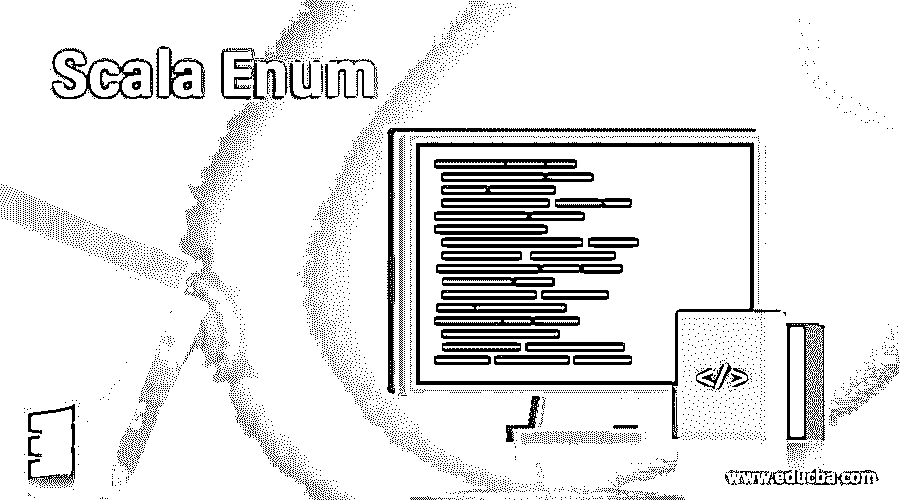
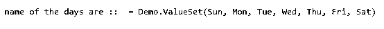
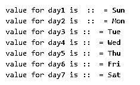
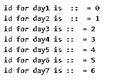

# Scala 枚举

> 原文：<https://www.educba.com/scala-enum/>




## Scala 枚举简介

Enum 代表枚举。Enums 是表示一些常数的项的集合，并在需要时提供轻量值。我们基本上使用枚举来表示属于同一类别的一组值。像平日可以创建一个枚举或月份名称也可以创建一个枚举在任何语言。Enum 的工作方式与它们在 c 和 java 中的工作方式相同。Scala enum 可以通过使用 Enumeration 类来实现。如果我们想要创造，那么我们必须扩展这个类。

**语法**

<small>网页开发、编程语言、软件测试&其他</small>

```
object Enum_name extends Enumeration {
type Enum_name = Value
val constant1, constant2, constant3, and so on ...  = Value
}
```

在 scala 中，我们有一个枚举类来创建 enum。为此，我们需要扩展这个类，并给枚举命名。在定义枚举时，我们也需要使用类型别名。之后，我们可以定义将成为枚举一部分的值。这是定义枚举的语法。

```
object MonthName extends Enumeration {
type MonthName = Value
val Jan, Feb, Mar, Apr, May, Jun, Jul Aug, Sep, Oct, Nov, Dec  = Value
}
```

在这里，我们试图创建一个表示月份名称的枚举。

### Scala 中的 Enum 函数是如何工作的？

Scala enum 的工作方式和其他编程语言一样。它们基本上是一组有限的值，这些值是一个已定义的枚举可以采用的枚举形式。将来，这个枚举将为所请求的类提供一个轻量级的替代值。我们还可以获取枚举常量的值。对于这个 scala，enum 提供了使用它的方法。

在定义枚举的值时，我们使用 val 关键字来使值易于访问。因此，我们在枚举中定义的所有值将代表一个公共的和共享一个公共的类别。

让我们看看它的超类型、子类和层次结构；

**1) Scala enum 超类型类；**

*   io。可序列化
*   Anyref
*   Anyref

**2) Scala enum 有已知的子类；**

*   舍入模式

**3) Scala 枚举层次；**

*   可序列化
*   列举
*   舍入模式

下面是一个解释其工作原理的例子；我们在这里所做的是创建一个枚举，其值类似于当天的名称。创建 enum 时，我们需要记住的第一件事是我们必须扩展 enumeration 类。如果我们不这样做，就会产生编译时错误。创建后，我们使用 type 和 values 关键字为枚举赋值。之后，我们打印出我们赋给常量的值。为此，我们使用 enum 名称后跟 values 方法。

```
object Main extends App{
// Your code here!
var demo = new Demo()
println(s"name of the days are ::  = ${demo.values}")
}
class Demo extends Enumeration
{
// creating with type alias
type Demo = Value
// values foe enum
val day1 = Value("Sun")
val day2 = Value("Mon")
val day3 = Value("Tue")
val day4 = Value("Wed")
val day5 = Value("Thu")
val day6 = Value("Fri")
val day7 = Value("Sat")
}
```

枚举类中可用的构造函数:

1) new Enumeration():这是没有参数的默认构造函数。

2) new Enumeration(count_val: Int):参数化的构造函数接受一个整数参数。此计数值将是初始值，在运行时将根据这些初始值为枚举内部的值定义定义计数。

### Scala 枚举的示例

以下是 Scala Enum 的示例:

#### 示例#1

在这个例子中，我们只是使用 values 方法打印出分配给 enum 类的值。

**代码:**

```
object Main extends App{
// Your code here!
var demo = new Demo()
println(s"name of the days are ::  = ${demo.values}")
}
class Demo extends Enumeration
{
// creating with type alias
type Demo = Value
// values foe enum
val day1 = Value("Sun")
val day2 = Value("Mon")
val day3 = Value("Tue")
val day4 = Value("Wed")
val day5 = Value("Thu")
val day6 = Value("Fri")
val day7 = Value("Sat")
}
```

**输出:**




#### 实施例 2

在这个例子中，我们使用变量名打印出常量的值。

**代码:**

```
object Main extends App{
// Your code here!
var demo = new Demo()
println(s"value for day1 is  ::  = ${demo.day1}")
println(s"value for day2 is  ::  = ${demo.day2}")
println(s"value for day3 is ::  = ${demo.day3}")
println(s"value for day4 is ::  = ${demo.day4}")
println(s"value for day5 is ::  = ${demo.day5}")
println(s"value for day6 is ::  = ${demo.day6}")
println(s"value for day7 is ::  = ${demo.day7}")
}
class Demo extends Enumeration
{
// creating with type alias
type Demo = Value
// values foe enum
val day1 = Value("Sun")
val day2 = Value("Mon")
val day3 = Value("Tue")
val day4 = Value("Wed")
val day5 = Value("Thu")
val day6 = Value("Fri")
val day7 = Value("Sat")
}
```

**输出:**




#### 实施例 3

在这个例子中，我们使用。id 方法。

**代码:**

```
object Main extends App{
// Your code here!
var demo = new Demo()
println(s"id for day1 is  ::  = ${demo.day1.id}")
println(s"id for day2 is  ::  = ${demo.day2.id}")
println(s"id for day3 is ::  = ${demo.day3.id}")
println(s"id for day4 is ::  = ${demo.day4.id}")
println(s"id for day5 is ::  = ${demo.day5.id}")
println(s"id for day6 is ::  = ${demo.day6.id}")
println(s"id for day7 is ::  = ${demo.day7.id}")
}
class Demo extends Enumeration
{
// creating with type alias
type Demo = Value
// values foe enum
val day1 = Value("Sun")
val day2 = Value("Mon")
val day3 = Value("Tue")
val day4 = Value("Wed")
val day5 = Value("Thu")
val day6 = Value("Fri")
val day7 = Value("Sat")
}
```

**输出:**




### 结论

在 scala enum 中，我们不像其他编程语言那样有任何名为 enum 的关键字。相反，我们有一个需要扩展的枚举类。此外，如果我们想定义枚举值，我们必须使用 val 关键字，因为要使它可访问。我们还可以将一些默认值赋给枚举常量，它将是枚举值的 id。

### 推荐文章

这是一个 Scala Enum 的指南。在这里，我们讨论了枚举函数在 Scala 中的工作原理和例子，以及代码和输出。您也可以看看以下文章，了解更多信息–

1.  [Scala for 循环](https://www.educba.com/scala-for-loop/)
2.  [Scala 版本](https://www.educba.com/scala-versions/)
3.  [什么是 Scala？](https://www.educba.com/what-is-scala/)
4.  [Scala 运算符](https://www.educba.com/scala-operators/)


