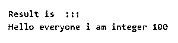
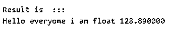
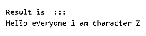
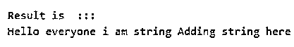

# Scala 格式

> 原文：<https://www.educba.com/scala-format/>


## Scala 格式介绍

在编程语言中，我们可以将字符串格式化为有意义的格式，并向用户提供包含值的有用消息。在 scala 中，我们有不同的方法来格式化我们的字符串；其中一个叫做“format ”,顾名思义，它是用来格式化我们的字符串的，就像我们在 C 语言中一样。

**语法:**

<small>网页开发、编程语言、软件测试&其他</small>

我们可以在 scala 中使用 format 来格式化 string 我们可以在想要显示给用户的字符串消息之间传递值。我们甚至可以将参数传递给 format()方法。

```
variable.formate(param1, param2, param3 ..so on)
```

在上面的语法中，我们在 format 方法内部传递不同的参数；该参数将是字符串消息的值。

**举例:**

**代码:**

```
val msg = "we have %d hands.!!"
val val1 = 2
val r = msg.format(val1)
```

这个语法会让你更好地理解在 scala 中格式化字符串时如何在程序中使用这个语法。

### Scala 中的 format 函数是如何工作的？

到目前为止，我们知道 format 方法在 scala 语言中是用来格式化字符串的。这个方法有不同的标识符，我们可以说是用来标识值，并将它们放在字符串的消息中。它有%d，%f 等等，就像我们在 C 语言中一样。通过使用它，我们可以用我们想要的方式格式化我们的字符串。同样，我们可以把我们的值放在字符串中，只需要大约几行代码。这个格式方法在内部也接受参数。

Scala 为我们提供了两种格式化字符串的方法:一种是格式化，另一种是被格式化。

#### 1.格式()

此方法可用于格式化字符串。这个方法在 scala 中使用各种标识符来为我们格式化字符串。

*   **%d:** 如果我们指定了这个标识符，那么它将代表一个整数值。通过使用这个标识符，我们可以将整数值放入字符串中。
*   **%f:** 如果我们指定这个标识符，那么它将表示双精度或浮点值。通过使用这个标识符，我们可以将 float 或 double 值放入字符串中，并在 scala 中对其进行格式化。
*   **%c:** 如果我们指定了这个标识符，那么它将代表字符值。通过使用这个标识符，我们可以将字符值放入字符串中，并在 scala 中对其进行格式化。
*   **%s:** 如果我们指定了这个标识符，那么它将表示字符串值。通过使用这个标识符，我们可以将字符串值放入消息中，并在 scala 中对其进行格式化。

**语法:**

```
varable.format(param1, param2)
```

#### 2.格式化

此方法可用于任何对象，无论是字符串、浮点、双精度还是整数。例如，我们可以在它内部传递一个包含与之相关联的标识符的字符串。

我们还将看到它的语法，以便更好地理解如何在程序中使用它来格式化我们的对象。

**语法:**

`variable.formatted("we have %d hands.")`

现在我们对 format 方法的工作原理有了基本的了解；现在，我们将看到一个例子，说明如何在 scala 的实际程序中使用这个方法来格式化我们的字符串和对象。

**举例:**

**代码:**

```
object Main extends App{
// Your code here!
val message = "We have %d hands."
val x =2
val result = message.format(x)
println(result)
}
```

在上面的例子中，我们在这里创建一个名为 Main 的类，并扩展 App 来运行我们的程序；这是 scala 类的基本语法。在这之后，我们在这里准备一条信息；在这个消息字符串中，我们也传递一个整数值。因此，我们使用%d 标识符。紧接在这一行之后，我们正在初始化要在字符串消息之间打印的整数变量。最后，我们在 String 对象上调用 format()方法，并在其中传递参数。在我们的例子中，我们在这里传递整数“x”作为输入。所以它会在最后打印消息。

### Scala 格式的例子

下面是 Scala 格式的例子:

#### 示例#1

在这个例子中，我们将整数值放入字符串中，并使用 format 方法。

**代码:**

```
object Main extends App{
// Your code here!
//creating string object
val message = "Hello everyone i am integer %d "
//assigning value
val x = 100
//calling format method here
val result = message.format(x)
//print result
println("Result is  ::: ")
println(result)
}
```

**输出:**




#### 实施例 2

在这个例子中，我们将 float 值放入字符串中，并使用 format 方法。

**代码:**

```
object Main extends App{
// Your code here!
//creating string object
val message = "Hello everyone i am float %f "
//assigning value
val x = 128.89
//calling format method here
val result = message.format(x)
//print result
println("Result is  ::: ")
println(result)
}
```

**输出:**




#### 实施例 3

在这个例子中，我们将字符值放入字符串中，并使用 format 方法。

**代码:**

```
object Main extends App{
// Your code here!
//creating string object
val message = "Hello everyone i am character %c "
//assigning value
val x = 'Z'
//calling format method here
val result = message.format(x)
//print result
println("Result is  ::: ")
println(result)
}
```

**输出:**




#### 实施例 4

在本例中，我们将字符串值放入字符串中，并使用 format 方法。

**代码:**

```
object Main extends App{
// Your code here!
//creating string object
val message = "Hello everyone i am string %s "
//assigning value
val x = "Adding string here "
//calling format method here
val result = message.format(x)
//print result
println("Result is  ::: ")
println(result)
}
```

**输出:**




### 结论

通过使用这种方法，我们可以将字符串格式化为所需的格式。此外，我们可以通过使用 scala 格式中不同的标识符来指定字符串消息中的值。这些标识符与 C 语言中用于打印消息的标识符相同。我们可以打印任何对象，如字符串，整数，浮点，双精度，字符等。

### 推荐文章

这是一个 Scala 格式的指南。这里我们讨论引言；scala 中的 format 函数是如何工作的？和示例。您也可以看看以下文章，了解更多信息–

1.  [Scala 减少](https://www.educba.com/scala-reduce/)
2.  Scala 中的[数组](https://www.educba.com/array-in-scala/)
3.  [Scala IDE](https://www.educba.com/scala-ide/)
4.  [Scala 找到了](https://www.educba.com/scala-finds/)


