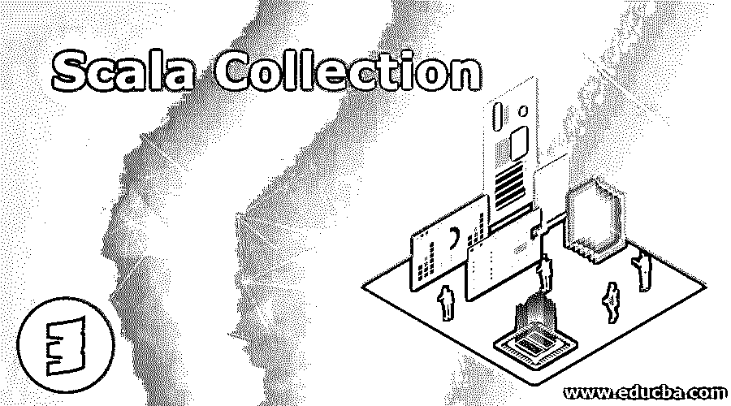
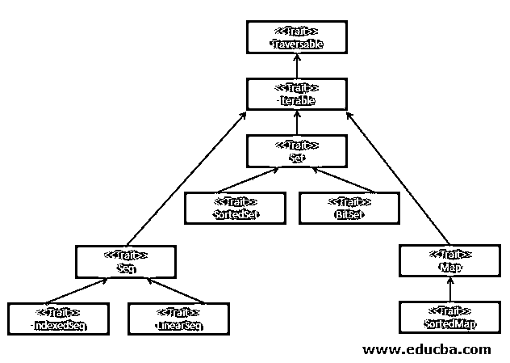

# Scala 收藏

> 原文：<https://www.educba.com/scala-collections/>

## Scala 集合简介

Scala 中的集合只不过是一个容器，数据项列表可以放在这个容器中，并在内存中一起处理。它由可变(scala.collection.mutable)和不可变(scala.collection.immutable)集合组成，这些集合又随 Val 和 Var 的功能而变化，此外，scala 集合提供了广泛的灵活内置方法，可用于直接在数据项上执行各种操作，如转换和操作。

### Scala 集合框架

在非常高的层次上，集合包含序列、集合和映射。所有这些都是可穿越特性的产物。请记住，Traversable (Parent)的所有子对象都是特征，而不是类，这使得它更容易在代码片段中实现，而不需要在调用它之前创建对象。

<small>网页开发、编程语言、软件测试&其他</small>

让我们详细讨论如下:

*   **参考—****书籍:**Scala、面向对象和函数式编程入门指南
*   **Traversable:** 帮助我们遍历整个集合，它实现了所有集合共有的行为，而不考虑数据类型。它只是意味着 Traversable 允许我们根据 for each 方法重复遍历集合。
*   **Iterable:** 给了我们一个迭代器，让我们一次遍历一个集合的元素。

**Note:** By using an iterator, the collection can be traversed only once, because each element is consumed during the iteration process.

### 可变和不可变集合

Scala 提供了两种集合。它们是:

*   易变的
*   不变的

#### 可变集合

这种类型的集合是可以更新的，这意味着，每当您试图向集合中添加元素时，它只是追加到同一个对象中。您可以添加、更新和删除现有可变集合中的元素。

**举例:**

1.  AnyRefMap
2.  数组缓冲器
3.  数组生成器
4.  ArraySeq
5.  ArrayStack(阵列堆栈)
6.  结束了
7.  双重链接列表
8.  散列表
9.  HashSet
10.  LinkedHashMap
11.  LinkedHashSet
12.  链接列表
13.  堆
14.  StringBuilder
15.  树集
16.  WeekHashMap 等。

#### 不可变集合

这种类型的集合永远不能改变。我们仍然可以看到类似于从集合中添加/更新/移除元素的方法。但是它实际上在内部创建了一个新的集合，并保持旧的不变。

**举例:**

1.  结束了
2.  散列表
3.  HashSet
4.  目录
5.  列表映射
6.  ListSet
7.  长图
8.  数字范围
9.  堆
10.  溪流
11.  流迭代器
12.  树图
13.  树集
14.  矢量
15.  索引等..

#### 字符串和惰性集合

每当我们使用过滤器、映射、最小值、最大值、减少、折叠等执行任何数据转换时..，在集合上，它基本上将其转换为另一个集合。可能有一些集合允许严格的转换意味着，当元素被求值并产生新的集合时，元素的内存被立即分配。在惰性集合中，转换不会预先创建另一个集合。这意味着不会立即分配内存，而是在有需求时创建新的集合。通过在集合上创建视图，可以将集合类转换为惰性集合。

为了更好的理解，让我们看看 Scala REPL 的例子。

**举例:**

**代码:**

`object Demo {
def main(args: Array[String]) {
val ls = (0 to 5).toList
println("List is: " + ls);
}
}`

**输出:**

在创建 collection-List 时，内存被立即分配，当我们试图调用该列表时，我们能够找到如下的元素列表。

**ls**

**res0: List[Int] = List(0，1，2，3，4，5)****//ls 的集合项分配给 res0。因此，它立即产生了记忆。**

**创建惰性集合:**

`object Demo {
def main(args: Array[String]) {
val ls = (0 to 5).toList
val lsLazy = ls.view
println("View: " + lsLazy);
}
}`

**lsla zy:Scala . collection . seq View[Int]= View(？)**

**Note:** Here when we try to create a view on the existing list, we can clearly say it doesn’t allocate the memory as it only builds a view of the list until unless any action is being called like foreach, min, max, etc.

**代码:**

`object Demo {
def main(args: Array[String]) {
val ls = (0 to 5).toList
val lsLazy = ls.view
println("max "+lsLazy.max);
}
}`

`object Demo {
def main(args: Array[String]) {
val ls = (0 to 5).toList
val lsLazy = ls.view
lsLazy.foreach(println)
}
}`

让我们研究一下集合附带的一些基本方法:

**可变集合:ArrayBuffer**

**举例**:

**代码:**

`object Demo {
def main(args: Array[String]) {
val arrBuff = (0 to 5).toBuffer
println(" "+arrBuff);
}
}`

**输出:**

现在，让我们尝试向现有的 ArrayBuffer 集合添加一个元素。

`object Demo {
def main(args: Array[String]) {
val arrBuff = (0 to 5).toBuffer
arrBuff += 5
println(" "+arrBuff);
}
}`

看看下面的结果，如果你仔细观察，你会发现数据项“5”已经被追加到现有的集合中。

**注意** : +=是一个用于将元素追加到原始集合中的方法。即，向集合添加新元素并将结果重新分配给原始集合。

*   :+–>该方法用于在对象副本中添加元素。
*   +:–>此方法用于在对象副本中预先添加元素。

**举例:**

**代码:**

`object Demo {
def main(args: Array[String]) {
val arrBuff1 = (0 to 5).toBuffer
println(" "+arrBuff1);
}
}`

**输出:**

**代码:**

`object Demo {
def main(args: Array[String]) {
val arrBuff1 = (0 to 5).toBuffer
arrBuff1 +=66
println(" "+arrBuff1);
}
}`

**输出:**

*   **res24:**Scala . collection . mutable . buffer[Int]= array buffer(0，1，2，3，4，5，66) **//** 添加在副本中，而不是原始的
*   **res25:**Scala . collection . mutable . buffer[Int]= array buffer(0，1，2，3，4，5) **//** 检查原始集合，注意集合项保持不变。

**不可变集合:列表**

**举例:**

**代码:**

`object Demo {
def main(args: Array[String]) {
val ls = (1 to 5).toList
println(" "+ls);
}
}`

**Note:** Mutable collections doesn’t have += method to append and reassign.

`object Demo {
def main(args: Array[String]) {
val ls = (1 to 5).toList
ls :+5
println(" "+ls);
}
}`

**Note: **Use ” :+= ” as the reassignment operator, while dealing with immutable collections to update the existing immutable collection. This method can be applied only on “var” and not on “val”.

map –>该方法帮助我们遍历集合，并允许我们将传入的数据项转换为所需的输出。

**举例:**

**代码:**

`object Demo {
def main(args: Array[String]) {
val ls = (1 to 5).toList
println("" + ls.map(e=> (e*2)));
}
}`

**输出:**

**Note**: map will always return the output of the same incoming data type. In the above screenshot, the input was List[Int], hence the output is also same. It output stored in “res13”.

foreach –>此方法的功能与 map 相同，只是它不能返回值。

**举例:**

**代码:**

`object Demo {
def main(args: Array[String]) {
val ls = (1 to 5).toList
ls.foreach(println)
}`

**输出:**

**Note**: If you look carefully in the screenshot, you can notice that the output of foreach hasn’t stored on any result variables here. This is why foreach varies with map.

### 结论

正如我们到目前为止所看到的，集合对于存储和检索各自数据类型的格式化项非常有用。此外，它还提供了各种方法来添加/更改或删除集合中的项目。它甚至适用于大多数关键场景，因为它提供了可变和不可变的集合。

### 推荐文章

这是 Scala 集合的指南。在这里，我们讨论了 Scala Collections 框架及其不同类型的简要概述和例子。您也可以浏览我们推荐的其他文章，了解更多信息——

1.  [什么是 Scala？](https://www.educba.com/what-is-scala/)
2.  [Scala 抽象类](https://www.educba.com/scala-abstract-class/)
3.  [Scala 数据类型](https://www.educba.com/scala-data-types/)
4.  [Scala foreach](https://www.educba.com/scala-foreach/)

