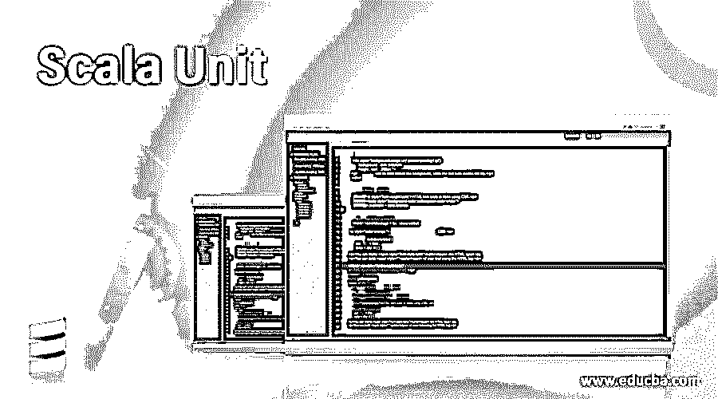
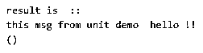
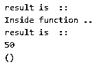
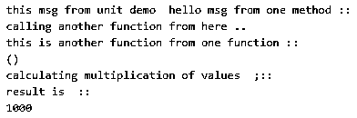
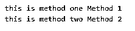

# 标量单位

> 原文：<https://www.educba.com/scala-unit/>

## Scala 单元简介

单元的行为方式与 java 中的 void 相同。void 用于那些不返回任何东西或者不应该返回任何值的函数。单元类型的工作方式与 void 相同，这意味着它也不返回任何内容。单元类型是特征中任何类型的子类。这与 scala 中的方法签名一起作为返回值使用。当我们不希望函数返回任何值时，我们应该使用它。在这个主题中，我们将学习 Scala 单元。

**语法**

<small>网页开发、编程语言、软件测试&其他</small>

要用单元类型定义任何函数，我们只需要在方法签名中使用' unit '关键字。我们还将看到一个练习示例来理解语法。

`def method_name(variavle_name: Data_type): Retunr_type = {
// logic goes here
}`

**举例:**

`def getM(msg: String): Unit = {
println("Msg goes here ")
}`

在上面几行代码中，我们使用了 Unit 关键字来定义我们的函数，它不会返回任何东西；它只会执行函数体内的逻辑。

### Scala 中的单元类型是如何工作的？

该单元在 scala 中是一个返回类型，在另一种编程语言(如 java)中充当 void。现在我们将看到一个例子来更好地理解它。当我们不从函数中返回任何东西时，我们应该选择单元类型；我们只是执行我们的逻辑并更新一些值，这些值可以是任何东西，也包括一些数据库调用或在单独的线程中运行一个方法。

在 scala 中，它还支持其他一些关键字来处理空值，见下文；

*   **无:**这也是一个特质，负责抛出异常。这个特征也没有实例。
*   **null:** Double、Int、Long 不能为空，但 String、Object 可以为空。
*   **null:** 通过使用这个，我们可以将引用类型指定为 Null，但是这里的值也不能为 Null。
*   **Unit:** 在这里，正如我们所讨论的，它不返回任何值。

现在我们将看到一个完整的功能程序来理解它的工作原理以及我们如何在我们的程序中使用它；

**举例:**

`object Main extends App{
// Your code here!
def getMessage(msg: String): Unit = {
println("this msg from unit demo  "+ msg)
}
println("result is  ::")
println(getMessage("hello !!"))
}`

在上面的代码行中，我们在这里创建了一个名为 main 的主对象，并从 scala 扩展了 App 类。之后，我们使用 def 关键字创建 getMessage 方法。此方法接受一个字符串类型的参数。但是这个函数的返回类型是 unit，这意味着这个函数在被调用时不会返回任何值；这是一个没有返回语句的简单函数。在程序的最后，我们只是从 scala 中已有的 println 方法中调用这个函数。所以它会打印出写在函数体内的代码行，并为我们执行整个逻辑。但是我们可以由此调用另一个返回类型不是 Unit 的函数；这在任何编程语言中都不受限制；这取决于我们的要求。

在 scala 中使用单元类型时要记住的要点；

1)如果你想定义一个不返回任何值的函数，那么我们应该选择 scala 中的 Unit。

2)要做一个不返回值的函数，我们必须在那里使用 Unit 关键字。

3)如果你想从你的函数中得到一些值，不要选择单元类型，因为它和其他编程语言中的空值一样，比如 java 等等。

4)在 scala 中用来表示空值，或者我们可以说根本没有值。

### Scala 单元的示例

下面给出的是 Scala 单元的例子:

#### 示例#1

在这个例子中，我们使用一个单元函数，它有一个参数，类型为 String。

**代码:**

`object Main extends App{
// Your code here!
//defining function here
def getMessage(msg: String): Unit = {
println("this msg from unit demo  "+ msg)
}
// printing output here
println("result is  ::")
println(getMessage("hello !!"))
}`

**输出:**

#### 实施例 2

在这个例子中，我们使用一个单位函数，并试图找出变量的总和。

**代码:**

`object Main extends App{
// Your code here!
//defining function here ..
def getMessage(x: Int, y: Int): Unit = {
println("Inside function ..")
var z  = x + y
println("result is  ::")
println(z)
}
// printing output here ..
println("result is  ::")
println(getMessage(20 , 30 ))
}`

**输出:**

#### 实施例 3

在这个例子中，我们用返回类型单元定义了许多函数。此外，我们从另一个调用另一个函数。

**代码:**

`object Main extends App{
// Your code here!
//defining function here ..
def getMessage(msg: String): Unit = {
println("this msg from unit demo  "+ msg)
}
def callAnother(msg: String): Unit = {
println("calling another function from here ..")
println(changefun("hello by another function ..."))
}
def getMultiply(x: Int , y: Int, z: Int): Unit = {
println("calculating multiplication of values  ;::")
var result  = x * y * z
println("result is  ::")
println(result)
}
def changefun(msg: String): Unit = {
println("this is another function from one function :: ")
}
getMessage("hello msg from one method ::")
callAnother("calling another function from here ... ")
getMultiply(10, 10 , 10)
}`

**输出:**

#### 实施例 4

我们在这里调用两种不同的方法。

**代码:**

`object Main extends App{
// Your code here!
//defining function here also using unit type here
def m1(msg1: String): Unit = {
println("this is method one "+ msg1)
}
def m2(msg2: String): Unit = {
println("this is method two "+ msg2)
}
// calling method here to print the result
m1("Method 1")
m2("Method 2")
}`

**输出:**

### 结论

Scala 单元类型用在没有什么可以返回的时候。它可以被声明为 null、没有值或没有任何回报。Scala 还提供了其他类型来处理它，比如 null、nil、nothing 和 none。所以这些类型过去在 scala 中显示任何空的返回类型值。scala 提供的这一功能与其他编程语言中的 void 关键字非常相似。

### 推荐文章

这是一个 Scala 单元的指南。这里我们讨论单元类型在 Scala 中是如何工作的，以及代码和输出的例子。您也可以看看以下文章，了解更多信息–

1.  [Scala 类构造函数](https://www.educba.com/scala-class-constructor/)
2.  [Scala 集合](https://www.educba.com/scala-set/)
3.  秤尾
4.  [Scala 抽象类](https://www.educba.com/scala-abstract-class/)

