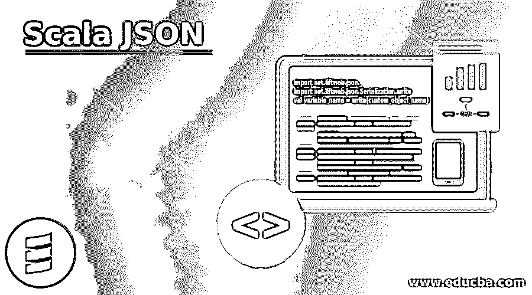
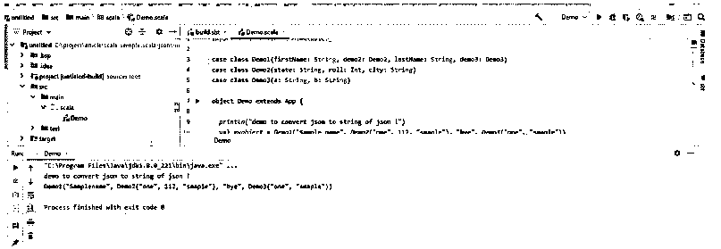

# Scala JSON

> 原文：<https://www.educba.com/scala-json/>




## Scala JSON 简介

JSON 代表 Javascript object notation，用于在任何编程语言中以键和值对的形式显示我们的类或对象。通过使用 JSON，我们可以将我们的类对象转换成键值对，并轻松地通过网络发送它们。此外，JSON 非常容易访问，但是在 scala 中，我们没有任何库来创建 JSON 对象，我们必须使用其他一些库来实现它，我们有各种选项可以在 Scala 中实现 JSON。

**语法:**

<small>网页开发、编程语言、软件测试&其他</small>

到目前为止，我们知道我们必须使用这个库来实现 JSON，我们有几种选择。让我们详细看看其中一种方法，但首先让我们从它的语法开始，如何在编程时使用它:

```
import net.liftweb.json._
import net.liftweb.json.Serialization.write
val variable_name = write(custom_object_name)
```

正如你在上面几行代码中看到的，我们正在使用 lift web json 库来使用 json。我们首先必须导入库，然后只有我们可以使用它的方法来创建 json 字符串。

### JSON 在 Scala 中是如何工作的？

现在我们知道 JSON 是类变量的表示，它以键值对的形式显示我们的类变量。同样，我们可以创建 JSON 对象或 JSON 字符串，JSON 数组也是可能的。它会将整个类及其深层转换成适当的格式。在 scala 中，我们有几种方法来处理 json，我们可以使用外部或第三方 API 来创建 JSON 对象。在这里，我们将详细了解它们。如果我们想访问 JSON 对象，那么我们可以通过传递键名直接获取值，这非常容易使用。Play 框架还提供了一个处理 JSON 的库，我们也可以用这个来实现 JSON。

#### 1.举起 JSON

这个 API 用于在 scala 中创建 JSON 对象，我们可以在创建 JSON 时使用它并将其导入到我们的项目中。它有 write()方法，可以将类对象或自定义对象转换成 json 字符串。这个 json 字符串可以很容易地通过网络传递，我们可以很容易地使用它，并再次将这个对象转换成 JSON 或任何特定于类的对象。如果我们想访问对象值，我们必须传递键，它会返回给我们里面的值。

**举例:**

```
case class Demo1(name: String, age: int, rollno: String, demo2: Demo2)
case class Demo2(grade: String, city: String, state: String)
```

这里我们已经创建了两个自定义类，我们将使用这个库把它转换成 json 字符串。如你所见，我们在“demo1”类中有“demo2”对象，所以在将其转换为 json 时，它也会转换其中的对象和列表。

我们必须将该库包含到我们的程序中，为了完成这项工作，我们在下面也提到了该库，如下所示:

```
import net.liftweb.json._
import net.liftweb.json.Serialization.write
```

在此之后，我们可以调用 write()方法，该方法会将类对象转换为字符串的 json。

```
val mjson = write(our_object)
```

在这里，我们可以传递我们的对象，它会将自定义对象转换为字符串的 json。在使用它时，我们可以再次将它转换成我们的对象或 json 对象。

下面是我们在 scala 中创建 json 的一些方法，见下文:

*   提升 json 库
*   Play 框架:它为我们提供了 play json 库来处理 scala 中的 json。
*   喷 json 库
*   谷歌 gson
*   Json4s

我们可以用这个 API 在 scala 中处理 json。

在 scala 中使用 json 时需要记住以下几点:

*   JSON 可以用来创建键值对对象。这以特定的格式表示它们，我们可以将我们的自定义对象也转换成 JSON。
*   我们必须将库包含或导入到我们的项目中，否则我们无法运行我们的程序，它会产生错误，所以请确保您将所有的依赖项和库放入我们的位置。
*   通过使用 JSON，我们可以通过网络进行转换和发送，这将很容易使用和处理。

### Scala JSON 示例

下面给出的是 Scala JSON 的例子:

在这个例子中，我们正在创建一个 json 对象。为此，我们使用 lift json 库。要运行此程序，请确保您的项目中有必要的依赖项，否则程序将无法编译。我们不能像普通的 scala 程序一样运行它，因为它依赖于库。我们使用 writer 方法将它们转换成 JSON。

**代码:**

```
import scala.collection.mutable._
import net.liftweb.json._
import net.liftweb.json.Serialization.write
// here we are creatng smaple classes to show the demo. This will convert into json
//class one
case class Demo1(firstName: String, demo2: Demo2, lastName: String, demo3: Demo3)
//class two
case class Demo2(state: String, roll: Int, city: String)
//class three
case class Demo3(a: String, b: String)
object Demo extends App {
println("demo to convert json to string of json !")
// here we are creating our object
val myobject = Demo1("Sample name", Demo2("one", 112, "smaple"), "bye", Demo3("one", "smaple"))
// calling write method to write our class object to json string
val mystring = write(myobject)
// now printing the result.
println(mystring)
}
```

**输出:**




### 结论

所以要在 scala 中使用 json，我们必须使用外部库或 java 库。包含了 library only 之后，我们就可以在 scala 中准备一个 json 对象了。这不像普通的 scala 程序，它们需要在程序中包含依赖关系才能使用。

### 推荐文章

这是一个 Scala JSON 的指南。这里我们讨论一下入门，JSON 在 scala 中是如何工作的？并分别给出了示例。您也可以看看以下文章，了解更多信息–

1.  [Scala 正则表达式](https://www.educba.com/scala-regex/)
2.  [Scala groupBy](https://www.educba.com/scala-groupby/)
3.  [Scala 减少](https://www.educba.com/scala-reduce/)
4.  [Scala IDE](https://www.educba.com/scala-ide/)


