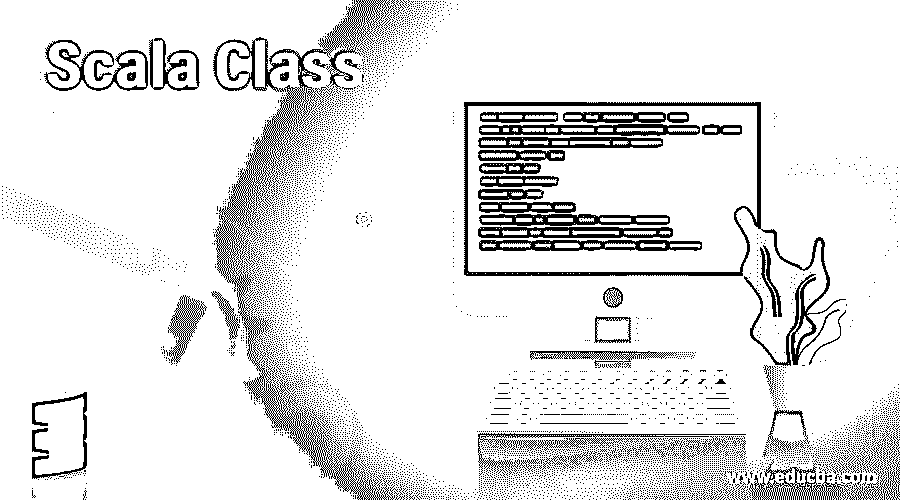
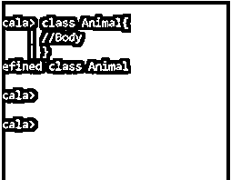
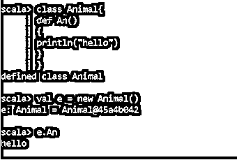
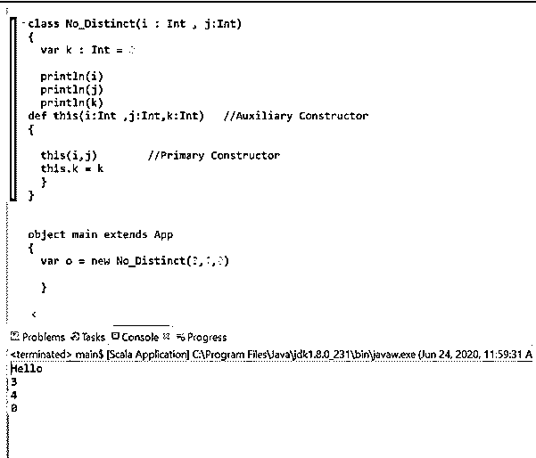

# Scala 类

> 原文：<https://www.educba.com/scala-class/>

## Scala 类介绍

Scala 类基本上是一个用户定义的蓝图，将方法和字段放在一个单元中，从这个单元中可以创建对象。类就像是在它的作用域内定义的各种方法和全局变量的家。我们可以使用 new 关键字(通过将其初始化为 calling)从类中创建一个对象，并使用它来调用类中的方法。类中有提供类状态的字段，类中定义了实现类行为的方法。在对象定义的帮助下，我们可以使用一个类中定义的所有功能。

### 类别声明

scala 中的类是用关键字 class 定义的，后跟类名。从花括号开始，它包含了类的主体，以花括号结束。该类可以有一些可选参数，也可以定义任何超类扩展或特征。public 是用于该类的默认修饰符。

<small>网页开发、编程语言、软件测试&其他</small>

`class Class_name{
// body with method and fields.
}`

#### 例子

`Class Animal
{
//Method Body
//Variable Declaration
}`

**输出:**

定义的动物类

### Scala 中的类是如何工作的？

在 scala 中声明 class 之后，我们有了所有需要使用的方法和变量。所以我们需要创建一个对象，当一个类的对象被创建时，这个类就被实例化了。一旦这样做了，我们就能够获取值并使用类中使用的方法。

我们可以为一个类创建多个实例，new 关键字用于在 Scala 中定义对象，一旦对象被创建，我们就可以访问类中的方法，并可以在我们的代码中实现它。

让我们看看如何用对象调用类方法。

`scala> class Animal{
| defAn()
| {
| println("hello")
| }
| }
defined class Animal`

这里我们声明了一个名为 Animal 的类，其中包含一个方法 An。

`scala>val e = new Animal()`

e: Animal = Animal@45a4b042

然后在 vale 中，我们创建了一个新的对象，它可以访问这个类的方法。

`scala>e.An
hello`

然后我们称它为一个方法，我们可以用对象 e 来调用它，并得到这个方法的功能。因此它将打印 Hello 消息。因为类中元素的默认访问修饰符是 public 的，但是我们也可以把它设为 private 来限制类中元素的访问。

因此，每当使用 new 运算符创建一个新对象时，就会分配内存并调用类构造函数返回一个引用。我们也可以创建匿名对象，匿名对象是那些没有任何引用的对象。

所以当一个对象被实例化时，构造函数基本上在 Scala 类中被调用。Scala 构造函数有两种类型:主构造函数和辅助构造函数，它们的主体和 class 的主体是一样的，所以 class 里面的任何东西都是构造函数的一部分。因此，如果没有定义构造函数，scala 将在创建对象时自动使用这个主构造函数，并且这个构造函数被作为默认构造函数调用。

关于这个默认的类构造函数，我们需要检查的几点是:-

*   如果里面定义的值是 var，那么我们可以改变它的值。
*   如果定义的值是 val in，那么它将被视为最终值，并且这些值不能更改。
*   如果没有定义任何内容(val，var ),它的可见性将受到限制。
*   我们也可以在定义内部值时使用访问修饰符，这样就可以按照访问修饰符的定义相应地工作。

让我们用一个例子来验证这一点:

`scala> class Animals(var a:Int , var b : Int){
| println("hello")
| }
defined class Animals`

这将定义一个具有主要构造函数 Animals 的类，并且每当对象被创建时，结果值被调用。

`scala>val b = new Animals(2,3)
hello
b: Animals = Animals@a8e6492`

而另一方面，如果我们想有一些除了主构造函数之外的其他构造函数，我们称之为辅助构造函数。我们可以在程序中创建尽可能多的辅助构造函数，但是主构造函数必须是一个。

辅助构造函数提供了一个不同的签名列表。辅助构造函数提出了一个叫做 this 的构造函数。

`classNo_Distinct(i : Int , j:Int)
{
vark :Int = 0
println("Hello")
println(i)
println(j)
println(k)
defthis(i:Int ,j:Int,k:Int)   //Auxiliary Constructor
{
this(i,j)        //Primary Constructor
this.k = k
}
}`

如果我们通过创建对象来调用这个方法，辅助构造函数将调用这两个方法，并执行方法中的操作。

**输出:**

`Val o = new No_Distinct(3,4,0)`

所以由此，我们看到了 Scala 类在面向对象编程模型中是多么的有用和有帮助。

### 结论

从上面的文章中，我们看到了 Scala 类及其展现的特性。对于 Scala 面向对象编程模型来说，拥有一个类是一个非常重要的概念。在示例的帮助下，我们了解了一个类可以拥有的方法和它所支持的功能。

### 推荐文章

这是一个 Scala 类的指南。在这里，我们还讨论了 scala 中的介绍和类的工作方式，以及例子和代码实现。您也可以看看以下文章，了解更多信息–

1.  [Scala 抽象类](https://www.educba.com/scala-abstract-class/)
2.  [Scala if else](https://www.educba.com/scala-if-else/)
3.  [Scala 高阶函数](https://www.educba.com/scala-high-order-functions/)
4.  [Scala 集合](https://www.educba.com/scala-collections/)

