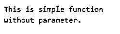
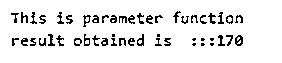
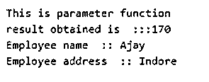
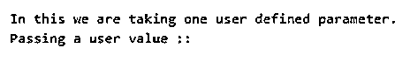

# Scala 函数

> 原文：<https://www.educba.com/scala-function/>

## Scala 函数的定义

顾名思义，Scala Function 意味着一段代码应该完成一个功能。像任何其他编程语言 scala 一样，Function 也以同样的方式工作。函数只不过是在一个单独的部分中编写我们的逻辑的一种方式，或者我们可以说函数是负责执行一些特定任务的一组语句。函数可以用在我们有相同逻辑或重复代码的地方，因此我们可以创建一个函数并从任何地方调用它，而不是一次又一次地编写代码。Scala 函数还负责执行特定的任务。

### 如何在 Scala 中定义函数？

在定义函数时，我们需要更加关注函数签名，因为它非常重要。我们的函数将完全依赖于我们如何定义它。我们应该记住，我们想从函数中得到什么，我们要提供什么参数。下面来看看；

<small>网页开发、编程语言、软件测试&其他</small>

`defname_of_function ([parametre_list]) : [return_type] = {
// function logic
}`

Scala 函数在定义时包含 6 个部分；让我们逐一讨论。

*   **def:** 是 scala 中可用的关键字。如果你想定义一个函数，我们必须在开头使用这个关键字。
*   **函数名:**这是用户自定义的函数名。它应该类似于函数在调用时将要执行的逻辑或任务。此外，它应该在一个骆驼的情况下(较低)。
*   **return_type:** return type 是指我们期望从函数执行后返回的内容。它可以是任何东西，但它是可选的。在 java 中，默认的返回类型是 void，而在 scale 中，如果我们不指定，它就是 Unit。
*   **parameter _ list:**这代表我们在调用时提供给函数的内容。在方括号[]内声明时，我们还必须指定参数的数据类型。我们将在下面的练习语法中看到它们。
*   **=:** 这可以和返回类型组件一起使用。它规定，如果=在那里，这意味着我们的函数将返回某个值。如果没有，那就没有我们想要的价值。它就像一个默认的返回类型函数。
*   **函数逻辑:**在这个里面，我们写了我们要对函数的调用执行的整个逻辑。我们也可以调用这个函数内部的不同函数。记住正文应该用{}花括号括起来。

`defcalculateSum ([a:Int, b: Int]) : Int = {
return a + b;
}`

这样，我们就可以定义它了。

### Scala 中的函数是如何工作的？

该函数用于执行任务。要使用任何函数，我们需要调用它。Scala 为我们提供了调用函数的不同方式，也就是说，我们可以直接调用它们，也可以使用类实例。

`[instance].name_of_function`

或者

`function(list_parameter)`

在 scala 中，像其他编程语言一样，我们有两种类型的函数。

*   **参数化函数:**在这种类型的函数中，我们传递参数列表。
*   **非参数化函数:**在这种类型的函数中，我们不向函数传递任何参数。那会是空的。此外，我们还可以将任何用户定义的值作为参数传递。

让我们举一个例子来理解它的工作原理；

`object Main extends App{
// Your code here!
calculateSum(10, 20)
defcalculateSum(a : Int, b : Int){
var result = a + b ;
println("Result is  :: "+ result)
}
}`

上面我们已经定义了一个名为 calculateSum 的函数，它接受两个变量 a 和 b，两者都是整数类型。在函数体内，我们已经编写了想要执行的逻辑。我们将 a 和 b 这两个值相加，并将值保存到第三个名为 result 的变量中。之后，我们只是打印我们获得的值。但是现在我们必须调用这个函数，所以在上面的行中，我们调用函数 b，它的名字和参数是指定的。我们传递的参数数量和函数签名中定义的数量应该相同；否则，它会给出一个编译时错误。

### Scala 函数示例

(简单函数、参数化函数等的例子。).

#### 示例#1

此示例显示了不带参数的函数的用法。

**代码:**

`object Main extends App{
// Your code here!
// calling function
simpleFunction()
defsimpleFunction(){
println("This is simple function")
println( "without parameter. ")
}
}`

**输出:**

#### 实施例 2

**代码:**

`object Main extends App{
// Your code here!
// calling function
sum(20 , 50, 100)
defsum(x: Int, y : Int, z: Int){
println("This is parameter function")
var result = x + y +z
println("result obtained is  :::"  +result)
}
}`

**输出:**

#### 实施例 3

在这个例子中，我们制作了一个函数的混合参数列表。这也需要整数和字符串。

**代码:**

`object Main extends App{
// Your code here!
// calling function
mixedFunction(20 , 50, 100, "Ajay", "Indore")
defmixedFunction(x: Int, y : Int, z: Int, name: String, address: String){
println("This is parameter function")
var result = x + y +z
println("result obtained is  :::"  +result)
//now other values
println("Employee name  :: " + name)
println("Employee address  :: " + address)
}
}`

**输出:**

#### 实施例 4

在这个例子中，我们获取一个用户定义的对象并打印它的值。我们可以取任何值作为参数。

**代码:**

`object Main extends App{
// Your code here!
// calling function
var emp1 = new Employee("Amita", 20, 30, "Indore")
employeeInfo(emp1)
defemployeeInfo(emp : Employee){
println("In this we are taking one user defined parameter.")
println("Passing a user value ::")
}
}
class Employee(name: String, Id:Int, Age: Int, address: String){
// your logic
}`

**输出:**

### 结论

函数用于避免冗余代码或重复代码。它使我们的代码看起来简单，更容易理解。此外，我们可以很容易地调试我们的代码，并确定错误，如果有的话。这些 Scala 函数和其他编程语言一样。在使用它们时，请记住函数的返回类型和参数列表或签名。

### 推荐文章

这是一个 Scala 函数的指南。在这里，我们还将讨论 Scala 中函数的定义和定义方法，以及不同的例子和代码实现。您也可以看看以下文章，了解更多信息–

1.  [Scala 高阶函数](https://www.educba.com/scala-high-order-functions/)
2.  Scala:函数式方法
3.  笔画比例
4.  [Scala 试抓](https://www.educba.com/scala-try-catch/)

