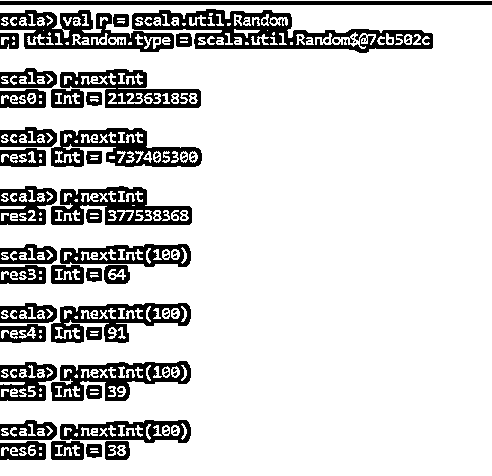
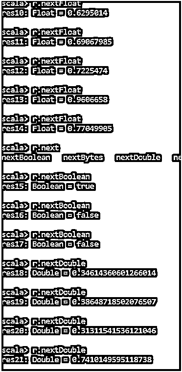
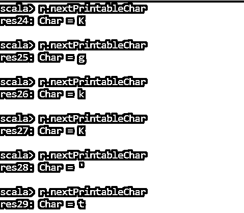
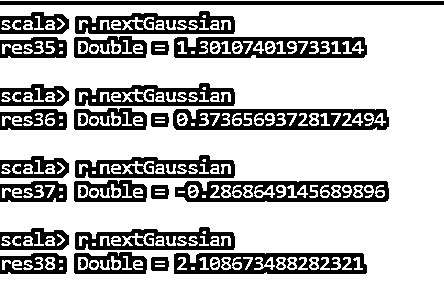
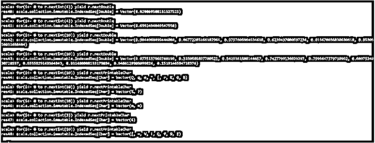

# Scala 随机

> 原文：<https://www.educba.com/scala-random/>

## Scala Random 简介

Scala Random 函数用于在 Scala 中生成随机数或字符。为了在 Scala 上生成随机数，我们在 Scala.util.Random 类中使用了 Random 函数。生成的随机数可以是任何整数、浮点、双精度、字符。这个随机数对于验证等各种级别的应用都很重要。因此，在我们的 Scala 应用程序中，它被用来随机生成数字。

**语法:**

<small>网页开发、编程语言、软件测试&其他</small>

Scala.util.Random 类用于在应用程序中生成随机数。我们只需要导入类和方法，比如 nextInt，nextFloat 生成数字。

`val r = scala.util.Random
r: util.Random.type = scala.util.Random$@7889a1ac
r.nextInt
res1: Int = 1825881164
r.nextInt(100)
res2: Int = 99
r.nextFloat
res3: Float = 0.10983747`

### Scala Random 的工作原理及实例

Scala 随机函数采用随机函数生成数字进行处理，它一般使用线性同余生成器，这个算法的工作是选择随机数。我们还可以选择要生成数字的范围。我们将看到随机数生成的一些例子。

#### 示例#1

**代码:**

`val r = scala.util.Random
r: util.Random.type = scala.util.Random$@7889a1ac
r.nextInt
res0: Int = 2123631858
r.nextInt
res1: Int = -737405300
r.nextInt
res2: Int = 377538368`

每次运行代码或调用这个函数时，我们都会以通常的模式获得一组不同的值，而无需遵循任何规则或模式。甚至我们还可以为我们想要生成的随机数设置一个包含性和排他性的限制。

**注意:**默认情况下，非独占限制为 0，因此我们也可以只设置独占限制。

`r.nextInt(100)
res3: Int = 64
r.nextInt(100)
res4: Int = 91
r.nextInt(100)
res5: Int = 39
r.nextInt(100)
res6: Int = 38`

**输出:**

#### 实施例 2

我们也可以通过 NextFloat 方法选择随机浮点值。所以范围是从十进制的 0.0 到 1。让我们用一些例子来验证一下:

**代码:**

`r.nextFloat
res8: Float = 0.59556204
r.nextFloat
res9: Float = 0.8322488
r.nextFloat
res10: Float = 0.6295014
r.nextFloat
res11: Float = 0.69067985
r.nextFloat
res12: Float = 0.7225474
r.nextFloat
res13: Float = 0.9606658
r.nextFloat
res14: Float = 0.77049905`

和 Float 一样，我们也可以为 Double 值创建随机数。

`r.nextDouble
res18: Double = 0.34614360601266014
r.nextDouble
res19: Double = 0.38648718502076507
r.nextDouble
res20: Double = 0.31311541536121046
r.nextDouble
res21: Double = 0.7410149595118738`

它还打印 0 到 1 之间的值。布尔值也可以使用相同的随机值，并基于布尔值产生结果。

`r.nextBoolean
res15: Boolean = true
r.nextBoolean
res16: Boolean = false
r.nextBoolean
res17: Boolean = false`

**输出:**

#### 实施例 3

甚至 Scala Random 函数也用于随机生成字符。我们可以使用 Random 类方法中的 nextprintableChar 方法，并相应地生成字符。让我们用例子来验证一下:

**代码:**

`r.nextPrintableChar
res24: Char = K
r.nextPrintableChar
res25: Char = g
r.nextPrintableChar
res26: Char = k
r.nextPrintableChar
res27: Char = K
r.nextPrintableChar
res28: Char = '
r.nextPrintableChar
res29: Char = t`

所以它随机打印所有的字符。同一个字符或整数值可能会出现多次，没有规则规定这些数字不能重复。

注意:这个随机函数是众所周知的用于模式验证和安全目的，如验证码和所有。

**输出:**

#### 实施例 4

我们也可以在分布上使用随机函数。与之配合的一个已知函数是高斯函数。高斯函数采用高斯分布的随机数据，并相应地打印数据。它返回一个平均值为 0、偏差为 1 的随机数。要改变这个高斯值，我们需要显式地提供它。

**代码:**

`r.nextGaussian
res35: Double = 1.301074019733114
r.nextGaussian
res36: Double = 0.37365693728172494
r.nextGaussian
res37: Double = -0.2868649145689896
r.nextGaussian
res38: Double = 2.108673488282321`

**输出:**

这是它通过高斯分布随机生成的。

#### 实施例 5

我们也可以合并随机函数并创建一个列表，或者将它们存储在我们想要的集合中。让我们用例子来验证一下:

**代码:**

`for(i<- 0 to r.nextInt(4)) yield r.nextDouble
res40: scala.collection.immutable.IndexedSeq[Double] = Vector(0.020069508131527525)
for(i<- 0 to r.nextInt(4)) yield r.nextDouble
res41: scala.collection.immutable.IndexedSeq[Double] = Vector(0.6992494049547558)
for(i<- 0 to r.nextInt(10)) yield r.nextDouble
res42: scala.collection.immutable.IndexedSeq[Double] = Vector(0.9844960499444084, 0.06772285166187964, 0.9797605964534618, 0.6239437080597234, 0.015670036830630618, 0.8530556031658404)
for(i<- 0 to r.nextInt(10)) yield r.nextDouble
res43: scala.collection.immutable.IndexedSeq[Double] = Vector(0.0775137969760199, 0.3150585897780521, 0.5429361580144657, 0.7427799136029297, 0.7595647379710992, 0.6097524030728557, 0.5555829149364843, 0.031480808153179884, 0.9486129909099824, 0.1519146584718376)
for(i<- 0 to r.nextInt(10)) yield r.nextPrintableChar
res44: scala.collection.immutable.IndexedSeq[Char] = Vector(Q, q, n, ", [, r, K, 0, B)
for(i<- 0 to r.nextInt(10)) yield r.nextPrintableChar
res45: scala.collection.immutable.IndexedSeq[Char] = Vector(%, ?)
for(i<- 0 to r.nextInt(10)) yield r.nextPrintableChar
res46: scala.collection.immutable.IndexedSeq[Char] = Vector(m, =)
for(i<- 0 to r.nextInt(3)) yield r.nextPrintableChar
res47: scala.collection.immutable.IndexedSeq[Char] = Vector(6)
for(i<- 0 to r.nextInt(10)) yield r.nextPrintableChar
res48: scala.collection.immutable.IndexedSeq[Char] = Vector([, =, V, !, Q, f, 9, E)`

在这里，我们可以看到我们是如何合并不同的随机函数并相应地生成结果的。

**输出:**

因此，Scala Random 函数用于在 Scala 应用程序中生成随机值，这些值可能会被反复使用。

### 结论

从上面的文章中，我们看到了如何使用 scala Random 函数生成随机值，并在 scala 应用程序中使用它。我们还看到了创建随机数的各种类型。所以对于各种 scala 作品来说都是 Scala 编程中使用的一个很好很重要的方法。

### 推荐文章

这是一个 Scala Random 的指南。在这里，我们也讨论了 scala random 的介绍和工作，以及不同的例子和它的代码实现。您也可以看看以下文章，了解更多信息–

1.  [Scala 找到了](https://www.educba.com/scala-finds/)
2.  [Scala 部分函数](https://www.educba.com/scala-partial-function/)
3.  [Scala 映射函数](https://www.educba.com/scala-map-function/)
4.  [Scala 流](https://www.educba.com/scala-stream/)

