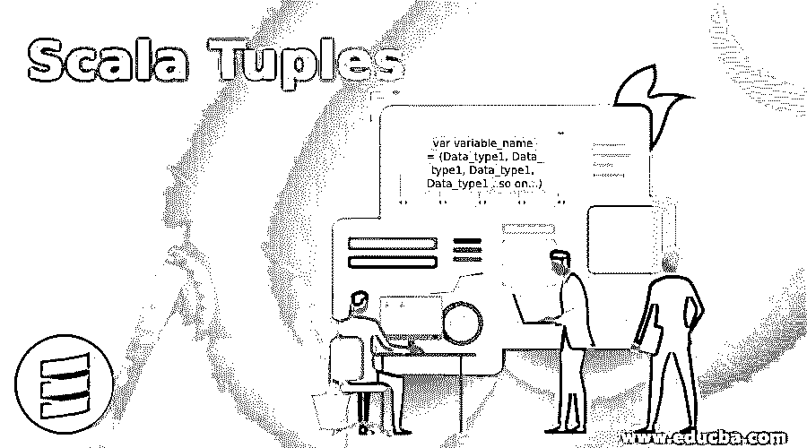
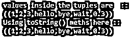
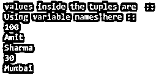
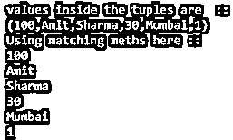

# 标量元组

> 原文：<https://www.educba.com/scala-tuples/>




## Scala 元组简介

元组是可以存储不同数据类型的元素的数据结构。它还用于存储和检索数据。在 scala 中，元组本质上是不可变的，存储异构类型的数据。不可变元组意味着对象一旦赋值就不能改变它的值。通过使用元组，我们可以将不同类型的数据分组在一起，以便于以后访问。就像我们有学生类，我们可以把它的名字、年龄、地址和 id 存储到一个叫做元组的数据结构中。

**语法&参数:**

<small>Hadoop、数据科学、统计学&其他</small>

```
var variable_name = (Data_type1, Data_type1, Data_type1, Data_type1 ..so on...)
```

现在我们可以看到一个练习语法，看看如何用 scala 中可用不同数据类型定义它；

```
var myTuple = (Int, String, String, Int)
var myTuple1 =  (001, "Amit", "Mumbai", 24)
```

这样，我们可以在 scala 中定义我们的元组。我们已经创建了一个数据类型为 int 和 String 的元组，在下一行中，我们试图向元组中提供一些值。

### Scala 中元组是如何工作的？

在 scala 中，元组可以存储固定数量的元素。存储元素的最大限制是 22 个。如果我们试图存储比它大的元素，那么就会产生一个错误。但是在 scala 中，我们有一个替代方法来克服这个问题，那就是嵌套元组，通过它我们可以在元组中创建元组。

在 scala 中，我们有如下类型的元组:

*   图一
*   图二
*   图三
*   图 4
*   Tuple5 等等。

例如，这个数字是 22。如果我们想在 scala 中存储更多的元素。这在小数据可用的情况下很有用。我们可以通过使用元组的索引或位置来访问元组的元素，我们可以说这是我们需要的。_ 语法。

现在问题来了，我们可以在哪里使用元组？因此，如果我们想将不同类型的元素组合在一起，我们可以在 scala 中使用元组。它们也维持着秩序，是集合的一部分。

尝试在元组上创建；

```
val myTuple1: (Int, String) = (2, "Hello")
```

这里我们创建了一个元组，但在内部它将使用元组类中的一个，即从元组 1 到元组 22，这是一个内部过程。当我们想从方法中返回多个值时，元组会很有帮助。因此，我们可以说 scala 元组是有序的集合，元组中的元素要么彼此相关，要么两者都不相关。

#### 要记住的事情

在 scala 中使用元组时，我们应该记住以下几点:

**1。**假设我们有一个需求，其中集合中的数据不会频繁更改，或者我们可以说它一旦被赋值，就会在很长一段时间后更改，那么在这种情况下，我们应该选择元组。

**2。**元组运算速度非常快，被认为是最快的数据结构。此外，它只包含有限的元素，所以内存消耗非常少。

**3。使用元组的一个优点是它可以存储不同数据类型的元素，这意味着它本质上是异构的。但是如果我们将它与列表进行比较，那么在列表集合中，我们只能存储相同类型的数据。**

**4。**这里标量中的元组是不可变的。

**5。**元组可以很容易的代替数组，因为它比所有的比较区域都要高效。它们有相似之处，它们在本质上是固定的。

### 实现 Scala 元组的例子

以下是 Scala 元组的示例:

#### 示例#1

在这个例子中，我们将创建一个简单的元组并打印输出。

**代码:**

```
object Main extends App{
// Your code here!
// creating tuple object
val t = new Tuple1(1, 2, 3, "hello", "bye", "wait", 00.3)
// printing out the values
println("values inside the tuples are :: ")
println(t)
}
```

**输出:**


**解释:**在上面的例子中，我们创建了一个 main 方法，在这个 main 方法中，我们创建了一个 Tuple1 对象，并为它赋值。为了创建一个 tuple 对象，我们在这里使用了 new 关键字来创建对象。创建对象后，我们可以给它们赋值。

#### 实施例 2

我们还可以在这里使用 toString()方法将元组转换为字符串。这个方法将把元组中所有可用的数据连接成字符串。

在这个例子中，我们展示了它在 scala 中对 tuple 的使用。

**代码:**

```
object Main extends App{
// Your code here!
// creating tuple object
val t = new Tuple1(1, 2, 3, "hello", "bye", "wait", 00.3)
// printing out the values
println("values inside the tuples are :: ")
println(t)
//print by using toString()
println("Using toString() meths here ::")
println(t.toString)
}
```

**输出:**




#### 实施例 3

在这个例子中，我们将看到在 scala 中定义 tuple 并通过变量名访问其元素的另一种方式。

**代码:**

```
object Main extends App{
// Your code here!
// creating tuple object
var (t1, t2, t3, t4, t5)= (100, "Amit", "Sharma", 30, "Mumbai")
// printing out the values
println("values inside the tuples are :: ")
//print by using toString()
println("Using variable names here ::")
println(t1)
println(t2)
println(t3)
println(t4)
println(t5)
}
```

**输出:**




#### 实施例 4

在这个例子中，我们正在迭代元组元素。我们可以在迭代器中对它执行任何操作。为了迭代元素，我们使用 scala 中可用的乘积迭代器。

**代码:**

```
object Main extends App{
// Your code here!
// creating tuple object
var myTuple = (100, "Amit", "Sharma", 30, "Mumbai", 1)
// printing out the values
println("values inside the tuples are :: ")
println(myTuple)
//print by iterating elements of the tuples::
println("Using matching meths here ::")
myTuple.productIterator.foreach{x=>println(x)}
}
```

**输出:**




### 结论

在 scala 元组中，我们可以存储异构元素。这些元素属于不同的类型。但是它们对元素字符串有限制，在 scala 中我们最多可以存储 22 个元素。我们可以使用嵌套元组来代替。

### 推荐文章

这是一个 Scala 元组的指南。在这里，我们讨论 Scala 元组及其不同示例和代码实现的简要概述。您也可以浏览我们推荐的其他文章，了解更多信息——

1.  [科特林 vs Scala |十大对比](https://www.educba.com/kotlin-vs-scala/)
2.  [Scala 数据类型概述](https://www.educba.com/scala-data-types/)
3.  [Scala for 循环|前 6 个例子](https://www.educba.com/scala-for-loop/)
4.  [Scala 高阶函数](https://www.educba.com/scala-high-order-functions/)


