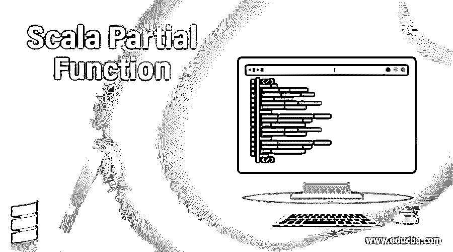
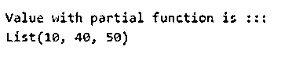
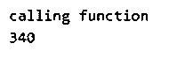
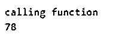
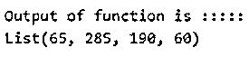
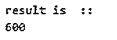
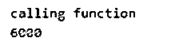

# Scala 部分函数

> 原文：<https://www.educba.com/scala-partial-function/>

## Scala 部分函数的定义

我们可以把它定义为，如果函数不能为每个提供的参数返回值，那么我们可以称它们为部分函数。这意味着该函数只能为一组给定的输入提供值，而不能为所有的输入提供值。我们可以说，部分函数的实现部分地不能为传递给它的所有输入提供值。它只为 Scala 中定义的一组数据提供值。但是要检查分部函数是否可以处理传递的值，我们有 idsDefinedAt 方法，它可以检查值对于给定的类型是否可用。

### 语法和参数

scala 部分函数的语法和参数

<small>网页开发、编程语言、软件测试&其他</small>

`valName_of_partical_function = new PartialFunction[Data_type1, Data_type1] {
//your logic
}`

我们可以使用上面的语法创建一个部分函数。我们需要使用 new 关键字给变量名后跟一个部分函数对象。同样在括号内，我们需要为函数分配数据类型。在这个主体里面，我们可以定义我们的局部函数。

让我们来看一个适合初学者的实用语法；

`val par1 = new PartialFunction[Int, Int] {
defisDefinedAt(q1: Int) = q1 != 0
}`

在上面的例子中，我们使用 isDefinedAt 方法来定义我们的函数。

### Scala 中的部分函数是如何工作的？

部分函数是这样的函数，它的实现是部分的，它们不能为我们传递的每个输入产生输出值。我们可以使用 case 语句来定义这些函数。让我们举一个例子来理解它的工作原理；

`object Main extends App{
// Your code here!
valparResult: PartialFunction[Int, Int] = {
case a: Int if a > 0 =>Math.abs(a)
}
varlist : List[Int] = List(10, 40, 50)
valfinalres = list.collect(parResult)
println(finalres)
}`

在本例中，我们将创建一个名为 parResult 的部分函数。此函数将检查值，如果它大于 0，然后应用数学。腹肌在上面。我们准备了一个集合列表，其中包含一些值，并通过将它的名称作为参数传递来调用分部函数。如果我们没有一个分部函数，并且如果我们试图在这里调用 Map，那么我们可能会为列表的一些输入接收一个 NAN 值。例如，我们试图计算给定输入的平方根，因此，在这种情况下，我们可能会收到 NAN 作为输入。所以我们可以说部分功能也能帮助我们摆脱任何副作用。

我们在 scala 中有一些扩展的、线性的超类型和部分函数的已知子类，让我们来看看它们；

1.提供扩展课程；

*   (A) => B

2.可用的超类型类；

*   (A) => B
*   AnyRef
*   任何的

3.它的等级制度；

*   maops
*   收藏品
*   UnliftOps

### Scala 部分函数示例

下面是一些例子:

#### 示例#1

在这个例子中，我们正在创建简单的部分函数。

**代码:**

`object Main extends App{
// Your code here!
// creating partial function
valparResult: PartialFunction[Int, Int] = {
case a: Int if a > 0 =>Math.abs(a)
}
varlist : List[Int] = List(10, 40, 50)
// calling partial function
valfinalres = list.collect(parResult)
//prinitng result
println("Value with partial function is :::")
println(finalres)
}`

**输出:**

#### 实施例 2

在本例中，我们使用 isDefinedAt 和 apply 方法来处理部分函数。

**代码:**

`object Main extends App{
// Your code here!
valparFun = new PartialFunction[Int, Int] {
// here applying defined method
defisDefinedAt(x: Int) = x != 0
// here apply method
defapply(x: Int) = 10 * x
}
// printing outpt from function
println("calling function")
println(parFun(34))
}`

**输出:**

#### 实施例 3

在这个例子中，我们使用 case 语句来定义我们的部分函数并编写我们的逻辑。

**代码:**

`object Main extends App{
// Your code here!
valparFun: PartialFunction[Int, Int] =
{
// using case statement
case obj if (obj % 3) == 0 =>obj * 2
}
// printing output from function
println("calling function")
println(parFun(39))
}`

**输出:**

#### 实施例 4

在这个例子中，我们使用 collect 方法来处理部分函数。

**代码:**

`object Main extends App{
// Your code here!
valparFun: PartialFunction[Int, Int] =
{
// declaring function using case statement
case obj if (obj % 5) != 0 =>obj * 5
}
// method
// using collect method
val result = List(13, 57, 38, 15, 0 , 12, 200) collect { parFun }
/// printing output
println("Output of function is :::::")
println(result)
}`

**输出:**

#### 实施例 5

在这个例子中，我们使用 andThen 方法来处理部分函数。

**代码:**

`object Main extends App{
// Your code here!
//here we are declaring partial function using case statement
valparFun: PartialFunction[Int, Int] =
{
case obj if (obj % 4) != 0 =>obj * 2
}
val a = (y: Int) => y * 100
//applingandThenfunction
val result = parFunandThen a
println("result is  :: ")
println(result(3))
}`

**输出:**

#### 实施例 6

在这个例子中，我们在 scala 中定义分部函数时，在 case 语句中使用了一个二元操作符。

**代码:**

`object Main extends App{
// Your code here!
valparFun: PartialFunction[Int, Int] =
{
// using case statement
case obj if (obj % 10) == 0 =>obj * 20
}
// printing output from function
println("calling function")
println(parFun(300))
}`

**输出:**

使用 Scala 部分函数时的要点:

*   部分函数是一种特征，这意味着我们需要给出它的所有方法的实现。在这里，我们定义并应用了两种方法。如果您在使用它时没有给出它们中任何一个的实现。它将抛出一个异常。
*   我们可以使用 case 语句来定义函数。
*   我们可以使用不同的方法，比如 collect，Then，If，else，scala 中部分函数的情况。

### 结论

Scala 部分函数部分实现。此外，我们有两种方法可以用来定义它们。此外，我们可以使用 case 语句定义部分函数，但是在这种情况下语法会有一点不同。

### 推荐文章

这是一个 Scala 部分函数的指南。这里我们还讨论了 scala 中部分函数的定义和工作方式，以及不同的例子和代码实现。您也可以看看以下文章，了解更多信息–

1.  笔画比例
2.  [Scala 平面图](https://www.educba.com/scala-flatmap/)
3.  [Scala if else](https://www.educba.com/scala-if-else/)
4.  [Scala 抽象类](https://www.educba.com/scala-abstract-class/)

