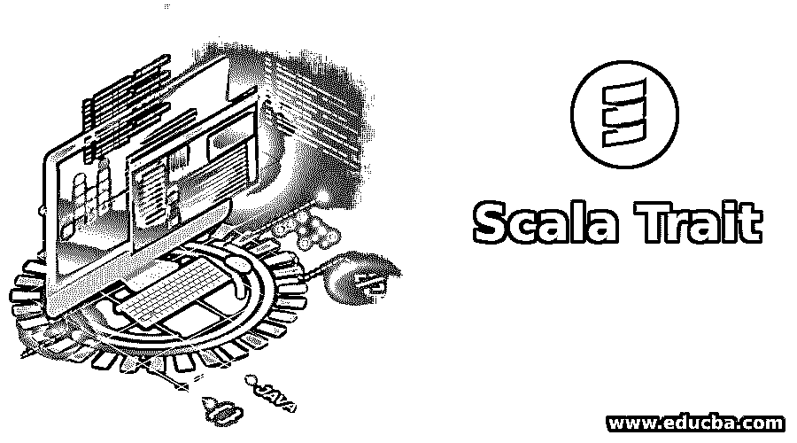
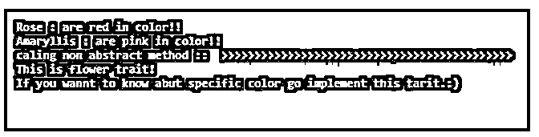
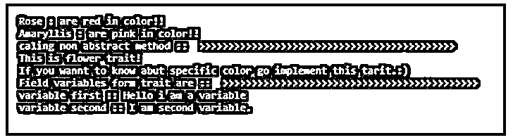

# 线比例

> 原文：<https://www.educba.com/scala-trait/>

## Scala Trait 简介

Scala 中的 Trait 可以通过使用 trait 关键字来创建。Scala 的特点就像 Java 中的接口。它们包含方法和字段成员。trait 内部的方法可以是抽象的和非抽象的，我们可以在不同的类中使用这些方法。但是我们不能赋予特征，它也没有构造函数参数。它们基本上用于提供抽象，抽象为我们提供安全性，并通过使我们的服务独立于用户来使我们的应用程序松散耦合。我们可以使用 extend 关键字将这一特性用于不同的类，并在需要时提供未实现方法的实现。如果我们不提供变量的方法体和类型，那么默认情况下它们将是抽象的。

**语法:**

<small>网页开发、编程语言、软件测试&其他</small>

`trait name{
// abstract method
// non abstract method and field members
}`

在上面的语法中，我们可以通过在特征名前使用特征关键字来创建 raid。在 trait 内部，我们可以定义方法和字段成员。

**举例:**

**代码:**

`trait FirstTrait {
def message()
def message2()
}`

在上面的例子中，我们在 trait 中定义了两个方法，但是我们还没有提供它们的实现。

因此，任何要实现的类都有责任提供如下方法的实现:

**代码:**

`class FirstDemo extends FirstTrait{
def message()
{
println("first message : Hello from first method.")
}
def message2()
{
println("second message: Hello from second method.")
}
// method to create object and call methods.
object Main
{
def main(args: Array[String])
{
val object= new FirstDemo();
obj.message();
obj.message2();
}
}`

现在我们已经给出了这两个方法的移植，我们还有 main 方法，我们将从它调用这个方法。记住 trait 不能被灌输，它们没有参数构造函数。

### Trait 在 Scala 中是如何工作的？

基本上特征的概念用于面向对象编程语言，它们就像 java 中的接口。在 java 中，接口意味着抽象。众所周知，抽象是向用户隐藏复杂性的过程，我们在这里也是如此。可以使用 extends 关键字来扩展特征。但是我们不能创建特征对象，因为它们没有契约者。为了提供实现并使用 traits 中定义的方法，我们可以通过使用类和对象来继承 trait。

特征包含抽象和非抽象方法，或者我们可以说包含具体方法。如果我们在特征中提供方法的实现，那么它将是一个非抽象方法，但是如果我们只在特征中定义一个方法，那么它将是一个抽象方法。它内部还包含字段变量。我们可以使用 Scala 提供 var 或 val 关键字在 trait 中定义一个变量。假设你已经用提到的关键字定义了一个变量，但是我们还没有初始化它，那么默认情况下它是抽象的。与方法一样，变量的实现也由实现这一特性的类本身负责。

另一点是，如果我们在 trait 中定义了一个方法，而另一个类扩展了这个 trait，但没有提供它的实现，那么这个类必须使自己成为抽象的，这和 java 是一样的。

**举例:**

**代码:**

`trait Test{
def getDetail()
}
abstract class Demo extends Test{
def printDetail(){
// provide your logic.
}
}`

所以我们把上面的演示类做成了抽象类，因为它没有为 trait 方法提供主体。所以如果实现这个演示的类必须提供方法体等等。变量的情况也是如此。

现在，如果一个特征包含一个非抽象的方法，这意味着它的实现已经在特征中定义了，那么在这种情况下，扩展这个特征的类不需要提供方法的实现。

**举例:**

**代码:**

`trait Test {
def details(){
println("this method is already been defined in trait itself.");
}
}`

### Scala 特征的例子

下面是提到的例子:

#### 示例#1

这里我们将看到如何使用抽象方法，并提供它们的实现和另一个使用 extend 关键字的类。

**代码:**

`trait Flower {
def getColor()
}
class Rose extends Flower{
def getColor(){
println("Rose : are red in color!!")
}
}
class Amaryllis extends Flower{
def getColor(){
println("Amaryllis : are pink in color!!")
}
}
object Main{
def main(args:Array[String]){
var r = new Rose()
r.getColor()
var a = new Amaryllis()
a.getColor()
}
}`

**输出:**

#### 实施例 2

它包含了 trait 中的抽象和非抽象方法，我们从 main()函数中调用它们。我们没有提供非抽象方法的实现。

**代码:**

`trait Flower {
def getColor()
def getMessage(){
println("This is flower trait!")
println("If you wannt to know abut specific color go implement this tarit.:)")
}
}
class Rose extends Flower{
def getColor(){
println("Rose : are red in color!!")
}
}
class Amaryllis extends Flower{
def getColor(){
println("Amaryllis : are pink in color!!")
}
}
object Main{
def main(args:Array[String]){
var r = new Rose()
r.getColor()
var a = new Amaryllis()
a.getColor()
println("caling non abstract method ::  >>>>>>>>>>>>>>>>>>>>>>>>>>>>>>>>>>>>>>>>>>>>")
a.getMessage()
}
}`

**输出:**

#### 实施例 3

此示例还包含字段成员。我们只在 trait 级别初始化了这些字段，但是如果你愿意，你可以用' var '或' val '关键字定义它们，并在扩展类中提供它们的实现。

**代码:**

`trait Flower {
def getColor()
def getMessage(){
println("This is flower trait!")
println("If you wannt to know abut specific color go implement this tarit.:)")
}
var v1: String = "Hello i am a variable"
var v2: String = "I am second variable."
def getDeatil(){
println("variable first :: " + v1)
println("variable second :: " + v2)
}
}
class Rose extends Flower{
def getColor(){
println("Rose : are red in color!!")
}
}
class Amaryllis extends Flower{
def getColor(){
println("Amaryllis : are pink in color!!")
}
}
object Main{
def main(args:Array[String]){
var r = new Rose()
r.getColor()
var a = new Amaryllis()
a.getColor()
println("caling non abstract method ::  >>>>>>>>>>>>>>>>>>>>>>>>>>>>>>>>>>>>>>>>>>>>")
a.getMessage()
println("Field variables form trait are ::  >>>>>>>>>>>>>>>>>>>>>>>>>>>>>>>>>>>>>>>>>>>>")
a.getDeatil()
}
}`

**输出:**

### 结论

特征就像 java 中用来提供抽象的接口。我们可以使用 extends 关键字对它们进行扩展，但不能对它们进行实例化，因为它们不包含参数构造函数。

### 推荐文章

这是 Scala Trait 的指南。在这里，我们讨论 Scala Trait 的介绍，Trait 如何与相应的编程例子一起工作。您也可以看看以下文章，了解更多信息–

1.  [Scala 高阶函数](https://www.educba.com/scala-high-order-functions/)
2.  [Scala 中的构造函数](https://www.educba.com/constructors-in-scala/)
3.  [Scala for 循环](https://www.educba.com/scala-for-loop/)
4.  [Scala 数据类型](https://www.educba.com/scala-data-types/)

