# Scala 正则表达式

> 原文：<https://www.educba.com/scala-regex/>

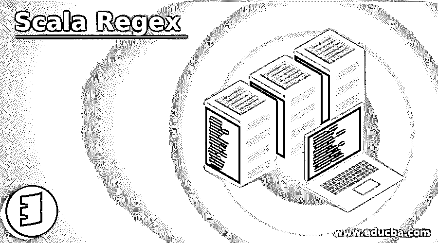

## Scala 正则表达式简介

这是一个 Scala 正则表达式的指南。Regex 代表正则表达式。我们可以使用正则表达式定义一些模式，并且我们可以使用这个正则表达式来测试我们传递的输入参数。正则表达式在许多不同的编程语言中使用。在 scala 中，它们的工作方式和 Java 一样。我们以某种模式编写正则表达式，或者它是一个字符序列，来检查我们传递的字符串或整数是否有效。

### Regex 在 Scala 中如何工作？

在 scala 中，正则表达式的工作方式和在其他语言中一样。在 scala 中，我们可以在名为 Regex 的 scala.util.matchingpackage 中找到这个类。这是包> > scala.util.matching.Regex 的完整路径。我们使用这个 Regex 类来搜索字符串中的子字符串或者进行解析。我们可以按照来的方法来处理正则表达式。我们可以直接将正则表达式赋值给字符串，然后将其转换为正则对象，但调用一些方法。我们还可以再做一件事，比如我们可以把我们的模式只传递给 regex 对象。

<small>网页开发、编程语言、软件测试&其他</small>

#### 1.将字符串转换为正则表达式对象

要将我们的字符串转换成 regex 对象，我们可以调用 scala 的 r()方法再次将其转换成 regex 对象。

**语法:**

`valstr = "Here is some string".r`

在上面的代码中，我们通过调用 r()方法将字符串转换为 regex 对象。

#### 2.直接分配给正则表达式对象

在这种方法中，我们可以直接将字符串赋给 regex 对象，而不需要显式调用 r()方法。

**语法:**

`valreg = new Regex("(A|b)fh")`

在上面的语法中，我们只将模式直接传递给 regex 对象。

### Scala 正则表达式函数

我们在 scala regex 类中有很多不同的函数来处理我们传递的字符串或输入。

下面给出了各种函数的列表和示例:

#### 1.findAllIn(来源:CharSequence)

这将在源字符串中找到子字符串。

**举例:**

**代码:**

`import scala.util.matching.Regex
object Main extends App{
// Your code here!
valstr = "Hello to all".r
val source = "Hello to all from world"
println(strfindFirstIn source)
}`

**输出:**

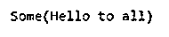

#### 2.findAllMatchIn(来源:CharSequence)

找到所有不重叠的。将这些字符串作为输出输出。

**举例:**

**代码:**

`import scala.util.matching.Regex
object Main extends App{
// Your code here!
valstr = "Hello to all to test regularexpression".r
val source = "Hello to all from world"
println(strfindAllMatchIn source)
}`

**输出:**

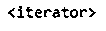

#### 3.findFirstIn(来源:CharSequence)

这个方法将从源代码中找到第一个出现的字符串并打印出来。

**举例:**

**代码:**

`import scala.util.matching.Regex
object Main extends App{
// Your code here
valstr = "to".r
val source = "Hello to all from world"
println(strfindFirstIn source)
}`

**输出:**

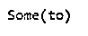

#### 4.replaceAllIn()

它将用指定的输入替换字符串。

**举例:**

**代码:**

`import scala.util.matching.Regex
object Main extends App{
// Your code here!
valstr = "replacetest"
valfinalstr = "replacetest".replaceAll(".test", "**")
println("befor ::" + str)
println("aftre ::" + finalstr)
}`

**输出:**

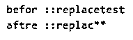

#### 5.replaceFirst()

替换第一个匹配项。

**举例:**

**代码:**

`import scala.util.matching.Regex
object Main extends App{
// Your code here!
valstr = "replacetest"
valfinalstr = "replacetest".replaceFirst(".test", "**")
println("befor ::" + str)
println("aftre ::" + finalstr)
}`

**输出:**

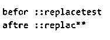

#### 6.匹配()

这个方法将字符串与我们传递的模式进行匹配，它将根据结果返回 true 或 false，或者它是否得到了与模式匹配的字符串。

**举例:**

**代码:**

`import scala.util.matching.Regex
object Main extends App{
// Your code here!
varstr = "check"
valfinalstr = str.matches(".*k")
// Displays output
println(finalstr)
}`

**输出:**

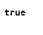

#### 7.split(字符串正则表达式，整数限制)

它将返回给我们数组，但是我们可以在返回时限制数组中对象的数量。

**举例:**

**代码:**

`import scala.util.matching.Regex
object Main extends App{
// Your code here!
varstr = "somestring to test the result"
valfinalstr = str.split(".ng", 4)
for ( s1 <-finalstr )
{
// Displays output
println( "Here the array ::"+s1)
}
}`

**输出:**

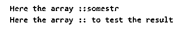

### Scala 正则表达式的例子

下面是提到的例子:

#### 示例#1

\\d:它匹配传递的任何输入中的数字[0-9]。此方法检查输入中的数字。

**代码:**

`import scala.util.matching.Regex
object Main extends App{
// Your code here!
valreg = new Regex("\\d")
valstr = "to check digit 520 in string"
println((regfindAllInstr).mkString(", "))
}`

**输出:**

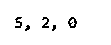

#### 实施例 2

\\D:此方法检查输入通道中是否包含非数字。

**代码:**

`import scala.util.matching.Regex
object Main extends App{
// Your code here!
valreg = new Regex("\\D")
valstr = "to check string 520 in string"
println((regfindAllInstr).mkString(", "))
}`

**输出:**

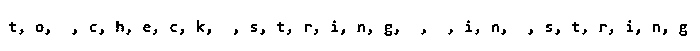

#### 实施例 3

\\S:检查非空格。

**代码:**

`import scala.util.matching.Regex
object Main extends App{
// Your code here!
valreg = new Regex("\\S")
valstr = "to check string 520 in string"
println((regfindAllInstr).mkString(", "))
}`

**输出:**

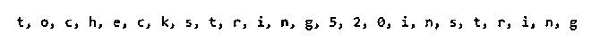

#### 实施例 4

\\s:这个方法主要检查字符串中的空白并打印出来。[\t\n\r\f]

**代码:**

`import scala.util.matching.Regex
object Main extends App{
// Your code here!
valreg = new Regex("\\s")
valstr = "to check string 520 in string"
println((regfindAllInstr).mkString(", "))
}`

**输出:**

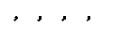

#### 实施例 5

q|r:这个表达式检查字符串中是否包含 q 或 r，并打印出来。

**代码:**

`import scala.util.matching.Regex
object Main extends App{
// Your code here!
valreg = new Regex("q|r")
valstr = "Check regular expression"
println((regfindAllInstr).mkString(", "))
}`

**输出:**

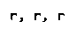

#### 实施例 6

.:此方法用于检查新行。"."如果包含任何新行，则检查字符串或输入参数。

**代码:**

`import scala.util.matching.Regex
object Main extends App{
// Your code here!
valreg = new Regex(".")
valstr = "check for new line "
// printing them out.
println((regfindAllInstr).mkString(", "))
}`

**输出:**

**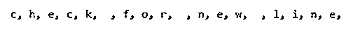

** 

### 结论

所以 Scala Regex 类似于任何其他正则表达式。它主要用于搜索和解析我们为了验证而传递的输入参数。我们可以创建不同类型模式，并根据它们来验证我们的输入。正则表达式也为我们提供了许多非构建表达式。

### 推荐文章

这是一个 Scala 正则表达式的指南。这里我们讨论 regex 在 scala 中是如何工作的，scala regex 函数用例子来更好的理解。您也可以看看以下文章，了解更多信息–

1.  [Scala 抽象类](https://www.educba.com/scala-abstract-class/)
2.  [Scala 高阶函数](https://www.educba.com/scala-high-order-functions/)
3.  [Scala foreach](https://www.educba.com/scala-foreach/)
4.  [Scala 版本](https://www.educba.com/scala-versions/)

