# 序列比例

> 原文：<https://www.educba.com/scala-seq/>

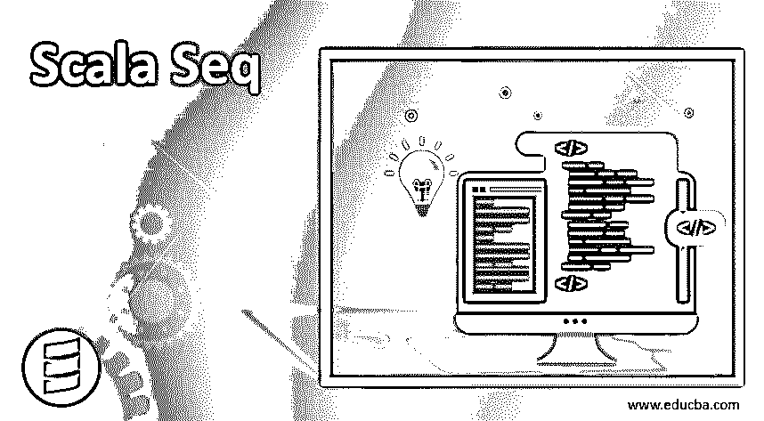

## Scala Seq 简介

Scala 序列是集合的一部分，它们是 iterable 类的特例。顾名思义，它们维护元素的顺序。它们维护一个索引序列，该序列表示指定的元素顺序，这意味着不可变。Scala sequence 只使用索引来保持元素的插入顺序。index 的范围从 0 开始，一直到元素的数量，这与 array 的工作方式相同。

**语法**

<small>网页开发、编程语言、软件测试&其他</small>

`var meseq:Seq[Int] = Seq(value1, value2, value3.....n)`

在上面的语法中，我们也为 seq 中的元素定义了数据类型。下面我们可以看到一个如何分配它们的练习示例

`var meseq:Seq[Int] = Seq(20, 40, 60, 80, 100)`

### Scala 序列方法

Scala 序列是不可变的，因为它们工作在索引、搜索和过滤操作的基础上，速度非常快，我们可以在索引的基础上访问任何元素。如果我们想以逆序访问元素序列，我们有两种方法反向迭代器和反向。

Scala 序列有两条尾线 LinerSeq 和 indexedSeq。这两者都为性能提供了保证。如果你想搜索或过滤元素，那么我们可以使用 indexdeSeq，它提供了对元素的随机访问。但是 LinerSeq 只在元素的头部和尾部搜索的情况下提供快速访问，这意味着只对元素进行第一次和最后一次搜索。

在我们讨论这些方法之前，首先要理解 seq

#### 1.它有各种超类型；

| 部分函数[Int，A] | 可与 GenSeq[A]迭代的[A] | GenericTraversableTemplate[A，Seq] | SeqLike[A，Seq[A] | 可遗传的 |
| 可并行化[A，ParSeq[A]] | FilterMonadic[A，Seq[A] | HasNewBuilder[A，Seq[A] | 可旅行的 | travelable once[a |
| 等于 | IterableLike[A，Seq[A]] | gentravelebleonce[a] | 钠 | 钠 |

#### 2.子类；

| 抽象集 | 线性序列 | 海景 | SeqViewLike | 附加 |
| 掉落时 | EmptyView | 走漏 | 平面映射 | 强迫的 |
| 计划 | 修补 | 假装 | 颠倒的 | 拍摄时间 |
| 走漏 | 数组缓冲器 | 索引请求视图 | 展开缓冲器 | 缓冲剂 Proxy |
| StreamView | 像溪流一样 | 附加 | 丢弃时间 | EmptyView |
| 双重链接列表 | 链接列表 | 可观察缓冲器 | 队列代理 | 堆 |
| ofBoolean | 字节数 | 翁查尔 | 双倍的 | 离岸 |

### Scala Seq 方法的类型

Scala seq 有两种可用的方法

*   具体的
*   摘要

#### 1.foreach()

此方法用于迭代序列的元素并打印它们。

**代号:** `var mySeq:Seq[Int] = Seq(20, 40 , 60 , 80 , 100)
// sequence output
mySeq.foreach((element:Int) => println(  "element is  ::" +element))
}`

**输出:**

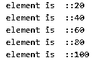

#### 2.isEmpty

此方法用于检查 seq 是否为空。它返回真或假。如果 seq 为空，它将返回 true，否则将返回 false。

**代号:** `var mySeq:Seq[Int] = Seq(20, 40 , 60 , 80 , 100)
// sequence output
var result = mySeq.isEmpty
println("result of sequence is  :: " + result)
}`

**输出:**

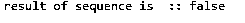

#### 3\. endsWith()

此方法返回 true 和 false。它检查指定的序列是否以传递的参数结束，并根据结果返回 true 和 false。

**代号:** `var mySeq:Seq[Int] = Seq(20, 40 , 60 , 80 , 100)
// sequence output
var result = mySeq.endsWith(Seq(100))
println("result of sequence for endsWith is :: " + result)
}`

**输出:**

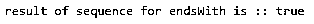

#### 4.长度()

此方法用于检查 seq 中存在的元素数量。这将返回一个整数值作为 seq 的长度。

**代号:** `var mySeq:Seq[Int] = Seq(20, 40 , 60 , 80 , 100)
// sequence output
var result = mySeq.length
println("result of sequence for length is :: " + result)
}`

**输出:**

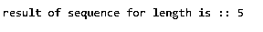

#### 5.包含()

该方法用于检查 seq 中是否存在该值。它返回布尔值 true 或 false。

**代号:**
`var mySeq:Seq[Int] = Seq(20, 40 , 60 , 80 , 100)
// sequence output
var result = mySeq.contains(80)
println("result of sequence for contains is :: " + result)
}`

**输出:**

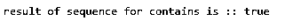

#### 6.lastIndexOf()

此方法用于返回值在序列列表中最后一次出现时的索引。它返回一个整数值作为它的索引。

**代码:**

`var mySeq:Seq[Int] = Seq(20, 40 , 60 , 80 , 100)
// sequence output
var result = mySeq.lastIndexOf(60)
println("result of sequence for lastIndexOf is :: " + result)
}`

**输出:**

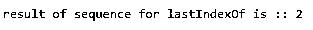

#### 7.反向()

该方法以相反的顺序打印序列。

**代号:** `var mySeq:Seq[Int] = Seq(20, 40 , 60 , 80 , 100, 60)
// sequence output
var result = mySeq.reverse
println("result of sequence for reverse is :: " + result)
}`

**输出:**

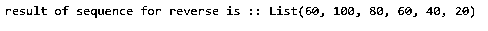

#### 8.头

此方法返回序列中的第一个元素。

**代号:**
 `var mySeq:Seq[Int] = Seq(20, 40 , 60 , 80 , 100, 60)
// sequence output
var result = mySeq.head
println("result of sequence for head is :: " + result)
}`

**输出:**

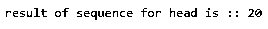

#### 9\. indexOf()

这个方法返回序列中元素的索引。

**代码:**

var mySeq:Seq[Int] = Seq(20，40，60，80，100，60)
//序列输出
var result = my Seq . index of(80)
println(" index of 的序列结果为::"+ result)
}

**输出:**

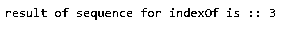

#### 10.最后一个()

该方法返回序列中的最后一个元素。

**代号:**
`var mySeq:Seq[Int] = Seq(20, 40 , 60 , 80 , 100, 60)
// sequence output
var result = mySeq.last
println("result of sequence for last is :: " + result)
}`

**输出:**

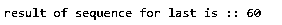

### 结论

Scala 序列保持插入顺序，因此它们是不可变的。它们最适合搜索广告过滤，但中间的插入和删除会增加我们的成本，性能也会降低，因为我们需要相应地移动序列的元素。它们基于数组等元素的索引映射

### 推荐文章

这是一个 Scala Seq 的指南。在这里我们讨论一个介绍，语法，与类型和方法，以实现详细。您也可以浏览我们的其他相关文章，了解更多信息——

1.  [Scala 抽象类](https://www.educba.com/scala-abstract-class/)
2.  [Scala 中的构造函数](https://www.educba.com/constructors-in-scala/)
3.  [Scala foreach](https://www.educba.com/scala-foreach/)
4.  [Scala While 循环](https://www.educba.com/scala-while-loops/)

