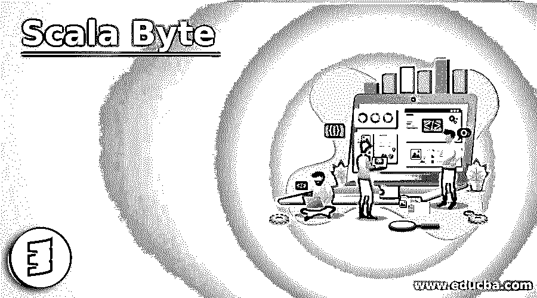
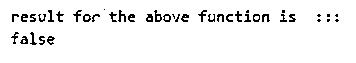
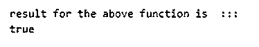
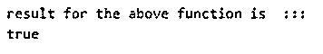
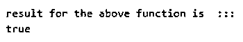
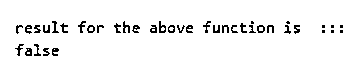
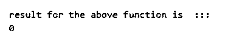

# Scala Byte

> 原文：<https://www.educba.com/scala-byte/>

## Scala 字节介绍

和其他编程语言一样，Scala 字节包含 8 位。scala byte 是 value 类的成员，这个 Scala byte 等于 java byte 原语类型。在 scala 中，我们不能将 byte 的实例表示为一个对象。在 scala 中，这个字节在内部被隐式地从字节转换成富字节，因为在转换之后，它为我们提供了一些有用的非原语操作。Byte 基本上是一个 8 位有符号整数，scala byte 也不同于 int 数据类型。

**语法:**

<small>网页开发、编程语言、软件测试&其他</small>

`varvariable_name: Byte = value _of_variable`

在上面的语法中，我们需要提供变量名，后跟变量的类型，在我们的例子中，我们将 Byte 定义为变量的数据类型。在该数据类型之后，我们可以为创建的变量赋值。

### Scala 中的字节类型是如何工作的？

字节是一个 8 位字节，是存储数据的最小单位。如果你想在计算机中存储最小的信息，我们应该用字节或位。在 scala 中我们有^(x:Byte)这个方法，这个方法返回变量 x 的按位异或。

但是在一般的语言中我们可以看到它是怎样的:

1 字节= 8 位

我们可以说它是 8 位的集合，这 8 位以 0 和 1 的形式表示。它也是计算机系统中最小的存储单位。所以我们可以说，字节是一组存储信息的位。

例如，它们看起来像:

0 和 1 格式的 0 1 0 1 0 1 0 表示形式。

现在我们可以寻找它的层次结构、扩展类、父类:

**层级:**

*   Anyval
*   郎。字节
*   RichByte
*   两倍
*   浮动
*   长的

**扩展和超类:**

*   Anyval
*   任何的

**举例:**

一个简单的程序来了解 scala 的工作。

**代码:**

`object Main extends App{
// Your code here!
// declaring it
valbyteResult = (20.toByte).^(2:Byte)
// Displays output
println("now the result is  :: " + byteResult)
}`

我们在主函数中定义了一个字节，然后是转换按位 XOR 传递的值的方法。把它放在我们的结果变量中来显示输出。在字节中，我们有溢出问题，这与字节的范围有关。Scala 字节范围从-128 到 127。因此，如果范围超出上述范围，它将开始溢出字节，并在输出中显示剩余字节。

我们还有一些字节类型，如下所示:

*   **千字节 KB:** 这个 KB 是经过测量的，等于 1024 字节。
*   **兆字节:**这个兆字节是经过测量的，等于 1，048，576 字节。
*   **千兆字节 YB:** 这一 GB 经测量等于 1，000 MB，或者我们可以换算成 1，073，741，824 字节。
*   **TB:**TB 经过测量等于 1，000 GB，或者我们可以将其转换为 1，000，000，000，000 字节。

我们可以测量字节倍数，因为我们有两个系统，即基数为 10 或基数为 2 的系统。

### Scala 字节的例子

下面是提到的例子:

#### 示例#1

Byte >(x: Byte): Boolean > >这个方法返回布尔值 true 和 false。如果值小于 x，则返回 false 如果值大于 x，则返回 true。

**代码:**

`object Main extends App{
// Your code here!
//declaring byte variable
vara : Byte = 10
varb : Byte = 20
// calling function on variable
valbyteResult = (a.toByte).>(b:Byte)
println("result for the above function is  ::: ")
println(byteResult)
}`

**输出:**

#### 实施例 2

Byte >这个方法将返回布尔值 true 和 false。如果 x 大于，它将返回 true，否则返回 false。

**代码:**

`object Main extends App{
// Your code here!
//declaring byte variable
vara : Byte = 10
varb : Byte = 20
// calling function on variable
valbyteResult = (a.toByte).<(b:Byte)
println("result for the above function is  ::: ")
println(byteResult)
}`

**输出:**

#### 实施例 3

Byte <=(x: Byte): Boolean >>这个方法返回布尔值 true 或 false。如果 x 大于或等于传递值，它将返回 true，否则返回 false。

**代码:**

`object Main extends App{
// Your code here!
//declaring byte variable
vara : Byte = 20
varb : Byte = 20
// calling function on variable
valbyteResult = (a.toByte).<=(b:Byte)
println("result for the above function is  ::: ")
println(byteResult)
}`

**输出:**

#### 实施例 4

Byte ==(x: Short): Boolean > >该方法将返回布尔值 true 或 false。如果两个值相等，则为 True 否则为 false。

**代码:**

`object Main extends App{
// Your code here!
//declaring byte variable
vara : Byte = 20
varb : Byte = 20
// calling function on variable
valbyteResult = (a.toByte).==(b:Byte)
println("result for the above function is  ::: ")
println(byteResult)
}`

**输出:**

#### 实施例 5

字节！=(x: Short): Boolean > >该方法将返回布尔值 true 或 false。如果两者不相等，则为 True 如果相等，则为 false。

**代码:**

`object Main extends App{
// Your code here!
//declaring byte variable
vara : Byte = 20
varb : Byte = 20
// calling function on variable
valbyteResult = (a.toByte).!=(b:Byte)
println("result for the above function is  ::: ")
println(byteResult)
}`

**输出:**

#### 实施例 6

Byte >>>(x: Short)> >这个方法会将值位右移。它还会用零填充新的 n =位。

**代码:**

`object Main extends App{
// Your code here!
//declaring byte variable
vara : Byte = 20
varb : Byte = 20
// calling function on variable
valbyteResult = (a.toByte).>>>(b:Byte)
println("result for the above function is  ::: ")
println(byteResult)
}`

**输出:**

### 结论

因此，scala 字节就像计算机系统中的任何其他字节，或者我们可以说是编程语言中的字节。一个字节可以通过使用 8 位集合或 8 位组来形成。我们也有不同类型的字节，相应地拥有不同的内存存储。它也给了我们各种方法来处理它。

### 推荐文章

这是一个 Scala Byte 的指南。这里我们讨论字节类型在 scala 中是如何工作的，以及相应的编程例子。您也可以看看以下文章，了解更多信息–

1.  [Scala 高阶函数](https://www.educba.com/scala-high-order-functions/)
2.  [Scala 抽象类](https://www.educba.com/scala-abstract-class/)
3.  [Scala if else](https://www.educba.com/scala-if-else/)
4.  [Scala for 循环](https://www.educba.com/scala-for-loop/)

