# Scala ArrayBuffer

> 原文： [https://www.educba.com/scala-arraybuffer/](https://www.educba.com/scala-arraybuffer/)

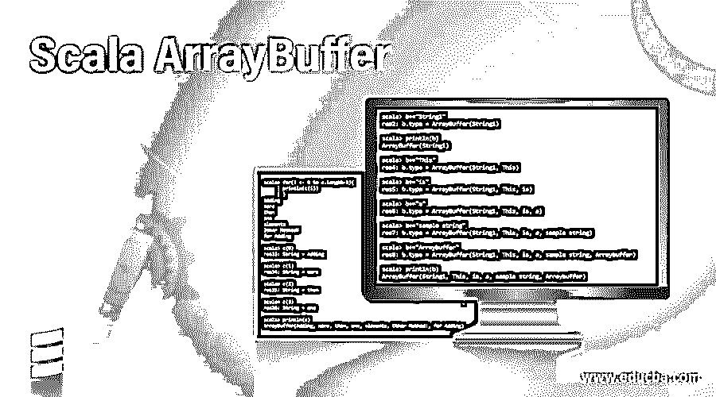

## Scala 数组缓冲区介绍

Scala ArrayBuffer 是一种索引序列可变数据结构，允许我们在特定索引处添加或更改元素。在 ArrayBuffer 中我们不需要担心大小，数组缓冲区的大小是可以改变的。它在本质上是可变的。借助数组缓冲区对元素的随机访问非常快。所有用于序列的通用方法都是由 ArrayBuffer 提供的。

### 语法和参数

为了定义一个数组缓冲区，我们使用下面的语法。

<small>网页开发、编程语言、软件测试&其他</small>

我们需要像这样导入 scala 可变数组缓冲区:-

`import scala.collection.mutable.ArrayBuffer
Val a = ArrayBuffer[datatype]()`

//我们定义数据类型，无论我们想用什么来创建 scala 数组缓冲区。可以是 int，String，double 等。

### Scala ArrayBuffer 使用示例

ArrayBuffer 包含数组的大小以及该数组中的元素。在将任何对象插入数组缓冲区之前，首先检查数组的大小，如果大小足以将数据元素放入其中，则添加该元素，否则创建具有更大大小的新数组并将该元素插入其中。所有元素都被复制到新数组中。

此外，如果我们想访问元素，索引被遍历，并检查该元素是否存在，然后只遍历该元素。

关键字 new 对于调用 ArrayBuffer 的对象不是必需的，因为它有一个 apply 方法。所以我们可以直接为 ArrayBuffer 创建一个对象。

让我们看一个例子:

**1。创建数组缓冲区的方法:**

`import scala.collection.mutable.ArrayBuffer
import scala.collection.mutable.ArrayBuffer`

**2。而不使用新的关键字。**

`val a = ArrayBuffer[Int]()
a: scala.collection.mutable.ArrayBuffer[Int] = ArrayBuffer()`

**3。使用一个新的关键字。**

`val b = new ArrayBuffer[Int]()
b: scala.collection.mutable.ArrayBuffer[Int] = ArrayBuffer()`

**4。字符串型数组缓冲区。**

`val b = new ArrayBuffer[String]()
b: scala.collection.mutable.ArrayBuffer[String] = ArrayBuffer()`

**5。双类型数组缓冲器。**

`val b = new ArrayBuffer[Double]()
b: scala.collection.mutable.ArrayBuffer[Double] = ArrayBuffer()`

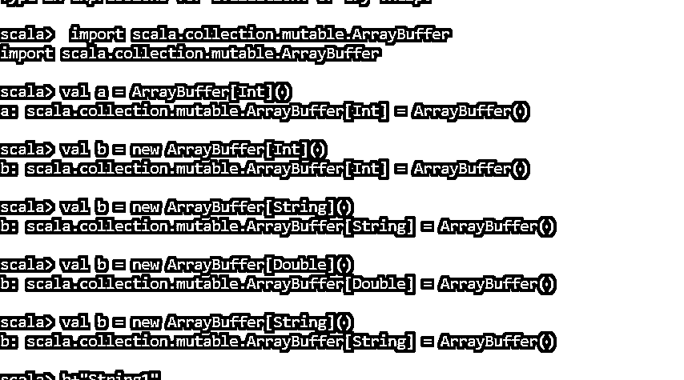

我们也可以使用。toBuffer 方法来创建 ArrayBuffer。此外，ArrayBuffer.range 函数将生成给定的 ArrayBuffer。

让我们用一个例子来验证一下:

`(1 to 5).toBuffer
res16: scala.collection.mutable.Buffer[Int] = ArrayBuffer(1, 2, 3, 4, 5)
(1 until 5).toBuffer
res17: scala.collection.mutable.Buffer[Int] = ArrayBuffer(1, 2, 3, 4)
('a' to 'c').toBuffer
res18: scala.collection.mutable.Buffer[Char] = ArrayBuffer(a, b, c)
("String1").toBuffer
res19: scala.collection.mutable.Buffer[Char] = ArrayBuffer(S, t, r, i, n, g, 1)
ArrayBuffer.range(1,5)
res22: scala.collection.mutable.ArrayBuffer[Int] = ArrayBuffer(1, 2, 3, 4)`

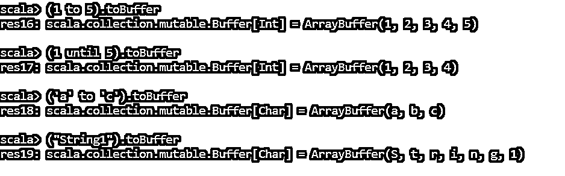

甚至 fill 和 table 方法也可以用来创建 ArrayBuffer。

#### 示例 1–在 ArrayBuffer 中添加元素

`b+="This"
res4: b.type = ArrayBuffer(String1, This)
b+="is"
res5: b.type = ArrayBuffer(String1, This, is)
b+="a"
res6: b.type = ArrayBuffer(String1, This, is, a)
b+="sample string"
res7: b.type = ArrayBuffer(String1, This, is, a, sample string)
b+="Arraybuffer"
res8: b.type = ArrayBuffer(String1, This, is, a, sample string, Arraybuffer)
println(b)
ArrayBuffer(String1, This, is, a, sample string, Arraybuffer)`

**代码片段:**

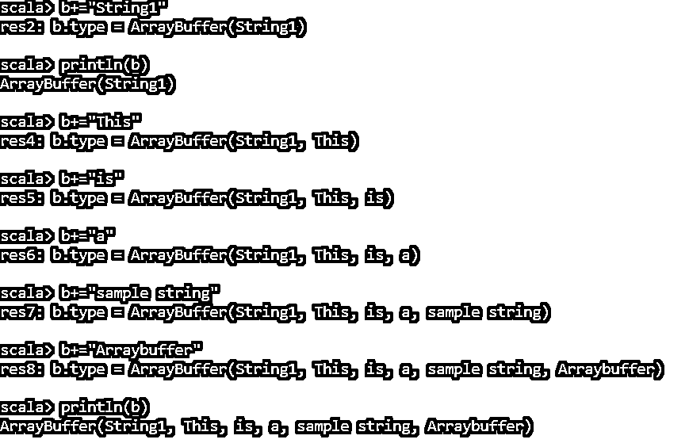

#### 示例 2–添加两个或更多元素

我们可以使用 append 方法在 ArrayBuffer 中一次追加两个或多个元素。让我们看一个例子:

`val c = ArrayBuffer[String]()
c: scala.collection.mutable.ArrayBuffer[String] = ArrayBuffer()
c+=("Adding","more","than","one","elements")
res10: c.type = ArrayBuffer(Adding, more, than, one, elements)
c.append("Other Method!","for Adding")
println(c)
ArrayBuffer(Adding, more, than, one, elements, Other Method!, for Adding)`

**代码片段:**

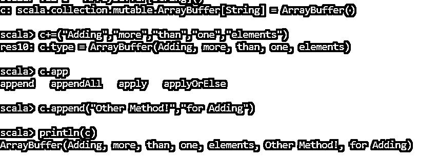

#### 示例# 3–访问 ArrayBuffer 中的元素

我们可以通过遍历 array buffer 的索引来访问数组缓冲区中的元素。

让我们用一个例子来验证一下:

`println(c)
ArrayBuffer(Adding, more, than, one, elements, Other Method!, for Adding)
for(i<- 0 to c.length-1){
| println(c(i))
| }
Adding
more
than
one
elements
Other Method!
for Adding
c(0)
res33: String = Adding
c(1)
res34: String = more
c(2)
res35: String = than
c(3)
res36: String = one`

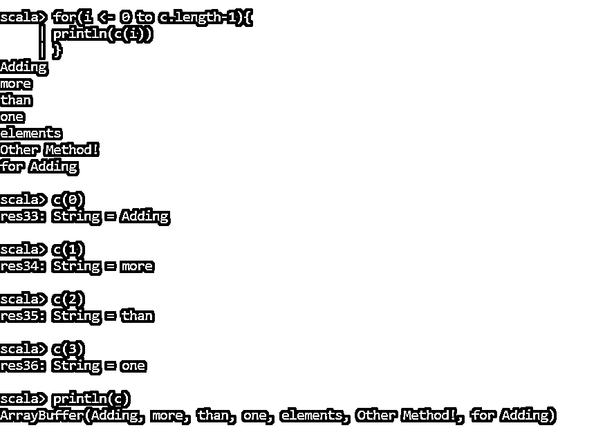

#### 示例 4–从数组缓冲区中删除元素

我们可以使用(-)运算符从数组缓冲区中删除元素。这将从 ArrayBuffer 中移除元素。

甚至我们可以使用 remove 和 clear 从 ArrayBuffer 中移除或清除一个元素。

`val a = ArrayBuffer("Arpit","Anand","String1")
a: scala.collection.mutable.ArrayBuffer[String] = ArrayBuffer(Arpit, Anand, String1)
a-= "Arpit"
res0: a.type = ArrayBuffer(Anand, String1)
a.remove(0)
res1: String = Anand
a.clear
println(a)
ArrayBuffer()`

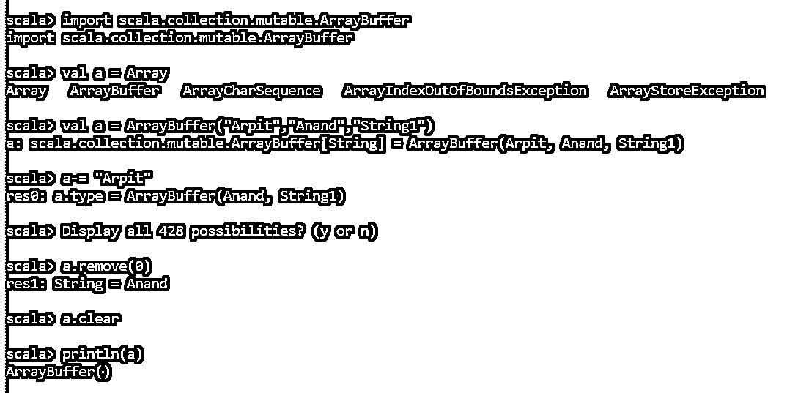

我们可以使用 reducetoSize 函数来减少 ArrayBuffer 的长度，无论我们想减少多少。

让我们用一个例子来验证一下:

`val a = ArrayBuffer("Arpit","Anand","String1","String2")
a: scala.collection.mutable.ArrayBuffer[String] = ArrayBuffer(Arpit, Anand, String1, String2)
a.reduceToSize(2)
println(a)
ArrayBuffer(Arpit, Anand)`

这将 ArrayBuffer 的大小减少到长度为 2。

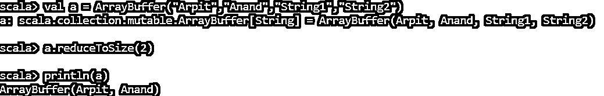

#### 示例 5–更新数组缓冲区中的元素

可以在 ArrayBuffer 中使用方法 update over the elements 来更新缓冲区元素的数组。

让我们用一个例子来验证一下:

`val a = ArrayBuffer("Arpit","Anand","String1","String2")
a: scala.collection.mutable.ArrayBuffer[String] = ArrayBuffer(Arpit, Anand, String1, String2)
a.update(0,"UpdatedString")
println(a)
ArrayBuffer(UpdatedString, Anand, String1, String2)`

**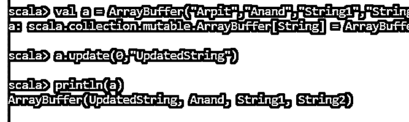

** 

这就产生了一个更新的数组缓冲区。

Head 和 Tail 函数将给出数组缓冲区的头和尾。

`ArrayBuffer(UpdatedString, Anand, String1, String2)
a.head
res8: String = UpdatedString
a.tail
res9: scala.collection.mutable.ArrayBuffer[String] = ArrayBuffer(Anand, String1, String2)`

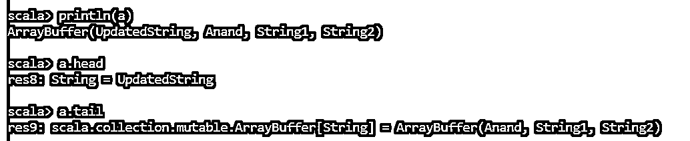

的。take()函数将获取其中的元素。

`a.take(2)
res10: scala.collection.mutable.ArrayBuffer[String] = ArrayBuffer(UpdatedString, Anand)`

的。isEmpty()函数检查 Arraybuffer 是否为空。

`a.isEmpty
res12: Boolean = false`

的。toArray 函数用于将 Arraybuffer 转换为 Array。

`a.toArray
res13: Array[String] = Array(UpdatedString, Anand, String1, String2)`

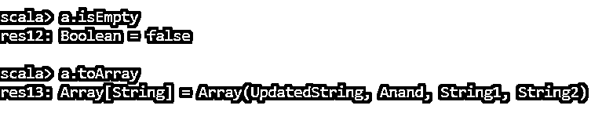

从上面的方法和函数中，我们看到了 ArrayBuffers 是如何工作的，以及与之相关的函数。

### 结论–Scala array buffer

从上面的文章中，我们看到了 Scala 中 ArrayBuffer 的工作原理和各种概念。我们遇到了 ArrayBuffer 类使用的各种函数和方法，并了解了那里的功能。通过各种示例，我们看到了 ArrayBuffer 如何用于不同的数据类型以及使用它背后的思想。

因此，上面的文章总结了 ArrayBuffer 的正确用法、语法和功能。

### 推荐文章

这是一个 Scala ArrayBuffer 的指南。这里我们讨论 Scala 中 ArrayBuffer 的工作原理和各种概念，以及各种函数和方法。您也可以看看以下文章，了解更多信息–

1.  [Scala 伴随对象](https://www.educba.com/scala-companion-object/)
2.  秤尾
3.  [Scala Singleton](https://www.educba.com/scala-singleton/)
4.  [Scala for 循环](https://www.educba.com/scala-for-loop/)

