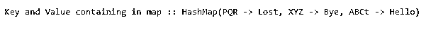
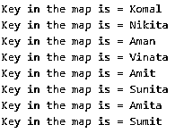
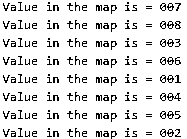
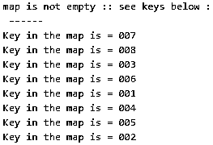
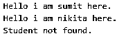
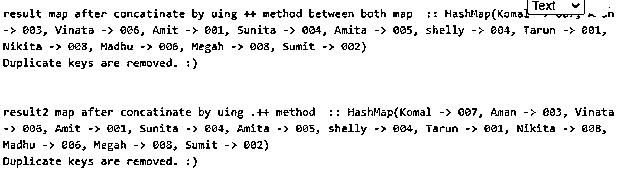

# Scala HashMap

> 原文：<https://www.educba.com/scala-hashmap/>

## Scala 散列表介绍

Scala HashMap 用于存储对象，它以键值对的形式存储对象。对于每个值，都应该有一个与之关联的键。Scala 集合包含这个 Hashmap，它是 map 的实现。它以键值对的形式存储元素，如果我们想从 hasmap 中检索任何值，那么只能在 key 的帮助下进行检索。映射中的键应该是唯一的。

**语法**

<small>网页开发、编程语言、软件测试&其他</small>

`var nameOfMap = HashMap("K1"->"V1", "K2"->"V2", "K3"->"V3", "K4"->"V4")`

**var map** = HashMap("红色"- >"玫瑰"、"黄色"- >"汽车")；

### HashMap 在 Scala 中是如何工作的？

HashMap 是 Map 的实现。在 Scala 中，映射有两种类型，如下所示:

*   易变的
*   不变的

在可变映射中，如果我们添加对象，它们将是可变的。不可变映射是我们在其中添加对象，它们将是不可变的。但是在 Scala 中，它们默认提供不可变映射。这两个术语之间的主要区别是，如果对象是不可变的，那么它不能为它们改变值本身。我们也可以使我们的地图可变，但这必须显式地做。通过导入 scala.collection.mutable.Map 类。

`var map:HashMap[Int, Char] = HashMap()`

在这里，我们正在创建一个空的地图，我们提到了它将采取的参数类型。在上面的例子中，我们定义了整数和字符，所以在插入时，它只允许我们插入整数和字符。如果我们尝试分配任何其他类型，编译时异常将被抛出。

#### 方法

Map 提供了一些检索键、值和检查 map 是否为空的方法。

*   **key:** 这个方法将给出包含在地图中的所有键的列表。
*   isEmpty :这个方法返回条件的真或假的基础。这个方法将检查地图是否为空，如果为空，它将返回 true，否则将返回 false，这个方法在我们尝试迭代一个空地图时非常有用。
*   **值:**该方法将返回映射中包含的值列表。
*   **包含:**该方法用于检查映射中是否存在该键。

#### Scala 中的两个地图

我们也可以在 Scala 中连接两个地图。但是在连接之后，它将删除结果映射中存在的所有重复键。对于连接，我们可以采用两种方法

*   Map++
*   ++

**代码:**

`import scala.collection.mutable.HashMap;
object Main extends App{
// Your code here!
// Here we are initializing our ap with key and value
val colors = HashMap("ABCt" -> "Hello", "XYZ" -> "Bye","PQR" -> "Lost")
println("Key and Value containing in map :: " + colors)
}`

**输出:**

在本例中，我们只是准备了带有所需键和值的映射，并使用 scala 中可用的 println 方法打印这些值。

### 实现 Scala HashMap 的例子

下面是提到的例子:

#### 1.使用关键方法

**代码:**

`import scala.collection.mutable.HashMap;
object Main extends App{
// Your code here!
// Here we are initializing our ap with key and value
val map = HashMap("Amit" -> "001", "Sumit" -> "002", "Aman" -> "003", "Sunita" -> "004", "Amita" -> "005", "Vinata" -> "006", "Komal" -> "007", "Nikita" -> "008")
map.keys.foreach{ k =>
println( "Key in the map is = " + k )
}
}`

**输出:**

#### 2.读取值

**代码:**

`import scala.collection.mutable.HashMap;
object Main extends App{
// Your code here!
// Here we are initializing our ap with key and value
val map = HashMap("Amit" -> "001", "Sumit" -> "002", "Aman" -> "003", "Sunita" -> "004", "Amita" -> "005", "Vinata" -> "006", "Komal" -> "007", "Nikita" -> "008")
map.values.foreach{ k =>
println( "Value in the map is = " + k )
}
}`

**输出:**

#### 3.使用 isEmpty 方法

**代码:**

`import scala.collection.mutable.HashMap;
object Main extends App{
// Your code here!
// Here we are initializing our ap with key and value
val map = HashMap("Amit" -> "001", "Sumit" -> "002", "Aman" -> "003", "Sunita" -> "004", "Amita" -> "005", "Vinata" -> "006", "Komal" -> "007", "Nikita" -> "008")
if(map.isEmpty ){
println("Map is empty")
} else{
println("map is not empty :: see keys below :")
println(" ------ ")
map.values.foreach{ k =>
println( "Key in the map is = " + k )
}
}
}`

**输出:**

#### 4.检查地图中的关键字

**代码:**

`import scala.collection.mutable.HashMap;
object Main extends App{
// Your code here!
// Here we are initializing our ap with key and value
val map = HashMap("Amit" -> "001", "Sumit" -> "002", "Aman" -> "003", "Sunita" -> "004", "Amita" -> "005", "Vinata" -> "006", "Komal" -> "007", "Nikita" -> "008")
if(map.contains( "Sumit" ) ){
println("Hello i am sumit here.")
}
if( map.contains( "Nikita" )){
println("Hello i am nikita here.")
}
if(map.contains( "ABC" )){
println("Hello i am abc here.")
} else{
println("Student not found.")
}
}`

**输出:**

#### 5.两张地图使用。++方法和++

**代码:**

`import scala.collection.mutable.HashMap;
object Main extends App{
val map1 = HashMap("Amit" -> "001", "Sumit" -> "002", "Aman" -> "003", "Sunita" -> "004", "Amita" -> "005", "Vinata" -> "006", "Komal" -> "007", "Nikita" -> "008")
val map2  = HashMap("Tarun" -> "001", "Sumit" -> "002", "Aman" -> "003", "shelly" -> "004", "Amita" -> "005", "Madhu" -> "006", "Komal" -> "007", "Megah" -> "008")
val result  = map1 ++ map2
println("result map after concatinate by uing ++ method between both map  :: " + result)
println("Duplicate keys are removed. :)")
println(" ")
println(" ")
val result2  = map1.++(map2)
println("result2 map after concatinate by uing .++ method  :: " + result2)
println("Duplicate keys are removed. :)")
}`

**输出:**

#### 

### 结论

所以 Hashmap 用于以键值格式存储我们的对象。它们是 map 在 Scala 中的实现，工作方式与 Java maps 非常相似。键必须是唯一的，我们也可以为键和值定义数据类型，以避免将来的错误。

### 推荐文章

这是一个 Scala HashMap 的指南。这里我们讨论 Scala HashMap 的介绍，语法，它是如何与示例代码一起工作的。您也可以浏览我们的其他相关文章，了解更多信息——

1.  [Scala for 循环](https://www.educba.com/scala-for-loop/)
2.  [Scala foreach](https://www.educba.com/scala-foreach/)
3.  [Scala While 循环](https://www.educba.com/scala-while-loops/)
4.  [Scala 中的构造函数](https://www.educba.com/constructors-in-scala/)

