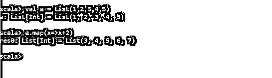
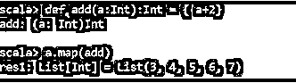
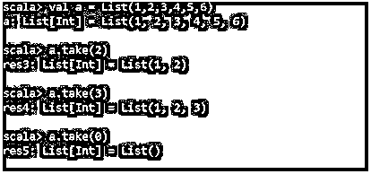
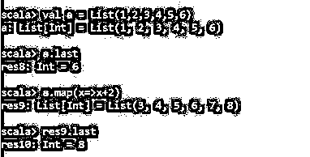
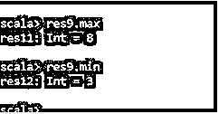
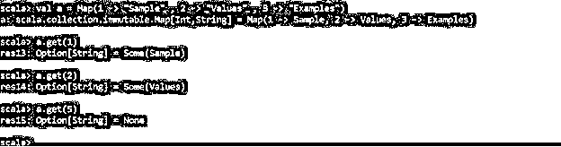
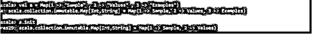
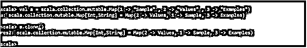
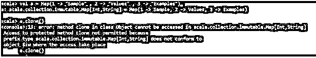

# Scala 映射函数

> 原文：<https://www.educba.com/scala-map-function/>

## Scala 映射函数介绍

Scala Map 函数也称为哈希表，是一组称为哈希表的键/值对。该键用于访问与其相关联的值。映射中的值可以相同，但键总是唯一的。map 是一个高阶函数，它将某个函数作为参数，并将该函数应用于源集合的每个元素。返回类型与集合的源类型相同。

**有两种地图:**

<small>网页开发、编程语言、软件测试&其他</small>

1.不可变地图

2.可变映射:-通过使用 scala.collection.mutable.Map

默认情况下，Scala 使用不可变映射，因为使用可变映射，我们需要显式导入 Scala 类。

### 句法

下面是 Scala 映射函数的语法:

`Def map[B](f: ((K, V)) => B): Iterable[B] Def map[K2, V2](f: ((K, V)) => (K2, V2)): Map[K2, V2]`

对于不可变:

`Var a = Map(key_1 -> value_1, key_2 -> value_2, ....)`

对于可变:

`Var a = scala.collection.mutable.Map(key_1 -> value_1, key_2 -> value_2,....)
def map[B](f: (A) ⇒ B): Traversable[B]`

### Scala Map 函数是如何工作的？

Map Functions 采用提供的函数，并应用于集合中的每个元素。因此，无论提供什么样的 function 元素，MAP 函数都会将其应用于集合中的每个元素。

使用 MAP 函数的源集合不受影响。

在地图功能的帮助下，我们可以一次性对集合进行多种操作。

### 实现 Scala 映射函数的例子

现在让我们借助一个例子来看看:

#### 示例#1

**代码:**

`Scala >val a = List (1,2,3,4,5)
a: List[Int] = List(1, 2, 3, 4, 5)
Scala > a.map(x=>x+2)
res0: List[Int] = List(3, 4, 5, 6, 7)`

**输出:**

**解释:**在这里我们可以看到，map 函数获取了 val a 中的所有值，并对元素进行操作，提供了一个新的元素列表，而不影响旧的列表。

#### 实施例 2

现在让我们再看一个例子，看看 Map 函数是如何通过传递函数定义来工作的。

**代码:**

`scala> def add(a:Int):Int = { a+2}
add: (a: Int)Int
scala> a.map(add)
res1: List[Int] = List(3, 4, 5, 6, 7)`

**输出:**

**解释:**这里我们传递了一个用户定义的函数 add，并将其传递给了 MAP 函数，该函数生成一个包含新值的列表。

### Scala Map 函数的用法

Scala 中有很多 MAP 函数的用法，我们将借助例子来检验它的一些功能和优势。

#### 1.地图中的 Take()方法

scala Map 中的 take 方法用于返回 Map 的前 n 个元素。让我们看一个例子:

**代码:**

`scala> val a = List(1,2,3,4,5,6)
a: List[Int] = List(1, 2, 3, 4, 5, 6)
scala> a.take(2)
res3: List[Int] = List(1, 2)
scala> a.take(3)
res4: List[Int] = List(1, 2, 3)
scala> a.take(0)
res5: List[Int] = List()`

**输出:**

**解释:**这里我们可以看到 take 函数根据值返回列表中的所有元素。

#### 2.MAP 中的 last()方法

这将返回地图元素的最后一个元素:

**代码:**

`scala> val a = List(1,2,3,4,5,6)
a: List[Int] = List(1, 2, 3, 4, 5, 6)
scala> a.last
res8: Int = 6
scala> a.map(x=>x+2)
res9: List[Int] = List(3, 4, 5, 6, 7, 8)
scala> res9.last
res10: Int = 8`

**输出:**

**解释:**这里返回列表中的最后一个元素。

#### 3.最大和最小函数

它返回地图中的最大值和最小值:

**代码:**

`scala> res9.max
res11: Int = 8
scala> res9.min
res12: Int = 3`

**输出:**

**说明:**从上面的例子来看，它返回最大和最小的 Map 值。

#### 4.GET()方法

get 方法用于给出与键相关联的值。如果没有键，则返回 NONE。

**代码:**

`scala> Val a = Map(1 -> "Sample" , 2 -> "Values" , 3 -> "Examples")
a: scala.collection.immutable.Map[Int,String] = Map(1 -> Sample, 2 -> Values, 3 -> Examples)
scala> a.get(1)
res13: Option[String] = Some(Sample)
scala> a.get(2)
res14: Option[String] = Some(Values)
scala> a.get(5)
res15: Option[String] = None`

**输出:**

#### 5.是空的()映射方法

它检查地图是否为空。它根据地图值返回带有 True 和 False 的布尔值。

**代码:**

`scala> a.isEmpty
res17: Boolean = false`

#### 6.计数方法

它返回映射中满足该条件的所有键。

**代码:**

`scala> a.count(z=>true)
res20: Int = 3`

**输出:**

#### 7.初始化方法

该方法返回除映射中最后一个值之外的所有值。

**代码:**

`scala> val a = Map(1 -> "Sample" , 2 -> "Values" , 3 -> "Examples")
a: scala.collection.immutable.Map[Int,String] = Map(1 -> Sample, 2 -> Values, 3 -> Examples)
scala> a.init
res29: scala.collection.immutable.Map[Int,String] = Map(1 -> Sample, 2 -> Values)`

**输出:**

#### 8.Clone()方法

它会复制特定的贴图值。它是 Scala . collection . mutable . map[String，Int]的成员。因此，如果我们将它用于一个不可变的映射，我们将得到一个错误。

**代码:**

`scala> val a = scala.collection.mutable.Map(1 -> "Sample" , 2 -> "Values" , 3 -> "Examples")
a: scala.collection.mutable.Map[Int,String] = Map(2 -> Values, 1 -> Sample, 3 -> Examples)
scala> a.clone()
res2: scala.collection.mutable.Map[Int,String] = Map(2 -> Values, 1 -> Sample, 3 -> Examples)`

**输出:**

在克隆函数的帮助下，我们得到了这些值的一个副本。

**代码:**

`scala> val a = Map(1 -> "Sample" , 2 -> "Values" , 3 -> "Examples")
a: scala.collection.immutable.Map[Int,String] = Map(1 -> Sample, 2 -> Values, 3 -> Examples)
scala> a.clone()
<console>:13: error: method clone in class Object cannot be accessed in scala.collection.immutable.Map[Int,String] Access to protected method clone not permitted because
prefix type scala.collection.immutable.Map[Int,String] does not conform to
object $iw where the access take place
a.clone()`

**输出:**

**解释:**这里我们看到 scala 中有很多与 MAP 函数相关的方法，以及它的用法与一个例子。因此，在 SCALA 中，MAP 函数被用于函数式编程方法。

### 结论

从上面的文章中，我们看到了 map 函数在 SCALA 中是如何使用的，以及我们可以在这个 MAP 函数中使用哪些方法来提高编程效率。MAP 函数对所有存在的值进行运算，并在不改变实际值的情况下获得较新的结果。因此 MAP 是 Scala 中用于各种数据加载的函数式编程的一种优化且有用的方法。

### 推荐文章

这是一个 Scala 映射函数的指南。这里我们讨论 Scala Map 函数的介绍，适当的语法，工作，用法和例子。您也可以浏览我们的其他相关文章，了解更多信息——

1.  [Scala While 循环](https://www.educba.com/scala-while-loops/)
2.  [Scala 版本](https://www.educba.com/scala-versions/)
3.  [Scala foreach](https://www.educba.com/scala-foreach/)
4.  [Scala 中的构造函数](https://www.educba.com/constructors-in-scala/)

