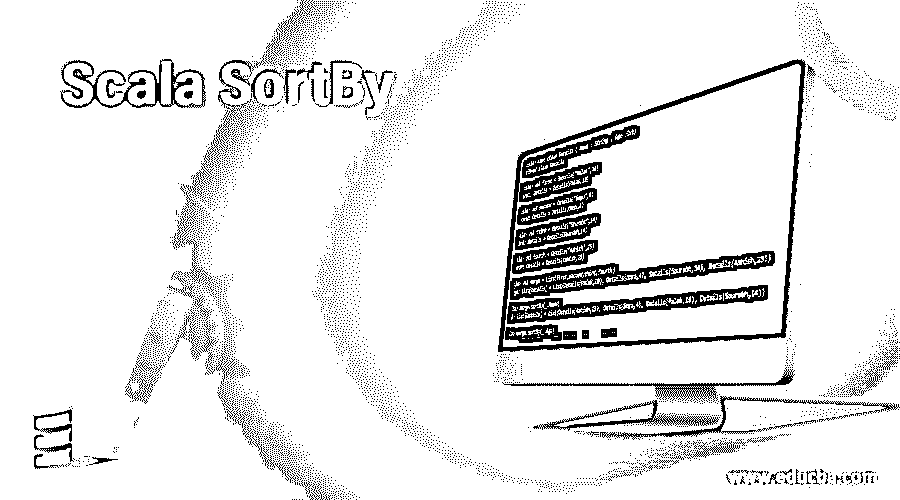
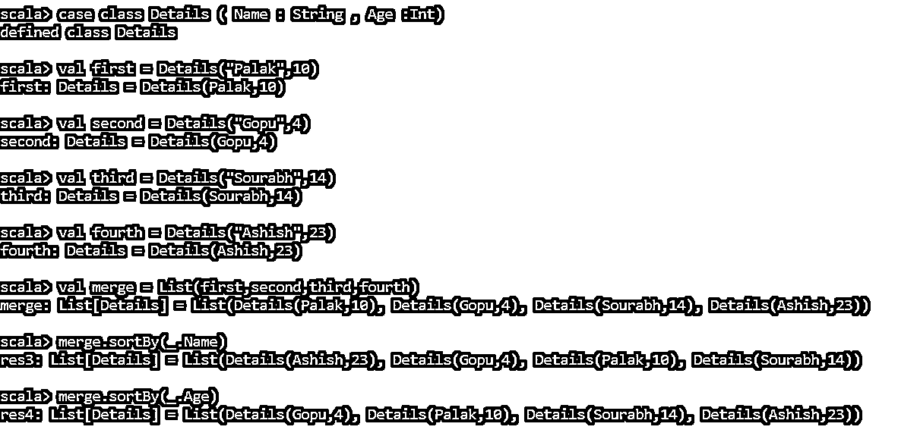
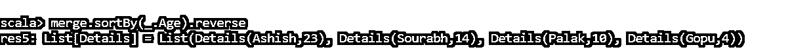
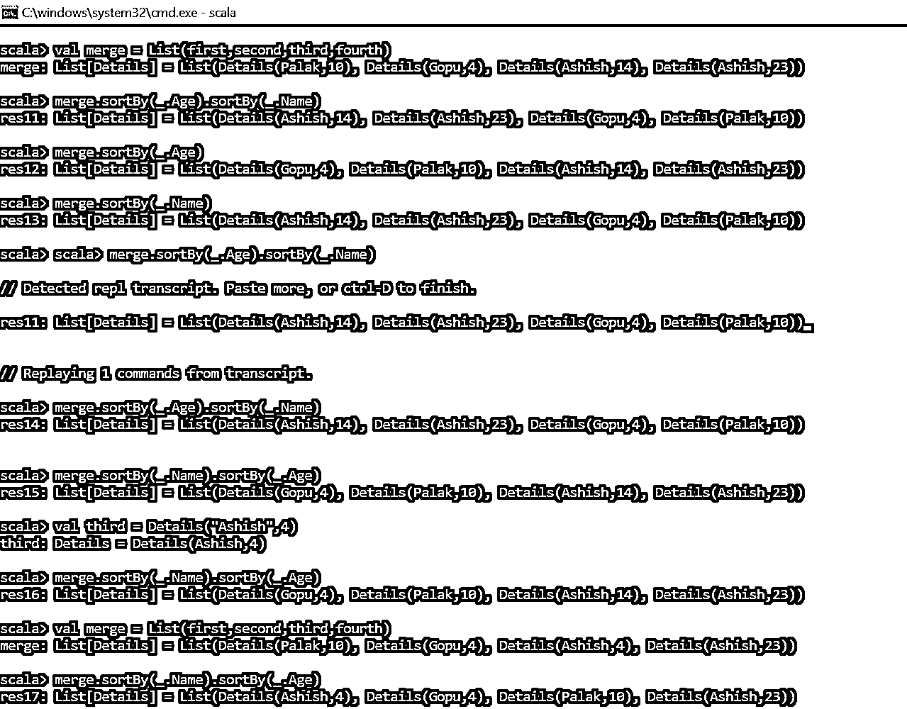
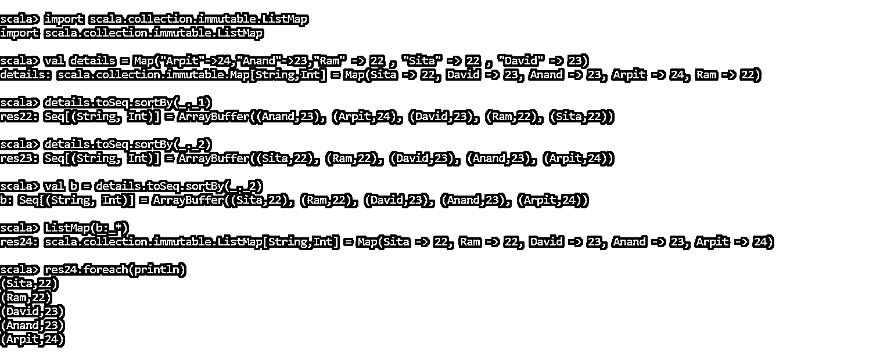

# 合并 SortBy

> 原文：<https://www.educba.com/scala-sortby/>

## Scala SortBy 简介

排序是按顺序或字母顺序对元素进行排序或安排的过程。scala 提出了一个特殊的排序函数，既适用于可变的 Scala 集合，也适用于不可变的 Scala 集合，称为 Scala Sort。SortyBy 函数用于对 Scala 集合中的一个或多个属性进行排序。它使用从用户端定义的函数对集合的元素进行排序。属于 SeqLike 特质。我们可以使用各种数据结构，并使用 sort by 函数根据需要对集合进行排序。在这个主题中，我们将学习 Scala SortBy。

**语法**

<small>网页开发、编程语言、软件测试&其他</small>

`def sortBy[B](f: (A) ⇒ B)(implicit ord: math.Ordering[B]): Repr`

这个 SortBy 把要进行排序的函数和属性作为参数。

### Sortby 的功能及示例

SortyBy 函数对可变或不可变集合列表中的元素进行排序。在内部，它使用合并排序算法，将元素列表分成多个部分，并对它们进行排序。这些递归地继续下去，直到获得一个排序的集合值。Sort By 函数采用多个属性对集合进行排序，首先根据第一个属性对元素进行排序，然后根据下一个属性进行排序。

让我们用一些例子来检查我们:—

#### 按单属性案例分类排序

`scala> case class Details ( Name : String , Age :Int)
defined class Details
scala> val first = Details("Palak",10)
first: Details = Details(Palak,10)
scala> val second = Details("Gopu",4)
second: Details = Details(Gopu,4)
scala> val third = Details("Sourabh",14)
third: Details = Details(Sourabh,14)
scala> val fourth = Details("Ashish",23)
fourth: Details = Details(Ashish,23)
scala> val merge = List(first,second,third,fourth)
merge: List[Details] = List(Details(Palak,10), Details(Gopu,4), Details(Sourabh,14), Details(Ashish,23))
scala> merge.sortBy(_.Name)
res3: List[Details] = List(Details(Ashish,23), Details(Gopu,4), Details(Palak,10), Details(Sourabh,14))
scala> merge.sortBy(_.Age)
res4: List[Details] = List(Details(Gopu,4), Details(Palak,10), Details(Sourabh,14), Details(Ashish,23))`

这种排序是按照年龄升序进行的。

我们甚至可以通过增加一个函数来进行降序排列。反向()覆盖它。

`scala> merge.sortBy(_.Age).reverse
res5: List[Details] = List(Details(Ashish,23), Details(Sourabh,14), Details(Palak,10), Details(Gopu,4))`

所以这里的细节给出了按降序排序的值，年龄越大越好。

**代码:**

我们可以看到的 sortBy 操作的另一个特性是，如果我们在同一个集合对象上有多个 SortBy 函数，它会优先考虑。

让我们用一个例子来验证一下:

仅仅从上面的代码来看，我们来修改并添加一个与 Ashish 同名但改变了年龄的变量。

所以上面的代码将改为:

`scala> val third = Details("Ashish",14)
third: Details = Details(Ashish,14)
scala> val merge = List(first,second,third,fourth)
merge: List[Details] = List(Details(Palak,10), Details(Gopu,4), Details(Ashish,14), Details(Ashish,23))`

所以现在列表中有两个同名但年龄不同的值。现在让我们像这样使用 sortby 函数:

`scala> merge.sortBy(_.Age).sortBy(_.Name)
res11: List[Details] = List(Details(Ashish,14), Details(Ashish,23), Details(Gopu,4), Details(Palak,10))`

因此这段代码将根据名称对元素进行排序，如果名称相同，它将考虑年龄。同样的代码，如果颠倒了排序方式中的顺序，将会表现为:-

`scala> merge.sortBy(_.Name).sortBy(_.Age)
res15: List[Details] = List(Details(Gopu,4), Details(Palak,10), Details(Ashish,14), Details(Ashish,23))`

在这里，因为年龄是可以进行分类的因素，所以按照年龄进行分类。

下面的代码更清楚地说明了上面的场景:

`scala> val third = Details("Ashish",4)
third: Details = Details(Ashish,4)`

现在两个名字的编号是一样的，即 Gopu 和 Ashish

`scala> val merge = List(first,second,third,fourth)
merge: List[Details] = List(Details(Palak,10), Details(Gopu,4), Details(Ashish,4), Details(Ashish,23))
scala> merge.sortBy(_.Name).sortBy(_.Age)
res17: List[Details] = List(Details(Ashish,4), Details(Gopu,4), Details(Palak,10), Details(Ashish,23))`

所以基于年龄的排序将保持第一位

**代码:**

我们也可以通过键、值对来整理集合。对地图排序后的输出是一个新生成的输出，存储在一个新变量中。的。toSeq 方法具有排序技术，因此我们可以通过将 sortBy 方法转换为 Seq 来使用它。让我们用一个例子来验证一下:

`scala> import scala.collection.immutable.ListMap
import scala.collection.immutable.ListMap`

该导入用于将排序后的值存储在列表映射中，以保持排序后的映射的顺序。我们创建了一个名为 Details 的地图函数。

`scala> val details = Map("Arpit"->24,"Anand"->23,"Ram" -> 22 , "Sita" -> 22 , "David" -> 23)
details: scala.collection.immutable.Map[String,Int] = Map(Sita -> 22, David -> 23, Anand -> 23, Arpit -> 24, Ram -> 22)`

的。to Seq 方法中有排序方法。

#### 按关键字排序

`scala> details.toSeq.sortBy(_._1)
res22: Seq[(String, Int)] = ArrayBuffer((Anand,23), (Arpit,24), (David,23), (Ram,22), (Sita,22))`

#### 按值排序

`scala> details.toSeq.sortBy(_._2)
res23: Seq[(String, Int)] = ArrayBuffer((Sita,22), (Ram,22), (David,23), (Anand,23), (Arpit,24))
scala> val b = details.toSeq.sortBy(_._2)
b: Seq[(String, Int)] = ArrayBuffer((Sita,22), (Ram,22), (David,23), (Anand,23), (Arpit,24))`

在 B 中排序后产生的结果是 ArrayBuffer 类型，所以为了把它转换成 Map，我们把函数放在 ListMap 中。

`scala> ListMap(b:_*)
res24: scala.collection.immutable.ListMap[String,Int] = Map(Sita -> 22, Ram -> 22, David -> 23, Anand -> 23, Arpit -> 24)`

**结果:**

`scala> res24.foreach(println)
(Sita,22)
(Ram,22)
(David,23)
(Anand,23)
(Arpit,24)`

**代码:**

从上面的代码中，我们看到了如何使用 Sortby 对列表中的各种元素进行排序。这是一个非常重要的概念，因为集合的排序使得面向对象编程变得更加容易。

### 结论

从上面的文章中，我们了解了 sortby 在 Scala 面向对象编程方法中是如何工作的。我们发现使用 sort by 函数可以帮助我们在很短的一行代码中实现有序的集合。

我们了解了 scala 中的 sortby 函数如何处理多个属性，从而对数据进行排序。所以 Scala Sort By 对于 Scala 排序来说是一个非常简洁的好方法。

### 推荐文章

这是一个 Scala SortBy 的指南。这里我们讨论 Scala Sortby 的介绍，在这里我们通过相应的例子了解 Sortby 是如何工作的。您也可以看看以下文章，了解更多信息–

1.  [Scala 函数](https://www.educba.com/scala-function/)
2.  [Scala 字符串](https://www.educba.com/scala-string/)
3.  [Scala 试抓](https://www.educba.com/scala-try-catch/)
4.  [Scala 抽象类](https://www.educba.com/scala-abstract-class/)

