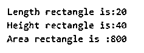
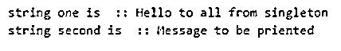
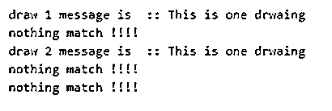

# Scala 单例

> 原文：<https://www.educba.com/scala-singleton/>

## Scala 单例的定义

Scala 语言是一种面向对象的编程语言，因此它支持单例对象概念。但是在 java 中，他们为此提供了静态关键字。单例对象是更强大的概念。顾名思义，它只允许我们创建一个类的一个对象，这意味着我们只为一个类定义一个对象。在 scala 中，单例对象是我们程序的入口点。所以如果我们不为我们的类定义一个单例对象，编译将会失败。

**语法:**

<small>网页开发、编程语言、软件测试&其他</small>

`object USER_DEFINED_NAME{
// write logic here
}`

这里我们使用 object 关键字来创建我们的 singleton 对象。在这里面，我们可以写出我们的逻辑。下面我们来看看；

`object Demo {
def m1(message: String){
println("singleton method called.")
}
}`

在上面的语法中，我们使用 object 关键字来定义我们的 singleton 对象。同样，通过导入这个类包，我们可以在任何地方使用这个 m1()方法。在单例类中，我们可以定义可以在代码中任何地方使用的实用方法，以减少冗余代码。

### Scala 中的 Singleton 对象是如何工作的？

单例对象的工作方式与 java 中的静态关键字相同。Singleton 对象意味着该类只有一个实例，而不是多个。在 java 中，我们可以通过类名访问静态方法，但是在 scala 中，我们只需要导入包含该方法的类包，就可以直接使用它。单例对象是懒惰创建的对象，因为它们只有一个类实例。在根级别的 scala 中，类对象是单例的。

`Like;
package Demopck
object Demo {
def m1(message: String){
println("message is ::" +message)
}
}
import Demopck.Demo.m1
class Employee(name: String, id: Int)
class Test {
val emp1 = new Employee("ABC XYZ", 001)
val emp2 = new Employee("IOP YHG", 005)
val emp3 = new Employee("TYH PPP", 006)
val emp4 = new Employee("OIU DFR", 007)
m1("called singleton object method.")
}`

在上面的例子中，我们做了一个单例对象。此外，我们创建一个 employee 类来测试我们的更改。这个 m1()方法可以在任何类中作为一个实用方法使用，只需导入更改即可。在测试类中，我们在代码末尾导入了演示类和方法 m1()，我们直接调用我们的方法，没有任何类引用。这意味着类的对象只是在开始的时候创建的，我们引用同一个对象来引用这个方法。

我们可以通过两种方式调用单例对象方法；

1.直接引用类名，后面跟着我们要调用的方法名。在这两种方法中，我们都不需要为类创建对象，我们只需要通过在方法前添加类名来引用方法。

例如:班级名称。方法名称()

2.通过导入包含该方法的类

例如:导入包名.类名.方法名

使用 singleton Scala 对象时要记住的几点；

*   在 scala 语言中，main 方法总是出现在 singleton 对象中，因为程序流只从那里开始。
*   我们的单例对象在我们的应用程序中是全局可访问的。
*   在 scala 中，我们可以在单例类中扩展特征和类。
*   我们可以创建 singleton 类的一个实例。因为它只被创建一次。
*   我们不能在 singleton 类的构造函数内部传递参数。
*   不需要创建单例类的对象来访问它们的方法，因为它们可以通过类名直接访问。

### Scala Singleton 的例子

下面是一些例子:

#### 示例#1

在这个例子中，我们从 main 方法中调用 singleton 方法。

**代码:**

`object Main extends App{
// Your code here!
//defining singleton object
object Demo {
def m1(message: String): Unit = println(s"INFO: $message")
}
val emp1 = new Employee("TABC", 001)
val emp2 = new Employee("TTYUs",002)
val emp3 = new Employee("TOPO", 003)
// calling siglenton method via class name.
Demo.m1("calling singleton method ")
}
class Employee(name: String, id: Int)`

**输出:**

#### 实施例 2

在这里，我们计算矩形的面积。

**代码:**

`object Main extends App{
// Your code here!
var result = new Rectangle();
result.area() ;
}
class Rectangle
{
var l = 20;
var h = 40;
// Method which gives the area of the rectangle
defarea()
{
var area = l * h;
println("Length rectangle is:" + l);
println("Height rectangle is:" + h);
println("Area rectangle is :" + area);
}
}`

**输出:**

#### 实施例 3

在这个例子中，我们通过调用 singleton 类中的方法来打印我们的消息。

**代码:**

`object Main extends App{
// Your code here!
//we are calling the methood from main
SingletonDemo.show()
}
object SingletonDemo
{
// Varaibles of singleton object
var message1 = "Hello to all from singleton";
var message2 = "Message to be priented";
// Method of singleton object
defshow()
{
println("string one is  :: "+ message1);
println("string second is  :: "+ message2);
}
}`

**输出:**

#### 实施例 4

在这个例子中，我们通过 singleton 对象传递一些参数来测试输入和输出。

**代码:**

`object Main extends App{
// Your code here!
//we are calling the methood from main
DrawDemo.test(1)
DrawDemo.test(2)
DrawDemo.test(10)
}
object DrawDemo
{
// Varaibles of singleton object
var draw1 = "This is one drwaing";
var draw2 = "This is second";
// Method of singleton object
deftest(num: Int)
{
if(num == 1){
println("draw 1 message is  :: " + draw1)
}
if(num == 2){
println("draw 2 message is  :: " + draw1)
}
if(num != 1 || num != 2){
println("nothing match !!!!")
}
}
}`

**输出:**

### 结论

只需要一个类实例时使用的 Scala singleton 对象。它还帮助我们维护应用程序的实用方法，这种方法在很多地方都被使用。从而也减少了代码的冗余。同样，我们也可以通过使用单例对象来扩展特征和类。它们很重要，因为它们提供了程序执行的入口。

### 推荐文章

这是一个 Scala Singleton 的指南。在这里，我们也讨论了 scala 中单例对象的定义和工作方式。以及不同的示例及其代码实现。您也可以看看以下文章，了解更多信息–

1.  [Scala if else](https://www.educba.com/scala-if-else/)
2.  [Scala 抽象类](https://www.educba.com/scala-abstract-class/)
3.  [Scala 高阶函数](https://www.educba.com/scala-high-order-functions/)
4.  [Scala for 循环](https://www.educba.com/scala-for-loop/)

