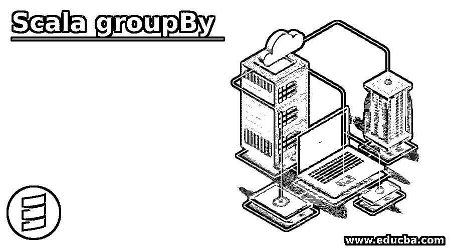
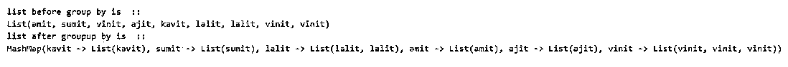
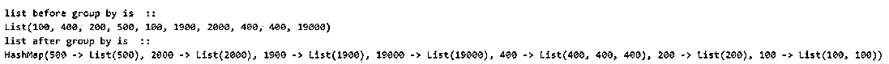
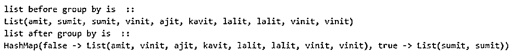
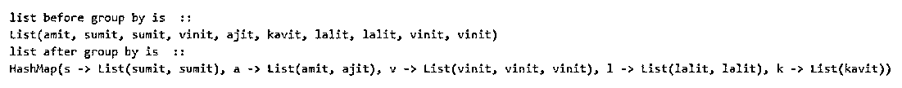
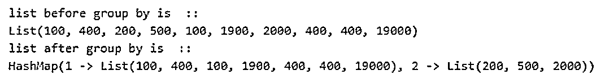

# 合并群件

> 原文：<https://www.educba.com/scala-groupby/>

## Scala groupBy 简介

Scala groupBy 是集合数据结构的一部分。顾名思义，它用于对集合的元素进行分组。这个 groupBy 既适用于 scala 中的可变集合，也适用于不可变集合。不可变对象是那些一旦被赋值就不能改变自身值的对象，可变对象是那些值变化非常频繁的对象。此外，这个 groupBy 将列表转换为映射，这样我们就可以对它执行一些有用的操作。它将返回一个包含键值对的映射。

**语法和参数:**

<small>网页开发、编程语言、软件测试&其他</small>

Scala groupBy 函数将一个谓词作为参数，并基于此将我们的元素分组到一个有用的键值对映射中。这意味着我们可以使用 groupBy 函数将 List 对象转换为 Map。

下面我们可以看到在 scala 中定义 groupBy 的语法:

`groupBy[K](f: (A) ⇒ K): immutable.Map[K, Repr]`

在上面的语法中，我们可以看到这个 groupBy 函数将返回一个键值对的映射。同样在 groupBy 内部，我们将把谓词作为参数传递。

我们可以看到一个更容易理解的实用语法:

`var l1= List("anc", "ahg", "tyh")
l1.groupBy(x => x.length()).foreach(println)`

这样，我们可以定义 groupBy 函数，并将列表转换为键值对的映射。我们可以对任何集合数据结构使用这个函数。

### groupBy 在 Scala 中是如何工作的？

Scala groupBy 用于对集合中的元素进行分组。它还用于存储对象和检索对象。groupBy 返回 scala 中的地图集合。

我们可以仔细看看 groupBy 语法是如何工作的:

`someList.groupBy(obj => obj)`

在上面的行中，我们可以看到一些列表名称，后面是 groupBy 函数，在 groupBy 函数中有一个匿名函数(= >)，这个函数将遍历所有列表元素，并将与“obj”具有相同值的元素分组。之后，它会在内部将其转换为具有键值对的 HashMap，并将具有相同内容的所有元素转换为一个组。如果两个或更多的元素在列表中是相同的，那么它们将映射到 HashMap 中的同一个键。

让我们看看它的扩展类、超类和 scala 中的一些已知类。

**可用扩展类:**

*   可迭代的[(K，V)]
*   MapOps[K，V，Map，Map[K，V]]
*   MapFactoryDefaults[K，V，Map，Iterable]
*   等于

**可用的超级类:**

*   等于
*   MapFactoryDefaults[K，V，Map，Iterable]
*   maops
*   部分功能
*   (K)=> V
*   可迭代的
*   IterableFactoryDefaults
*   IterableOps
*   地图
*   IterableOnceOps
*   IterableOnce
*   AnyRef
*   AnyRef

**一些已知的可用子类:**

*   抽象地图
*   塞克曼
*   分类地图
*   地图
*   树形图
*   散列表
*   位图
*   列表映射
*   长图
*   地图
*   地图 1
*   地图 2
*   地图 3
*   地图 4
*   默认情况下
*   塞克曼
*   树图
*   TreeSeqMap
*   矢量地图
*   抽象地图
*   AnyRefMap
*   防撞地图
*   散列表
*   LinkedHashMap
*   长图
*   系统属性
*   列表映射
*   多地图
*   OpenHashMap

**可用层级:**

*   可迭代的
*   maops
*   等于
*   UnliftOps
*   IterableOnceExtensionMethods
*   不变地图
*   可变地图

**举例:**

**代码:**

`object Main extends App{
// Your code here!
var list1= List("amit", "sumit", "vinit", "ajit", "kavit", "lalit", "lalit", "vinit", "vinit")
var g = list1.groupBy(x => x)
println(g)
}`

在上面的例子中，我们首先定义了一个包含一些对象的列表。这个列表也包含一些重复的对象。之后，我们应用 groupBy 函数对相同的元素进行分组。所以在我们的列表 vinit 和 lalit 中，它出现了不止一次，所以在创建 HashMap 时，它会根据 Map 中的同一个键对所有这些相似的列表元素进行分组。

如果我们想在基于元素分组的列表上应用一些逻辑，这是很有用的。

### Scala groupBy 示例

下面是提到的例子:

#### 示例#1

在这个例子中，我们只是应用 groupBy 让初学者理解。我们在列表中使用 groupBy。

**代码:**

`object Main extends App{
// Your code here!
// initializing the list
var list1= List("amit", "sumit", "vinit", "ajit", "kavit", "lalit", "lalit", "vinit", "vinit")
println("list before group by is  ::")
println(list1)
//applying groupBy method here
var group1 = list1.groupBy(x => x)
// printing output
println("list after group by is  ::")
println(group1)
}`

**输出:**

#### 实施例 2

在这个例子中，我们对整数列表进行分组。

**代码:**

`object Main extends App{
// Your code here!
// initializing the list
var list1= List(100, 400, 200, 500, 100, 1900, 2000, 400, 400, 19000)
println("list before group by is  ::")
println(list1)
//applying groupBy method here
var group1 = list1.groupBy(x => x)
// printing output
println("list after group by is  ::")
println(group1)
}`

**输出:**

#### 实施例 3

在这个例子中，我们根据作为谓词的 contains 方法对元素进行分组。

**代码:**

`object Main extends App{
// Your code here!
// initializing the list
var list1= List("amit", "sumit", "sumit", "vinit", "ajit", "kavit", "lalit", "lalit", "vinit", "vinit")
println("list before group by is  ::")
println(list1)
//applying groupBy method here
var group1 = list1.groupBy(_.contains("sumit"))
// printing output
println("list after group by is  ::")
println(group1)
}`

**输出:**

#### 实施例 4

在这个方法中，我们在 groupBy 方法中将 charAt 作为谓词传递。

**代码:**

`object Main extends App{
// Your code here!
// initializing the list
var list1= List("amit", "sumit", "sumit", "vinit", "ajit", "kavit", "lalit", "lalit", "vinit", "vinit")
println("list before group by is  ::")
println(list1)
//applying groupBy method here
var group1 = list1.groupBy(_.charAt(0))
// printing output ..
println("list after group by is  ::")
println(group1)
}`

**输出:**

#### 实施例 5

在这个例子中，我们通过检查元素是否能被“3”整除来对整数列表进行分组。

**代码:**

`object Main extends App{
// Your code here!
// initializing the list
var list1= List(100, 400, 200, 500, 100, 1900, 2000, 400, 400, 19000)
println("list before group by is  ::")
println(list1)
//applying groupBy method here
var group1 = list1.groupBy(_ % 3)
// printing output
println("list after group by is  ::")
println(group1)
}`

**输出:**

### 结论

Scala groupBy 用于根据函数中定义为谓词的一些标准对元素进行分组。这个函数在内部将集合转换成 map 对象，这个 map 对象处理键值对。这主要用于存储和检索元素。在 scala 中使用 groupBy 的主要优点是，它可以根据我们在函数中提供的条件或谓词对元素进行分组，这些条件或谓词可以在程序的后面使用。

### 推荐文章

这是一个 Scala groupBy 的指南。在这里，我们讨论 Scala groupBy 的介绍，groupBy 如何与编程示例一起工作。您也可以看看以下文章，了解更多信息–

1.  [Scala 试抓](https://www.educba.com/scala-try-catch/)
2.  笔画比例
3.  [Scala foreach](https://www.educba.com/scala-foreach/)
4.  [Scala 抽象类](https://www.educba.com/scala-abstract-class/)

