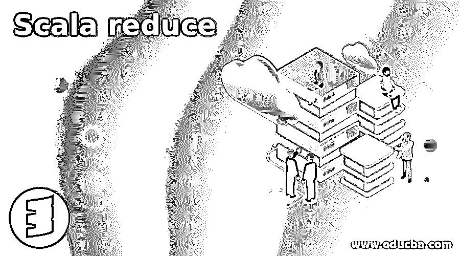
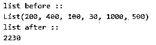
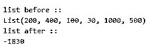
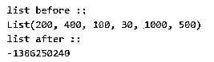
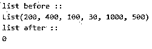
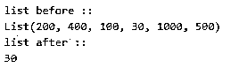

# 标量减少

> 原文：<https://www.educba.com/scala-reduce/>

## Scala reduce 函数介绍

Scala reduces 函数，减少 Scala 中的集合数据结构。这个函数可以应用于可变和不可变的集合数据结构。可变对象是那些值经常变化的对象，而不可变对象是那些赋值后不能改变自身的对象。Reduce 函数可以应用于映射、序列、集合和列表等。该函数从集合数据结构中返回一个值。在 reducing 函数中，它合并了集合数据结构中的所有值，并返回单个值。

**语法**

<small>网页开发、编程语言、软件测试&其他</small>

下面是 Scala reduce 的语法:

`def reduce[A1 >: A](op: (A1, A1) ⇒ A1): A1`

**解释:**根据他们的文档，这是在 Scala 中定义简化函数的语法。最后，它将从元素组中返回一个值。让我们来看一个 de 在程序中声明的练习示例:

`val result: Int = collection_name.reduce((a1, b1) => a1 + b1)`

**解释:**在上面的语法中，我们准备了一个集合，后面是简化函数，它带有两个参数，我们可以对这些参数执行操作。最后，我们将获得一个值作为输出。

### Scala 中的 reduce 函数是如何工作的？

Reduce 函数减少了集合数据结构中的元素数量。它在内部做的是使用二元运算，将所有可用的元素合并成一个元素。我们可以看到它在内部是如何工作的，假设我们有一个包含很多元素的列表，比如 3，7，9，2，1，5。现在，我们将对其应用 reduce 函数，以在添加列表中的所有数字后生成单个数字。

1.首先，它需要第一个元素 3。然后，它将对第一个和第二个数字应用二元运算，并将它们合并以生成第三个数字。

2.f(3，7) -> 10，这将使用二进制运算生成第三个数字。

3.f(10，9) -> 19，而不是在添加下一个两元素后输出将是 19。

4.f(19，2) -> 21 应用二元运算后，接下来两个元素的和为 21。

5.f(21，1) -> 22，下两个值之和是 22。

6.f(22，5) -> 26 现在接下来的两个元素是 22 和 5，合并值将是 26，这是列表中的最后一个元素。所以最后一个值是 26。

它将作为输出生成。在 reduce 函数中，我们使用匿名函数将对象迭代到列表中(= >)。归约函数的运算是结合律和交换律。

现在我们可以看一个实际例子，让初学者更好地理解:

**代码:**

`object Main extends App{
// Your code here!
// creating collection
val collection = List(200 , 400, 100, 30, 1000, 500)
// applying reduce function
val res = collection.reduce((x1, y1) => x1 max y1)
}`

**说明:**在这个例子中，我们正在创建一个集合数据结构列表。之后，我们在链表上应用 reduce 函数，试图从元素列表中找出最大的元素。这也将作为元素列表中的单个值返回。

**扩展类:**

*   可抽象的[(K，V)]
*   地图[K，V]

**一些超类型:**

*   地图
*   等于
*   映射工厂默认值
*   maops
*   部分功能
*   可抽象的
*   可迭代的
*   IterableFactoryDefault
*   IterableOps
*   IterableOnceOps
*   IterableOnceOps

**一些已知的类:**

*   树形图
*   抽象地图
*   散列表
*   位图
*   列表映射
*   朗曼（姓氏）
*   地图 1
*   地图 2
*   地图 3
*   地图 4
*   默认情况下
*   树图
*   TrrSeqMap
*   矢量地图
*   抽象地图
*   AnyRefMap
*   防撞地图
*   LinkedHashMap
*   长图
*   默认情况下
*   系统属性
*   列表映射
*   OpenHashMap

**类似 reduce 的方法如下:**

*   向左缩小
*   reduceRight
*   减少选项
*   reduceRightOPtion
*   reduceLeftOPtion

### 实现 Scala reduce 的示例

下面是提到的例子:

#### 示例#1

在这个例子中，我们通过使用二元运算找出集合数据结构中存在的所有元素的总和。

**代码:**

`object Main extends App{
// Your code here!
// creating collection
val list1 = List(200 , 400, 100, 30, 1000, 500)
println("list before ::")
println(list1)
// applying reduce function
val result = list1.reduce((x1, y1) => x1 + y1)
println("list after ::")
println(result)
}`

**输出:**

#### 实施例 2

在这个例子中，我们通过使用二元运算找出集合数据结构中存在的所有元素的减法。

**代码:**

`object Main extends App{
// Your code here!
// creating collection
val list1 = List(200 , 400, 100, 30, 1000, 500)
println("list before ::")
println(list1)
// applying reduce function
val result = list1.reduce((x1, y1) => x1 - y1)
println("list after ::")
println(result)
}`

**输出:**

#### 实施例 3

在这个例子中，我们通过使用二元运算找出集合数据结构中存在的所有元素的乘积。

**代码:**

`object Main extends App{
// Your code here!
// creating collection
val list1 = List(200 , 400, 100, 30, 1000, 500)
println("list before ::")
println(list1)
// applying reduce function
val result = list1.reduce((x1, y1) => x1 * y1)
println("list after ::")
println(result)
}`

**输出:**

#### 实施例 4

在这个例子中，我们通过使用二元运算找出集合数据结构中存在的所有元素的划分。

**代码:**

`object Main extends App{
// Your code here!
// creating collection
val list1 = List(200 , 400, 100, 30, 1000, 500)
println("list before ::")
println(list1)
// applying reduce function
val result = list1.reduce((x1, y1) => x1 / y1)
println("list after ::")
println(result)
}`

**输出:**

#### 实施例 5

在这个例子中，我们使用二元运算找出集合数据结构中所有元素的最小值。

**代码:**

`object Main extends App{
// Your code here!
// creating collection
val list1 = List(200 , 400, 100, 30, 1000, 500)
println("list before ::")
println(list1)
// applying reduce function
val result = list1.reduce((x1, y1) => x1 min y1)
println("list after ::")
println(result)
}`

**输出:**

### 结论

Scala reduces 函数用于对集合元素执行二元运算。我们可以做很多类型的手术。此外，我们可以使用 reduce 函数从集合中找到最大值和最小值。请始终记住，这种归约将始终返回单个值作为逻辑的输出，因为它将合并集合中的所有值。

### 推荐文章

这是一个 Scala reduce 的指南。这里我们讨论一个介绍 Scala reduce 函数，语法，它是如何工作的编程例子。您也可以浏览我们的其他相关文章，了解更多信息——

1.  [Scala 平面图](https://www.educba.com/scala-flatmap/)
2.  [Scala 版本](https://www.educba.com/scala-versions/)
3.  [Scala 集合](https://www.educba.com/scala-collections/)
4.  [Scala foreach](https://www.educba.com/scala-foreach/)

